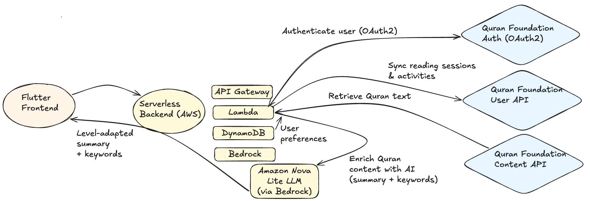

# 📖 Tilawa

A context-aware preparation engine for Quranic recitation. Tilawa generates **personalized summaries and keywords** based on user level and preferences using AWS serverless architecture and Amazon Nova (LLM).

---

## 🚀 Live Demo

👉 **Deployed App:** http://tilawa.s3-website-us-east-1.amazonaws.com

The app is fully deployed and ready to test.

### 🔐 Test Access

This application uses **Quran Foundation pre-production credentials**.

Judges can log in using the provided hackathon credentials:

* OAuth2 login via Quran Foundation
* No setup required

---

## 🧠 What this project does

Tilawa enhances Quran reading by:

* Providing **instant AI-generated summaries**
* Extracting **key concepts and keywords**
* Adapting explanations based on **user level**
* Syncing reading sessions with Quran Foundation API

---

## Design Approach

- **Mobile-First** — The app is designed primarily for mobile usage, with layouts and interactions optimized for small screens. This allows a seamless transition to a native mobile app in the future, which aligns with the primary use case of recitation on-the-go.

---

## 🏗️ System Architecture

The system is fully serverless and built on AWS.

```text id="xq8v1p"
Frontend (Flutter web)
        ↓
API Gateway
        ↓
AWS Lambda (Core Orchestration)
   ├── Quran Content API
   ├── User Preferences and session history (DynamoDB)
   ├── Quran User API (session sync)
   └── Amazon Bedrock (Nova Lite)
                ↓
     AI-generated summary + keywords
                ↓
          Frontend Response
```

---

## 🧩 Key Idea

The AI does not just summarize content — it **personalizes it based on user reading level and preferences**, creating a tailored learning experience instead of a static explanation.

---

## 🧱 Repository Structure

```bash id="repo123"
.
├── frontend/   # Flutter application (UI + state management)
├── backend/    # AWS Lambda functions + API logic
└── README.md   # This file
```

Each module contains its own detailed README:

* [`frontend/README.md`](./frontend/README.md) → UI, state management, Flutter architecture
* [`backend/README.md`](./backend/README.md) → Infrastructure as Code, AWS Lambda, API, Bedrock integration

---

## ⚙️ Tech Stack

### Frontend

* Flutter web

### Backend

* AWS Lambda
* API Gateway
* DynamoDB

### AI Layer

* Amazon Bedrock (Nova Lite)

### External Integrations

* Quran Foundation OAuth2
* Quran Foundation Content API
* Quran Foundation User API

---

## 🎯 Hackathon Requirements Mapping

This project fulfills the following technical requirements:

### ☁️ Use at least one Quran Foundation Content API

* chapters
* verses by page
* verses by chapter

### 🤖 Use at least one Quran Foundation User API

* reading sessions
* activity days

### 🔐 Authentication

* OAuth2 integration via Quran Foundation

### 📦 Data Layer

* DynamoDB for storing user preferences
* Quran Foundation API integration for Quran content + sessions

### 🔄 System Design

* Separation of concerns:

  * Frontend (Flutter UI)
  * Backend (AWS orchestration)
  * AI layer (Bedrock)
  * External APIs (Quran Foundation)



---


## 🧭 How to run locally

👉 See detailed instructions in:

* [`frontend/README.md`](./frontend/README.md)
* [`backend/README.md`](./backend/README.md)

---

## 🔮 Future Improvements

* ???

---

