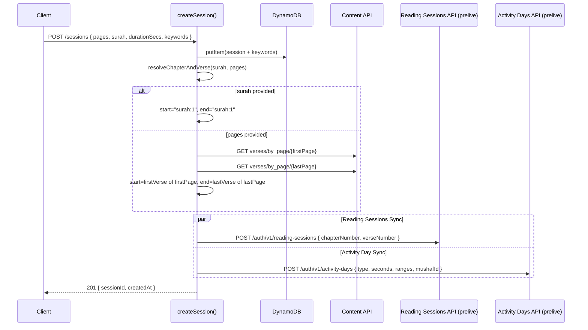
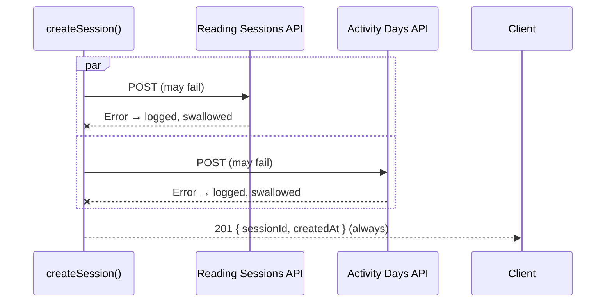

# Design Document: Activity Day Sync

## Overview

This feature adds a second fire-and-forget sync to the `createSession()` flow in `src/sessions.mjs`. After persisting a session to DynamoDB, the system already syncs to the Reading Sessions API. This feature adds a parallel call to the Quran Foundation Activity Days API (`POST /auth/v1/activity-days`) on the prelive endpoint, recording the user's daily reading activity with duration and verse ranges.

### Key Design Decisions

1. **Expand `resolveChapterAndVerse` to return verse keys**: The existing function returns `{ chapterNumber, verseNumber }` for the Reading Sessions API. We expand it to also return `startVerseKey` and `endVerseKey` strings (e.g. `"2:1"`, `"2:286"`). The existing `chapterNumber` and `verseNumber` fields remain unchanged so `syncReadingSession` is unaffected.
2. **User access token, not client credentials**: The Activity Days API requires the user's own OAuth2 access token (passed via `x-auth-token`), not a client credentials token. The `userAccessToken` is already available in `createSession()` — it's passed through from the Authorization header.
3. **`mushafId` hardcoded to 4**: The frontend doesn't track which mushaf the user reads from. UthmaniHafs (ID 4) is the default.
4. **`x-timezone` header omitted**: The frontend doesn't provide timezone info. The API defaults to server-side date handling.
5. **Independent sync execution**: Both `syncReadingSession` and `syncActivityDay` run independently. A failure in one does not prevent the other. This is achieved with separate try/catch blocks (matching the existing pattern).
6. **No new routes or files**: All changes are localized to `src/sessions.mjs`.

## Architecture



### Error Path



## Components and Interfaces

### Modified Function: `resolveChapterAndVerse`

Expanded to return start and end verse keys alongside the existing `chapterNumber` and `verseNumber`.

```javascript
/**
 * Resolves session parameters to chapter/verse numbers and verse key range.
 *
 * @param {string|number|undefined} surah
 * @param {string|undefined} pages
 * @returns {Promise<{
 *   chapterNumber: number,
 *   verseNumber: number,
 *   startVerseKey: string,
 *   endVerseKey: string
 * }>}
 */
async function resolveChapterAndVerse(surah, pages)
```

- **Surah path**: Returns `{ chapterNumber: surah, verseNumber: 1, startVerseKey: "{surah}:1", endVerseKey: "{surah}:1" }`
- **Pages path**: Fetches verses for the first page AND the last page. `startVerseKey` = first verse of first page, `endVerseKey` = last verse of last page. `chapterNumber` and `verseNumber` still derived from the start verse key (preserving existing behavior).

### New Function: `syncActivityDay`

Fire-and-forget sync to the Activity Days API. Follows the same pattern as `syncReadingSession`.

```javascript
/**
 * Syncs a completed session to the Quran.com Activity Days API.
 * Fire-and-forget: logs errors but never throws.
 *
 * @param {string} startVerseKey - e.g. "2:1"
 * @param {string} endVerseKey - e.g. "2:5"
 * @param {number} durationSecs - Session duration in seconds (integer >= 1)
 * @param {string} userAccessToken - The user's OAuth2 access token
 */
async function syncActivityDay(startVerseKey, endVerseKey, durationSecs, userAccessToken)
```

- Validates `userAccessToken` is present (logs warning and returns if missing)
- Validates `durationSecs` is an integer >= 1 (logs warning and returns if invalid)
- Endpoint: `POST https://apis-prelive.quran.foundation/auth/v1/activity-days`
- Headers: `x-auth-token` (user token), `x-client-id` (`QF_PRELIVE_CLIENT_ID`), `Content-Type: application/json`
- No `x-timezone` header
- Body: `{ type: "QURAN", seconds: durationSecs, ranges: ["{start}-{end}"], mushafId: 4 }`
- Wraps entire flow in try/catch — logs and swallows all errors

### Modified Function: `createSession`

After DynamoDB writes, runs both syncs independently:

```javascript
// After putItem and keyword upserts...
try {
  const { chapterNumber, verseNumber, startVerseKey, endVerseKey } =
    await resolveChapterAndVerse(surah, pages);

  // Fire both syncs independently
  try {
    await syncReadingSession(chapterNumber, verseNumber, userAccessToken);
  } catch (err) {
    console.error("Reading session sync failed:", err);
  }

  try {
    await syncActivityDay(startVerseKey, endVerseKey, durationSecs, userAccessToken);
  } catch (err) {
    console.error("Activity day sync failed:", err);
  }
} catch (err) {
  console.error("Verse resolution failed, skipping syncs:", err);
}

return { statusCode: 201, body: { sessionId, createdAt } };
```

### Existing Functions Used (No Changes)

- `syncReadingSession(chapterNumber, verseNumber, userAccessToken)` — unchanged
- `fetchVersesForPage(pageNumber)` — reused, now called for both first and last page
- `parsePageRange(pages)` — reused to extract page numbers from range string

## Data Models

### Activity Days API Request Body

```json
{
  "type": "QURAN",
  "seconds": 300,
  "ranges": ["2:1-2:5"],
  "mushafId": 4
}
```

| Field | Type | Constraints | Description |
|-------|------|-------------|-------------|
| type | string | Always `"QURAN"` | Activity type identifier |
| seconds | integer | >= 1 | Session duration in seconds |
| ranges | string[] | Single element, format `"ch:v-ch:v"` | Verse range covered |
| mushafId | integer | Always `4` | UthmaniHafs mushaf identifier |

The `date` field is intentionally omitted — the API defaults to the current date.

### Activity Days API Headers

| Header | Value | Source |
|--------|-------|--------|
| `x-auth-token` | User's access token | `userAccessToken` parameter |
| `x-client-id` | Prelive client ID | `process.env.QF_PRELIVE_CLIENT_ID` |
| `Content-Type` | `application/json` | Static |

No `x-timezone` header is sent.

### Expanded `resolveChapterAndVerse` Return Shape

```javascript
{
  chapterNumber: 2,      // existing — used by syncReadingSession
  verseNumber: 1,        // existing — used by syncReadingSession
  startVerseKey: "2:1",  // new — used by syncActivityDay
  endVerseKey: "2:5"     // new — used by syncActivityDay
}
```

### Verse Range Format

The `ranges` array contains a single string built from the resolved verse keys:

```
"{startVerseKey}-{endVerseKey}"
```

Examples:
- Surah 2: `"2:1-2:1"`
- Pages 50-54: `"3:92-4:23"` (first verse of page 50 to last verse of page 54)


## Correctness Properties

*A property is a characteristic or behavior that should hold true across all valid executions of a system — essentially, a formal statement about what the system should do. Properties serve as the bridge between human-readable specifications and machine-verifiable correctness guarantees.*

### Property 1: Surah resolution returns consistent verse keys and chapter/verse

*For any* valid surah number (integer 1–114), calling `resolveChapterAndVerse(surah, undefined)` should return `{ chapterNumber: surah, verseNumber: 1, startVerseKey: "{surah}:1", endVerseKey: "{surah}:1" }`.

Reasoning: When a surah is provided, the chapter number is the surah itself, verse defaults to 1, and both verse keys point to the first verse. The existing `chapterNumber`/`verseNumber` fields must remain correct so `syncReadingSession` is unaffected.

**Validates: Requirements 1.1, 1.5**

### Property 2: Page resolution returns correct start and end verse keys

*For any* page range string and *for any* set of verses returned by the content API for the first and last pages, `resolveChapterAndVerse(undefined, pages)` should return `startVerseKey` equal to the `verse_key` of the first verse on the first page, and `endVerseKey` equal to the `verse_key` of the last verse on the last page. The `chapterNumber` and `verseNumber` should be derived from the start verse key.

Reasoning: When pages are provided, we need both the start and end of the range. The function fetches verses for the first and last pages, extracts the boundary verse keys, and also parses the start key for backward compatibility with the Reading Sessions API.

**Validates: Requirements 1.2, 1.3, 1.4, 1.5**

### Property 3: Payload constant fields invariant

*For any* valid inputs to `syncActivityDay`, the request body sent to the Activity Days API should always have `type` equal to `"QURAN"`, `mushafId` equal to `4`, and should never contain a `date` field.

Reasoning: These are hardcoded values that must be present (or absent, for `date`) in every request regardless of session data. Combining three constant-field requirements into one invariant check.

**Validates: Requirements 2.1, 2.4, 2.5**

### Property 4: Payload seconds and range formatting

*For any* valid `durationSecs` (integer >= 1) and *for any* pair of verse keys (start, end), the request body should have `seconds` equal to `durationSecs` and `ranges` equal to an array containing exactly one string in the format `"{startVerseKey}-{endVerseKey}"`.

Reasoning: The seconds field is a direct pass-through of durationSecs, and the range string is a concatenation of the two verse keys with a hyphen separator. Both are deterministic transformations that must hold for all valid inputs.

**Validates: Requirements 2.2, 2.3**

### Property 5: Invalid durationSecs skips sync

*For any* `durationSecs` value that is less than 1, not an integer, NaN, null, or undefined, `syncActivityDay` should skip the API call (not send any request) and not throw an exception.

Reasoning: The function must validate durationSecs before making the API call. Invalid values should result in a warning log and early return, never an API call or thrown error.

**Validates: Requirements 4.2**

### Property 6: Sync failure never throws

*For any* error condition during `syncActivityDay` execution (HTTP error status from the API, network error, timeout), the function should catch the error, log it, and return without throwing an exception.

Reasoning: This is the core fire-and-forget guarantee for the sync function itself. No matter what goes wrong during the API call, the error must be contained within the function.

**Validates: Requirements 4.3, 4.4**

### Property 7: Sync independence

*For any* combination of outcomes (success or failure) of `syncReadingSession` and `syncActivityDay`, both syncs should be attempted. A failure in one should not prevent the other from executing.

Reasoning: The two syncs serve different APIs and must be isolated from each other. This is the most critical integration property — it ensures that adding the Activity Day sync doesn't regress the existing Reading Sessions sync.

**Validates: Requirements 4.6**

### Property 8: createSession always returns 201 regardless of sync outcome

*For any* error thrown during verse resolution, Activity Day sync, or Reading Sessions sync, `createSession()` should still return status 201 with `{ sessionId, createdAt }` after the DynamoDB write succeeds.

Reasoning: This is the top-level fire-and-forget guarantee. The client-facing response must never be affected by sync failures. This subsumes the verse resolution failure case (4.5) and the response shape requirement (5.2).

**Validates: Requirements 4.5, 5.1, 5.2**

## Error Handling

| Scenario | Behavior | User Impact |
|----------|----------|-------------|
| User access token missing/empty | `syncActivityDay` logs warning, returns early | Sync skipped, 201 returned |
| `durationSecs` invalid (< 1, non-integer) | `syncActivityDay` logs warning, returns early | Sync skipped, 201 returned |
| Activity Days API returns non-2xx | `syncActivityDay` logs status + body, returns | Sync logged as failed, 201 returned |
| Activity Days API unreachable (network/timeout) | `syncActivityDay` catches error, logs it | Sync logged as failed, 201 returned |
| Verse resolution fails (content API error) | Outer try/catch logs error, both syncs skipped | Both syncs skipped, 201 returned |
| Content API returns no verses for a page | `resolveChapterAndVerse` throws, caught by outer wrapper | Both syncs skipped, 201 returned |
| Reading Sessions sync fails | Caught independently, Activity Day sync still runs | One sync failed, other attempted, 201 returned |
| Activity Day sync fails | Caught independently, Reading Sessions sync unaffected | One sync failed, other attempted, 201 returned |

All sync errors are contained within try/catch blocks in `createSession()`. No new error codes or response shapes are introduced. The only observable effect of sync failures is `console.error` / `console.warn` log output.

## Testing Strategy

### Property-Based Tests (fast-check + vitest)

Each correctness property maps to a single property-based test with a minimum of 100 iterations.

**File**: `tests/property/activity-day-sync.property.test.mjs`

| Test | Property | Generator Strategy |
|------|----------|--------------------|
| Surah resolution | Property 1 | Generate random integers 1–114 as surah numbers. Verify all four return fields. |
| Page resolution | Property 2 | Generate random page range strings and random verse key arrays. Mock `fetchVersesForPage` to return them. Verify startVerseKey, endVerseKey, chapterNumber, verseNumber. |
| Payload constants | Property 3 | Generate random valid inputs. Mock fetch to capture request body. Verify type, mushafId, and absence of date. |
| Payload formatting | Property 4 | Generate random durationSecs (>= 1) and random verse key pairs. Mock fetch to capture body. Verify seconds and ranges format. |
| Invalid duration skips | Property 5 | Generate random invalid durationSecs (0, negatives, floats, NaN, null). Mock fetch. Verify fetch is never called. |
| Sync never throws | Property 6 | Generate random error types (HTTP errors, network errors). Mock fetch to fail. Verify syncActivityDay resolves without throwing. |
| Sync independence | Property 7 | Generate random success/failure combinations for both syncs. Mock both API calls. Verify both are attempted regardless of the other's outcome. |
| Response isolation | Property 8 | Generate random errors at various points (resolution, reading sync, activity sync). Verify createSession returns 201 with correct shape. |

Each test must be tagged with: `Feature: activity-day-sync, Property {N}: {title}`

### Unit Tests (vitest)

**File**: `tests/unit/activity-day-sync.test.mjs`

| Test | Validates |
|------|-----------|
| `syncActivityDay` sends POST to correct prelive URL with correct headers | Requirements 3.1, 3.2, 3.3, 3.4, 5.3 |
| `syncActivityDay` omits `x-timezone` header | Requirement 3.5 |
| `syncActivityDay` skips when userAccessToken is missing | Requirement 4.1 (edge case) |
| `syncActivityDay` skips when userAccessToken is empty string | Requirement 4.1 (edge case) |
| `resolveChapterAndVerse` with single page returns same page for start and end | Edge case for Requirement 1.2 |
| `createSession` calls both syncs after DynamoDB write | Requirement 5.1 |
| `syncActivityDay` uses `QF_PRELIVE_CLIENT_ID` for x-client-id header | Requirement 5.4 |

### Testing Configuration

- Library: `fast-check` (already in devDependencies)
- Runner: `vitest --run` (already configured)
- Minimum iterations: 100 per property test (`{ numRuns: 100 }`)
- Each property test must reference its design property in a comment tag:
  ```
  // Feature: activity-day-sync, Property {N}: {title}
  ```
- Each correctness property is implemented by exactly one property-based test
