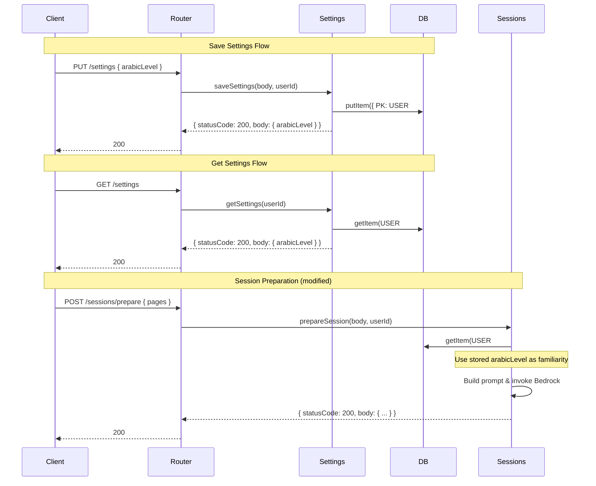

# Design Document: Arabic Level Settings

## Overview

This feature introduces a user settings system that persists the user's Arabic proficiency level (`new`, `somewhat_familiar`, `well_known`) in DynamoDB. It adds two new API routes (`PUT /settings` and `GET /settings`) handled by a new `src/settings.mjs` module, and modifies `prepareSession` to fetch the stored level instead of relying on the per-request `familiarity` field.

The design is intentionally minimal: one new module, two new router branches, and a small change to the session preparation flow. No infrastructure changes are needed — the existing single-table DynamoDB design and Lambda function support this directly.

## Architecture



## Components and Interfaces

### New Module: `src/settings.mjs`

Two exported functions:

```javascript
/**
 * Validates and persists the user's Arabic level.
 * @param {object} body - { arabicLevel: "new" | "somewhat_familiar" | "well_known" }
 * @param {string} userId
 * @returns {Promise<{ statusCode: number, body: object }>}
 */
export async function saveSettings(body, userId)

/**
 * Retrieves the user's stored Arabic level.
 * @param {string} userId
 * @returns {Promise<{ statusCode: number, body: object }>}
 */
export async function getSettings(userId)
```

### Router Changes (`src/router.mjs`)

Add two route branches:

- `PUT /settings` → `saveSettings(parsedBody, userId)`
- `GET /settings` → `getSettings(userId)`

Import `saveSettings` and `getSettings` from `./settings.mjs`.

### Session Changes (`src/sessions.mjs`)

Modify `prepareSession` to:

1. Call `getItem(`USER#${userId}`, "SETTINGS")` to fetch the stored settings record.
2. Use `storedRecord.arabicLevel` as the familiarity value if it exists.
3. If no stored level exists, fall back to `body.familiarity`.
4. If neither exists, return HTTP 400.
5. Ignore `body.familiarity` when a stored level is present.

## Data Models

### Settings Record (DynamoDB)

| Attribute    | Type   | Description                                          |
|-------------|--------|------------------------------------------------------|
| PK          | String | `USER#<userId>`                                      |
| SK          | String | `SETTINGS` (constant)                                |
| arabicLevel | String | One of: `"new"`, `"somewhat_familiar"`, `"well_known"` |
| updatedAt   | String | ISO 8601 timestamp of last update                    |

This follows the existing single-table pattern. One record per user, upserted on each PUT.


## Correctness Properties

*A property is a characteristic or behavior that should hold true across all valid executions of a system — essentially, a formal statement about what the system should do. Properties serve as the bridge between human-readable specifications and machine-verifiable correctness guarantees.*

### Property 1: Settings round-trip

*For any* valid `arabicLevel` value and any user ID, saving the setting via `saveSettings` and then retrieving it via `getSettings` should return the most recently saved `arabicLevel` value. If two different valid values are saved in sequence, `getSettings` should return only the second value.

**Validates: Requirements 1.1, 1.4, 1.5, 2.1**

### Property 2: Invalid arabicLevel values are rejected

*For any* string that is not one of `"new"`, `"somewhat_familiar"`, or `"well_known"` (including empty strings, null, and undefined), calling `saveSettings` should return a response with `statusCode` 400 and should not modify the user's stored settings.

**Validates: Requirements 1.2, 1.3**

### Property 3: Stored arabicLevel takes precedence over request-body familiarity

*For any* user with a stored `arabicLevel` and any `familiarity` value in the request body, `prepareSession` should use the stored `arabicLevel` as the familiarity level, ignoring the request-body value.

**Validates: Requirements 3.2, 3.4**

### Property 4: Router dispatches settings requests correctly

*For any* HTTP request with method PUT or GET and path `/settings`, the router should produce a response consistent with calling the corresponding settings handler (`saveSettings` or `getSettings`) directly.

**Validates: Requirements 4.1, 4.2**

## Error Handling

| Scenario                                      | HTTP Status | Error Message                                                    |
|-----------------------------------------------|-------------|------------------------------------------------------------------|
| Missing `arabicLevel` in PUT /settings body   | 400         | `"arabicLevel is required"`                                      |
| Invalid `arabicLevel` value                   | 400         | `"arabicLevel must be one of: new, somewhat_familiar, well_known"` |
| No stored setting and no body `familiarity`   | 400         | `"familiarity is required (set your Arabic level in settings or provide familiarity in the request)"` |
| DynamoDB read/write failure                   | 500         | `"An unexpected error occurred"` (generic, no internal details)  |

All error responses follow the existing `{ error: "...", message: "..." }` pattern used throughout the codebase. Internal error details (stack traces, DynamoDB error codes) are logged but never returned to the client.

## Testing Strategy

### Unit Tests

Unit tests cover specific examples and edge cases:

- `getSettings` returns `{ arabicLevel: null }` for a user with no settings record (Requirement 2.2)
- `prepareSession` returns 400 when no stored setting exists and no `familiarity` in body (Requirement 3.3)
- Router returns 404 for unrelated routes (regression)
- `saveSettings` returns 400 for each specific invalid value type: `undefined`, `""`, `"invalid_string"`

### Property-Based Tests

Property tests use `fast-check` (already in devDependencies) with a minimum of 100 iterations per property. Each test references its design document property.

| Property | Test Description | Tag |
|----------|-----------------|-----|
| Property 1 | Generate random valid arabicLevel values, save then get, verify round-trip | `Feature: arabic-level-settings, Property 1: Settings round-trip` |
| Property 2 | Generate arbitrary strings not in the valid set, verify 400 and no state change | `Feature: arabic-level-settings, Property 2: Invalid arabicLevel values are rejected` |
| Property 3 | Generate stored level + different body familiarity, verify stored level wins | `Feature: arabic-level-settings, Property 3: Stored arabicLevel takes precedence` |
| Property 4 | Generate PUT/GET events for /settings, verify router output matches direct handler call | `Feature: arabic-level-settings, Property 4: Router dispatches settings requests correctly` |

Each correctness property is implemented by a single property-based test. The DB layer will be mocked using an in-memory Map to isolate the settings logic from DynamoDB.
