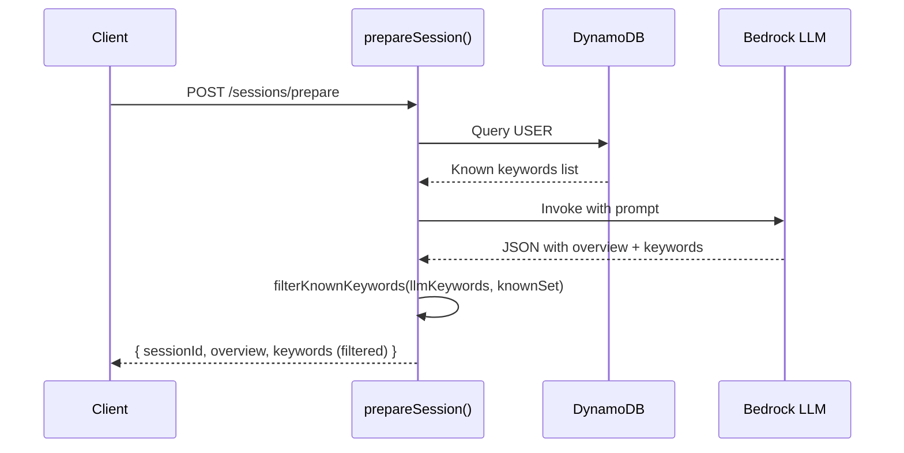
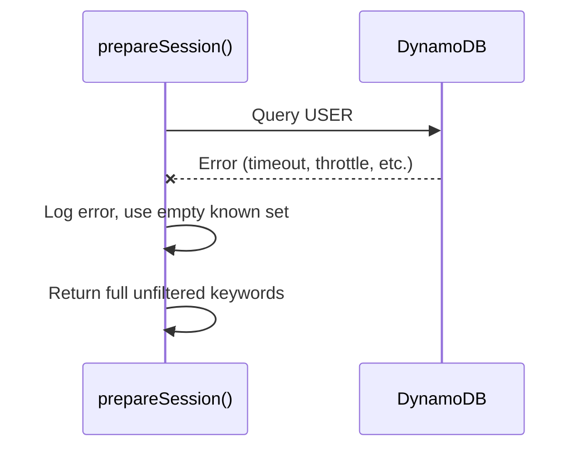

# Design Document: Known Keywords Filter

## Overview

This feature adds a filtering step to the `POST /sessions/prepare` endpoint so that keywords the user has already marked as "known" in previous sessions are excluded from the LLM-generated keyword list. The system queries DynamoDB for the user's known keywords, then removes matches from the LLM response before returning it to the client.

The filtering is a pure data transformation that sits between the LLM response parsing and the API response construction in `prepareSession()`. It does not modify any stored data and degrades gracefully — if the known-keywords query fails, the full unfiltered list is returned.

### Key Design Decisions

1. **Filter in `prepareSession()`, not a middleware**: The filtering is tightly coupled to the keyword response shape and only applies to one endpoint. A dedicated middleware would add unnecessary abstraction.
2. **Exact string matching on `arabic` field**: The requirements specify exact matching. Fuzzy or normalized matching would add complexity without a clear requirement.
3. **Graceful degradation on DB failure**: If the DynamoDB query for known keywords fails, we log the error and return the full keyword list rather than failing the entire request. This keeps the user experience intact.
4. **Extract filter logic into a pure function**: The actual filtering is a pure function (`filterKnownKeywords`) that takes the LLM keywords array and a Set of known Arabic strings, making it trivially testable without mocking.

## Architecture

The change is localized to `src/sessions.mjs`. No new files, routes, or infrastructure resources are needed.



### Error Path



## Components and Interfaces

### New Function: `filterKnownKeywords`

A pure function in `src/sessions.mjs`:

```javascript
/**
 * Removes keywords whose arabic field matches an entry in the known set.
 * Preserves original ordering.
 *
 * @param {Array<{arabic: string, translation: string, hint: string, type: string}>} keywords - LLM keywords
 * @param {Set<string>} knownArabicSet - Set of known Arabic strings
 * @returns {Array<{arabic: string, translation: string, hint: string, type: string}>} Filtered keywords
 */
function filterKnownKeywords(keywords, knownArabicSet) {
  return keywords.filter(k => !knownArabicSet.has(k.arabic));
}
```

### Modified Function: `prepareSession`

Changes to the existing function:

1. After extracting `userId`, query DynamoDB for known keywords using `queryItems(`USER#${userId}`, "KEYWORD#")`
2. Build a `Set<string>` from the `arabic` field of each returned item
3. Wrap the query in try/catch — on failure, log and use an empty Set
4. After parsing the LLM response, call `filterKnownKeywords()` on the keywords array
5. Apply `.slice(0, 20)` after filtering (preserving the existing cap)

### Existing Functions Used (No Changes)

- `queryItems(pk, skPrefix)` in `src/db.mjs` — already supports the `begins_with` query pattern needed
- `createSession()` in `src/sessions.mjs` — already writes `KEYWORD#{arabic}` items for known keywords; no changes needed

## Data Models

### Existing DynamoDB Schema (No Changes)

The known keywords are already stored by `createSession()`:

| Attribute     | Type   | Description                          |
|---------------|--------|--------------------------------------|
| PK            | String | `USER#{userId}`                      |
| SK            | String | `KEYWORD#{arabic}`                   |
| arabic        | String | The Arabic keyword text              |
| translation   | String | English translation                  |
| lastSeenAt    | String | ISO timestamp of last session        |
| sessionId     | String | ID of the session that stored it     |

### Query Pattern

```
PK = "USER#{userId}" AND begins_with(SK, "KEYWORD#")
```

This returns all known keywords for the user. The `arabic` field from each item is collected into a `Set<string>` for O(1) lookup during filtering.

### Keyword Object Shape (from LLM)

```json
{
  "arabic": "string",
  "translation": "string",
  "hint": "string",
  "type": "focus | advanced"
}
```

Matching is done on the `arabic` field only, using exact string equality.


## Correctness Properties

*A property is a characteristic or behavior that should hold true across all valid executions of a system — essentially, a formal statement about what the system should do. Properties serve as the bridge between human-readable specifications and machine-verifiable correctness guarantees.*

### Property 1: Filter correctness — known keywords are removed, unknowns preserved in order

*For any* list of LLM keyword objects and *for any* set of known Arabic strings, calling `filterKnownKeywords(keywords, knownSet)` should return exactly the subsequence of `keywords` whose `arabic` field is not in `knownSet`, preserving the original relative order.

This single property validates:
- Known keywords are removed (2.1)
- Only exact string matches on `arabic` are removed (2.2)
- Remaining keywords are returned (2.3)
- Original ordering is preserved (3.1)
- When all keywords are known, the result is empty (2.4, edge case)

**Validates: Requirements 2.1, 2.2, 2.3, 2.4, 3.1**

### Property 2: Output cap — at most 20 keywords returned

*For any* list of LLM keyword objects (of any length) and *for any* set of known Arabic strings, the final output of the prepare endpoint should contain at most 20 keywords.

**Validates: Requirements 3.2, 3.3**

### Property 3: Graceful degradation — DB failure returns full keyword list

*For any* list of LLM keyword objects, if the DynamoDB query for known keywords throws an error, the system should return the same keyword list as if the known set were empty (i.e., the full unfiltered list, capped at 20).

**Validates: Requirements 1.3**

## Error Handling

| Scenario | Behavior | User Impact |
|----------|----------|-------------|
| DynamoDB query for known keywords fails (timeout, throttle, internal error) | Log error via `console.error`, proceed with empty known set | User sees full unfiltered keyword list — no degradation in core functionality |
| LLM returns malformed JSON (existing handling) | Existing fallback: `{ overview: [raw], keywords: [] }` — no change | User sees raw text as overview, empty keywords |
| LLM returns fewer than 20 keywords | Filter runs normally, no padding | User sees fewer keywords (expected) |
| User has no known keywords in DynamoDB | Query returns empty array, filter is a no-op | User sees full keyword list (expected for new users) |

No new error codes or response shapes are introduced. The only new failure mode (DynamoDB query failure) is handled silently with graceful degradation.

## Testing Strategy

### Property-Based Tests (fast-check + vitest)

Each correctness property maps to a single property-based test with a minimum of 100 iterations.

**File**: `tests/property/keywords-filter.property.test.mjs`

| Test | Property | Generator Strategy |
|------|----------|--------------------|
| Filter correctness | Property 1 | Generate random arrays of keyword objects (random Arabic strings, translations, hints, types) and random Sets of known Arabic strings. Verify the output is the expected subsequence. |
| Output cap | Property 2 | Generate keyword arrays of varying lengths (0–50) and random known sets. Verify output length ≤ 20. |
| Graceful degradation | Property 3 | Generate random keyword arrays. Mock `queryItems` to throw. Verify output matches unfiltered list (capped at 20). |

Each test must be tagged with: `Feature: known-keywords-filter, Property {N}: {title}`

### Unit Tests (vitest)

**File**: `tests/unit/keywords-filter.test.mjs`

| Test | Validates |
|------|-----------|
| `prepareSession` queries DynamoDB with correct PK and SK prefix | Requirements 1.1, 1.2 |
| `createSession` still writes `KEYWORD#{arabic}` items for known keywords | Requirement 4.1 |
| Filter with empty known set returns all keywords | Baseline behavior |
| Filter with all keywords known returns empty array | Requirement 2.4 (edge case) |
| Filter with partially overlapping known set | Requirement 2.1 |

### Testing Configuration

- Library: `fast-check` (already in devDependencies)
- Runner: `vitest --run` (already configured)
- Minimum iterations: 100 per property test (`{ numRuns: 100 }`)
- Each property test must reference its design property in a comment tag:
  ```
  Feature: known-keywords-filter, Property {N}: {title}
  ```
- Each correctness property is implemented by exactly one property-based test
