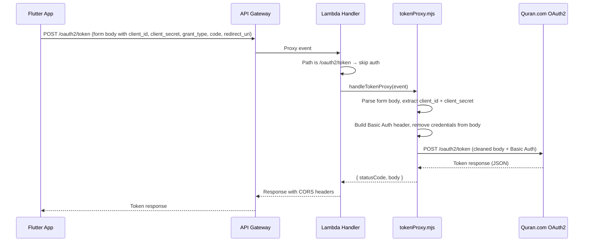
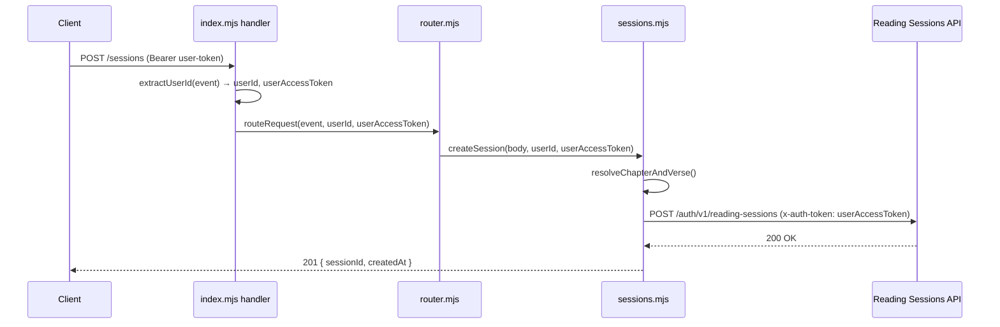
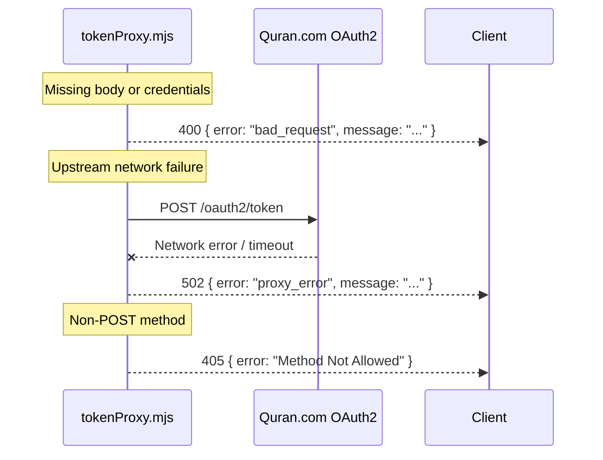

# Design Document: OAuth Token Proxy

## Overview

This feature adds two related capabilities to the existing Lambda:

1. **OAuth2 Token Proxy** (Requirements 1–7): A new `/oauth2/token` POST route that proxies OAuth2 token exchange requests from the Flutter web app to the Quran.com OAuth2 token endpoint. The route bypasses Bearer token authentication (since it's used to *obtain* a token), parses the form-urlencoded body, extracts `client_id` and `client_secret` to construct a Basic Auth header, removes them from the forwarded body, and sends the cleaned request upstream. The upstream response is returned as-is.

2. **User Token Forwarding for Session Sync** (Requirement 8): Modifies `syncReadingSession()` to use the caller's own Bearer token (passed through from the incoming request) instead of fetching a server-side client credentials token via `getPreliveAccessToken()`. This ensures reading session activity is recorded under the user's account.

### Key Design Decisions

1. **New module `src/tokenProxy.mjs`**: The token proxy logic is self-contained and unrelated to session management. A separate module keeps `sessions.mjs` focused and avoids bloating it further.
2. **Auth bypass at the handler level**: The `/oauth2/token` path is checked in `src/index.mjs` *before* calling `extractUserId()`. If matched, the request is routed directly to the token proxy without authentication. All other paths continue through the existing auth flow.
3. **Hardcoded upstream path**: The proxy only forwards to `/oauth2/token` on the derived TOKEN_HOST. The target URL is never accepted from the request, preventing open-proxy abuse.
4. **QF_ENV-based host resolution at request time**: TOKEN_HOST is derived from `process.env.QF_ENV` on every request, not at module load time. This supports environment variable changes without cold-start issues and matches the requirement.
5. **User token threading**: The user's Bearer token is extracted in `index.mjs` (already happens via `extractUserId`) and passed down through `createSession()` → `syncReadingSession()` as a parameter. `syncReadingSession()` stops calling `getPreliveAccessToken()` entirely.
6. **No new environment variables**: The proxy uses only the existing `QF_ENV`. The session sync change uses the existing `QF_PRELIVE_CLIENT_ID`.

## Architecture

### Token Proxy Flow



### User Token Forwarding Flow



### Error Paths



## Components and Interfaces

### New Module: `src/tokenProxy.mjs`

#### `getTokenHost()`

```javascript
/**
 * Derives the TOKEN_HOST from QF_ENV at request time.
 * @returns {string} The base URL of the OAuth2 token server
 */
function getTokenHost()
```

- `QF_ENV === "prelive"` → `https://prelive-oauth2.quran.foundation`
- `QF_ENV === "production"` or unset/unrecognized → `https://oauth2.quran.com`
- Called per-request, not cached at module level

#### `parseFormBody(body)`

```javascript
/**
 * Parses a URL-encoded form body string into key-value pairs.
 * @param {string} body - The raw form body
 * @returns {URLSearchParams} Parsed parameters
 */
function parseFormBody(body)
```

#### `handleTokenProxy(event)`

```javascript
/**
 * Handles POST /oauth2/token requests by proxying to the upstream OAuth2 endpoint.
 * @param {object} event - API Gateway proxy event
 * @returns {Promise<{statusCode: number, body: object}>}
 */
export async function handleTokenProxy(event)
```

Flow:
1. Validate method is POST → 405 if not
2. Validate body is present → 400 if missing
3. Parse form body, extract `client_id` and `client_secret` → 400 if either missing
4. Build Basic Auth header: `Basic ${base64(client_id:client_secret)}`
5. Remove `client_id` and `client_secret` from params
6. Derive TOKEN_HOST from `QF_ENV`
7. POST to `${TOKEN_HOST}/oauth2/token` with cleaned body and Basic Auth
8. Return upstream status code and JSON body
9. On network/fetch error → 502 with `proxy_error`

### Modified: `src/index.mjs`

The handler checks for `/oauth2/token` path before calling `extractUserId()`:

```javascript
// Before auth extraction
if (event.path === "/oauth2/token") {
  const result = await handleTokenProxy(event);
  return { statusCode: result.statusCode, headers: CORS_HEADERS, body: JSON.stringify(result.body) };
}

// Existing auth flow continues for all other paths
const userId = extractUserId(event);
```

Also passes the raw Bearer token to `routeRequest()`:

```javascript
const authHeader = event.headers?.Authorization || event.headers?.authorization;
const userAccessToken = authHeader?.startsWith("Bearer ") ? authHeader.slice(7) : null;
const result = await routeRequest(event, userId, userAccessToken);
```

### Modified: `src/router.mjs`

`routeRequest(event, userId, userAccessToken)` — accepts the new `userAccessToken` parameter and passes it to `createSession()`.

### Modified: `src/sessions.mjs`

#### `syncReadingSession(chapterNumber, verseNumber, userAccessToken)`

- Uses `userAccessToken` as the `x-auth-token` header instead of calling `getPreliveAccessToken()`
- Uses `process.env.QF_PRELIVE_CLIENT_ID` as the `x-client-id` header (instead of `QF_CLIENT_ID`)
- If `userAccessToken` is missing/empty, logs a warning and skips the sync entirely
- Does NOT log the token value

#### `createSession(body, userId, userAccessToken)`

- Accepts `userAccessToken` parameter
- Passes it to `syncReadingSession()`

## Data Models

### Token Proxy Request (from Flutter)

Form-urlencoded body:

| Field | Type | Required | Description |
|-------|------|----------|-------------|
| grant_type | string | Yes (by upstream) | OAuth2 grant type (e.g. `authorization_code`) |
| code | string | Conditional | Authorization code (for `authorization_code` grant) |
| redirect_uri | string | Conditional | Redirect URI (for `authorization_code` grant) |
| client_id | string | Yes | OAuth2 client ID — extracted and moved to Basic Auth |
| client_secret | string | Yes | OAuth2 client secret — extracted and moved to Basic Auth |

### Token Proxy Forwarded Request (to upstream)

| Aspect | Value |
|--------|-------|
| Method | POST |
| URL | `${TOKEN_HOST}/oauth2/token` |
| Content-Type | `application/x-www-form-urlencoded` |
| Authorization | `Basic ${base64(client_id:client_secret)}` |
| Body | Original form body minus `client_id` and `client_secret` |

### Token Proxy Response (pass-through)

The upstream response body is returned as-is with the upstream status code. Typical success response:

```json
{
  "access_token": "...",
  "token_type": "bearer",
  "expires_in": 3600,
  "refresh_token": "...",
  "scope": "..."
}
```

### Error Response Shapes

```json
// 400 Bad Request
{ "error": "bad_request", "message": "Missing request body" }
{ "error": "bad_request", "message": "Missing client_id" }
{ "error": "bad_request", "message": "Missing client_secret" }

// 405 Method Not Allowed
{ "error": "Method Not Allowed" }

// 502 Proxy Error
{ "error": "proxy_error", "message": "<error description>" }
```

### Modified Reading Sessions API Headers

| Header | Old Value | New Value |
|--------|-----------|-----------|
| `x-auth-token` | `getPreliveAccessToken()` result | `userAccessToken` (from incoming Bearer header) |
| `x-client-id` | `process.env.QF_CLIENT_ID` | `process.env.QF_PRELIVE_CLIENT_ID` |


## Correctness Properties

*A property is a characteristic or behavior that should hold true across all valid executions of a system — essentially, a formal statement about what the system should do. Properties serve as the bridge between human-readable specifications and machine-verifiable correctness guarantees.*

### Property 1: Non-POST methods return 405

*For any* HTTP method other than POST, calling `handleTokenProxy` with that method should return HTTP status 405 with body `{ "error": "Method Not Allowed" }`.

Reasoning: Requirement 1.2 specifies that only POST is allowed on the token proxy route. We can generate random non-POST HTTP methods (GET, PUT, DELETE, PATCH, HEAD, etc.) and verify they all produce 405.

**Validates: Requirements 1.2**

### Property 2: Basic Auth encoding correctness

*For any* `client_id` and `client_secret` strings present in a form-urlencoded body, the proxy should construct an Authorization header equal to `Basic ${base64(client_id + ":" + client_secret)}` and include it in the forwarded request.

Reasoning: This is a transformation property. The proxy extracts credentials from the body and re-encodes them as a Basic Auth header. For all possible credential strings, the encoding must be `base64(id:secret)`. This combines requirements 2.2, 2.3, and 3.2 which are all steps in the same credential transformation pipeline.

**Validates: Requirements 2.2, 2.3, 3.2**

### Property 3: Forwarded body excludes credentials, preserves other fields

*For any* form-urlencoded body containing `client_id`, `client_secret`, and arbitrary additional fields, the forwarded request body should contain exactly the additional fields (with their original values) and should not contain `client_id` or `client_secret`.

Reasoning: Requirements 2.4, 3.1, and 3.3 all describe the same invariant from different angles: the forwarded body is the original minus credentials, with nothing added. One property covers all three.

**Validates: Requirements 2.4, 3.1, 3.3**

### Property 4: TOKEN_HOST resolution from QF_ENV

*For any* value of the `QF_ENV` environment variable, `getTokenHost()` should return `https://prelive-oauth2.quran.foundation` when QF_ENV is `"prelive"`, and `https://oauth2.quran.com` for `"production"` or any other value (including undefined). Changing QF_ENV between calls should change the returned host accordingly.

Reasoning: Requirements 3.4, 3.5, 3.6, 6.1, and 7.1 all describe aspects of the same host resolution behavior. This single property validates the mapping, the default, and the per-request evaluation.

**Validates: Requirements 3.4, 3.5, 3.6, 6.1, 7.1**

### Property 5: Upstream response pass-through

*For any* upstream HTTP status code and JSON response body, the proxy should return the same status code and the same body to the caller without modification.

Reasoning: Requirements 4.1, 4.2, and 4.3 all describe pass-through behavior. One property validates that both status code and body are forwarded unchanged for all possible upstream responses.

**Validates: Requirements 4.1, 4.2, 4.3**

### Property 6: Fetch errors produce 502 proxy_error

*For any* error thrown by the upstream fetch call (network error, timeout, DNS failure, or unexpected error), the proxy should return HTTP status 502 with body containing `{ "error": "proxy_error", "message": "<description>" }`.

Reasoning: Requirements 5.1 and 5.2 describe the same error handling pattern for different error sources. One property covers both: any fetch-level error results in a 502 proxy_error response.

**Validates: Requirements 5.1, 5.2**

### Property 7: User token forwarded as x-auth-token in session sync

*For any* non-empty user access token string, when `syncReadingSession` is called with that token, the request to the Reading Sessions API should include the token as the `x-auth-token` header value.

Reasoning: Requirement 8.1 specifies the user's own token must be used instead of a server-side token. This property validates that for all possible token strings, the correct header is set.

**Validates: Requirements 8.1, 8.3**

### Property 8: Missing user token skips session sync

*For any* call to `syncReadingSession` where the user access token is null, undefined, or empty string, the function should skip the API call entirely and log a warning.

Reasoning: Requirement 8.6 specifies graceful handling when no user token is available. We can generate various falsy token values and verify no HTTP request is made.

**Validates: Requirements 8.6**

## Error Handling

| Scenario | Behavior | HTTP Status | Response Body |
|----------|----------|-------------|---------------|
| Non-POST method on `/oauth2/token` | Return method not allowed | 405 | `{ "error": "Method Not Allowed" }` |
| Missing or empty request body | Return bad request | 400 | `{ "error": "bad_request", "message": "Missing request body" }` |
| Missing `client_id` in form body | Return bad request | 400 | `{ "error": "bad_request", "message": "Missing client_id" }` |
| Missing `client_secret` in form body | Return bad request | 400 | `{ "error": "bad_request", "message": "Missing client_secret" }` |
| Upstream network error / timeout / DNS failure | Log error, return proxy error | 502 | `{ "error": "proxy_error", "message": "<error description>" }` |
| Unexpected error during request processing | Log error, return proxy error | 502 | `{ "error": "proxy_error", "message": "<error description>" }` |
| Upstream returns 4xx/5xx | Pass through upstream response | Upstream code | Upstream body (unchanged) |
| Missing user access token for session sync | Log warning, skip sync | N/A | Session creation still returns 201 |

Security-related error handling:
- `client_secret` and Basic Auth header values are never included in log output
- `userAccessToken` is never included in log output
- Error messages from upstream are passed through but local credential values are excluded from logs

## Testing Strategy

### Property-Based Tests (fast-check + vitest)

Each correctness property maps to a single property-based test with a minimum of 100 iterations.

**File**: `tests/property/oauth-token-proxy.property.test.mjs`

| Test | Property | Generator Strategy |
|------|----------|--------------------|
| Non-POST → 405 | Property 1 | Generate random HTTP methods excluding POST. Verify 405 response. |
| Basic Auth encoding | Property 2 | Generate random `client_id` and `client_secret` strings. Build form body, call proxy (mock fetch), verify Authorization header is `Basic base64(id:secret)`. |
| Forwarded body excludes credentials | Property 3 | Generate random form bodies with `client_id`, `client_secret`, and 0–5 additional fields. Mock fetch, verify forwarded body has all fields except credentials. |
| TOKEN_HOST resolution | Property 4 | Generate random QF_ENV values (including "production", "prelive", random strings, undefined). Verify `getTokenHost()` returns the correct URL. |
| Response pass-through | Property 5 | Generate random HTTP status codes (200–599) and random JSON objects. Mock fetch to return them. Verify proxy returns same status and body. |
| Fetch errors → 502 | Property 6 | Generate random Error objects with random messages. Mock fetch to throw. Verify 502 response with `proxy_error`. |
| User token forwarding | Property 7 | Generate random non-empty token strings. Mock fetch in syncReadingSession. Verify `x-auth-token` header matches the token. |
| Missing token skips sync | Property 8 | Generate null, undefined, and empty string tokens. Verify no fetch call is made and a warning is logged. |

Each test must be tagged with: `Feature: oauth-token-proxy, Property {N}: {title}`

### Unit Tests (vitest)

**File**: `tests/unit/oauth-token-proxy.test.mjs`

| Test | Validates |
|------|-----------|
| Handler routes POST `/oauth2/token` to token proxy without auth | Requirement 1.1 |
| Handler still requires auth for other paths (e.g. `/sessions`) | Requirement 1.3 |
| Missing body returns 400 with "Missing request body" | Requirement 2.5 |
| Body without `client_id` returns 400 with "Missing client_id" | Requirement 2.6 |
| Body without `client_secret` returns 400 with "Missing client_secret" | Requirement 2.7 |
| Error logging includes error message (but not secrets) | Requirement 5.3, 6.3 |
| `syncReadingSession` uses `QF_PRELIVE_CLIENT_ID` as `x-client-id` | Requirement 8.2 |
| `syncReadingSession` does not call `getPreliveAccessToken()` | Requirement 8.5 |

### Testing Configuration

- Library: `fast-check` (already in devDependencies)
- Runner: `vitest --run` (already configured)
- Minimum iterations: 100 per property test (`{ numRuns: 100 }`)
- Each property test must reference its design property in a comment tag:
  ```
  Feature: oauth-token-proxy, Property {N}: {title}
  ```
- Each correctness property is implemented by exactly one property-based test
