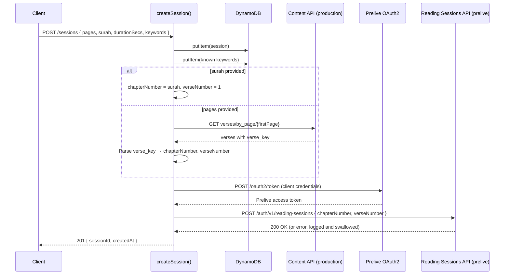
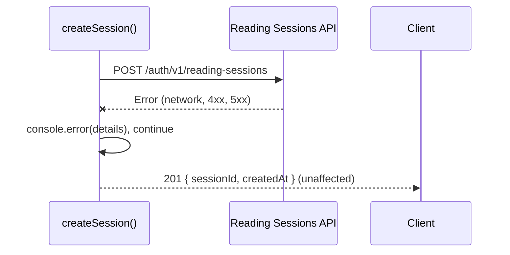

# Design Document: Reading Sessions Sync

## Overview

This feature adds a fire-and-forget sync step to the existing `createSession()` flow. After a session is persisted to DynamoDB, the system sends the session's chapter and verse information to the Quran.com Reading Sessions API (`POST /auth/v1/reading-sessions`) on the pre-production environment. This keeps the user's recitation history reflected on Quran.com without blocking or degrading the local session creation.

### Key Design Decisions

1. **Separate token cache for prelive auth**: The existing `getAccessToken()` uses `QF_ENV` to pick the auth server, which is set to `production` for the content API. The reading sessions sync always targets prelive, so a second token cache (`cachedPreliveToken` / `preliveTokenExpiresAt`) is maintained independently. This avoids mutating the existing token flow.
2. **Hardcoded prelive URLs**: The reading sessions sync always uses `prelive-oauth2.quran.foundation` and `apis-prelive.quran.foundation` regardless of `QF_ENV`. This is a deliberate constraint from the Quran.com API availability.
3. **Fire-and-forget with logging**: Sync failures (network errors, HTTP errors, token failures) are caught, logged, and swallowed. The `createSession()` response is never affected by sync outcomes.
4. **Page-to-chapter resolution via existing content API**: When a session uses `pages` instead of `surah`, we call the existing `fetchVersesForPage()` to get the first verse on the first page, then parse its `verse_key` (e.g. `"2:255"`) to extract chapter and verse numbers. This reuses existing infrastructure.
5. **No new files**: All changes are localized to `src/sessions.mjs`. The module already has the OAuth2 flow, API base URL maps, and verse-fetching logic.

## Architecture



### Error Path



## Components and Interfaces

### New Function: `getPreliveAccessToken`

A separate OAuth2 token function that always targets the prelive auth server, with its own in-memory cache.

```javascript
/**
 * Fetches an OAuth2 access token from the prelive auth server.
 * Caches independently from the production token used by the content API.
 */
async function getPreliveAccessToken() → string
```

- Auth server: `https://prelive-oauth2.quran.foundation/oauth2/token`
- Uses `QF_CLIENT_ID` and `QF_CLIENT_SECRET` from environment variables
- Client credentials flow with `grant_type=client_credentials`
- Caches token in module-level variables (`cachedPreliveToken`, `preliveTokenExpiresAt`)
- Refreshes 60 seconds before expiry (same pattern as existing `getAccessToken()`)
- Throws on non-success response after logging error details

### New Function: `syncReadingSession`

The core sync function that sends session data to the Reading Sessions API.

```javascript
/**
 * Syncs a completed session to the Quran.com Reading Sessions API.
 * Fire-and-forget: logs errors but never throws.
 *
 * @param {number} chapterNumber - Quran chapter number (>= 1)
 * @param {number} verseNumber - Verse number within the chapter (>= 1)
 */
async function syncReadingSession(chapterNumber, verseNumber) → void
```

- Endpoint: `POST https://apis-prelive.quran.foundation/auth/v1/reading-sessions`
- Headers: `x-auth-token` (prelive token), `x-client-id` (QF_CLIENT_ID), `Content-Type: application/json`
- Body: `{ "chapterNumber": integer, "verseNumber": integer }`
- Wraps entire flow in try/catch — logs and swallows all errors

### New Function: `resolveChapterAndVerse`

Resolves session data (surah or pages) into a `{ chapterNumber, verseNumber }` pair.

```javascript
/**
 * Resolves session parameters to chapter and verse numbers for the Reading Sessions API.
 *
 * @param {string|number|undefined} surah - Surah number if provided
 * @param {string|undefined} pages - Page range string if provided (e.g. "50-54")
 * @returns {Promise<{chapterNumber: number, verseNumber: number}>}
 */
async function resolveChapterAndVerse(surah, pages) → { chapterNumber, verseNumber }
```

- If `surah` is provided: returns `{ chapterNumber: Number(surah), verseNumber: 1 }`
- If `pages` is provided: calls `fetchVersesForPage(firstPage)`, parses the first verse's `verse_key` (e.g. `"2:255"` → `{ chapterNumber: 2, verseNumber: 255 }`)
- Throws if resolution fails (caller handles the error)

### Modified Function: `createSession`

After the existing DynamoDB writes (session + keywords), adds a fire-and-forget sync call:

```javascript
// After putItem and keyword upserts...
try {
  const { chapterNumber, verseNumber } = await resolveChapterAndVerse(surah, pages);
  await syncReadingSession(chapterNumber, verseNumber);
} catch (err) {
  console.error("Reading session sync failed:", err);
}
// Return 201 as before
```

### Existing Functions Used (No Changes)

- `getAccessToken()` — unchanged, continues to serve the content API
- `fetchVersesForPage(pageNumber)` — reused for page-to-chapter resolution
- `parsePageRange(pages)` — reused to extract the first page number from a range

## Data Models

### Reading Sessions API Request

```json
{
  "chapterNumber": 2,
  "verseNumber": 255
}
```

| Field | Type | Constraints | Description |
|-------|------|-------------|-------------|
| chapterNumber | integer | >= 1 | Quran chapter (surah) number |
| verseNumber | integer | >= 1 | Verse (ayah) number within the chapter |

### Reading Sessions API Headers

| Header | Value | Source |
|--------|-------|--------|
| `x-auth-token` | JWT access token | `getPreliveAccessToken()` |
| `x-client-id` | Client ID string | `process.env.QF_CLIENT_ID` |
| `Content-Type` | `application/json` | Static |

### Token Cache State (Module-Level)

Two independent caches coexist in `sessions.mjs`:

| Variable | Purpose |
|----------|---------|
| `cachedToken` / `tokenExpiresAt` | Existing production token for content API |
| `cachedPreliveToken` / `preliveTokenExpiresAt` | New prelive token for reading sessions API |

### Verse Key Parsing

The `verse_key` field from the content API has the format `"{chapter}:{verse}"` (e.g. `"2:255"`). Parsing:

```javascript
const [chapter, verse] = verseKey.split(":").map(Number);
// chapter = 2, verse = 255
```


## Correctness Properties

*A property is a characteristic or behavior that should hold true across all valid executions of a system — essentially, a formal statement about what the system should do. Properties serve as the bridge between human-readable specifications and machine-verifiable correctness guarantees.*

### Property 1: Surah resolution returns chapter number with verse 1

*For any* valid surah number (integer >= 1), calling `resolveChapterAndVerse(surah, undefined)` should return `{ chapterNumber: surah, verseNumber: 1 }`.

Reasoning: When a surah is provided directly, the chapter number is the surah itself and the verse defaults to 1. This is a straightforward mapping that must hold for all valid surah values.

**Validates: Requirements 2.3**

### Property 2: Verse key parsing extracts correct chapter and verse from first page

*For any* page range string and *for any* verse key in the format `"{chapter}:{verse}"` returned by the content API for the first page, `resolveChapterAndVerse(undefined, pages)` should return `{ chapterNumber: chapter, verseNumber: verse }` where chapter and verse are the integers parsed from the first verse's `verse_key`.

Reasoning: When pages are provided, we take the first page from the range, fetch its verses, and parse the first verse_key. The parsing of `"X:Y"` into `{ chapterNumber: X, verseNumber: Y }` must be correct for all valid verse keys. This combines requirements 2.4 and 4.1 — both are about resolving pages to chapter/verse via the first page.

**Validates: Requirements 2.4, 4.1**

### Property 3: Sync failure never affects createSession response

*For any* error thrown during the reading session sync (token acquisition failure, network error, HTTP error, verse resolution failure), `createSession()` should still return a 201 status code with the session data from DynamoDB.

Reasoning: This is the most critical property of the feature. The sync is fire-and-forget — any failure in the sync path (token, resolution, API call) must be caught and logged without propagating to the caller. This subsumes requirements 3.4 (token failure) and 4.3 (resolution failure) as specific cases.

**Validates: Requirements 3.3, 3.4, 4.3**

### Property 4: Prelive token caching is independent from production token

*For any* sequence of calls to `getAccessToken()` and `getPreliveAccessToken()`, the two token caches must operate independently: obtaining or expiring one token must not affect the other's cached value or expiry time.

Reasoning: The system maintains two separate OAuth2 tokens — one for the production content API and one for the prelive reading sessions API. Combining requirements 1.3 (prelive caching) and 1.4 (cache independence) into a single property that validates both caching correctness and isolation.

**Validates: Requirements 1.3, 1.4**

### Property 5: Environment isolation — prelive sync always uses prelive URLs

*For any* value of the `QF_ENV` environment variable (including `"production"`, `"prelive"`, or any other string), `getPreliveAccessToken()` must always use `https://prelive-oauth2.quran.foundation` as the auth base URL, and `syncReadingSession()` must always use `https://apis-prelive.quran.foundation` as the API base URL. Simultaneously, `getAccessToken()` must continue to use the URL corresponding to the current `QF_ENV` value.

Reasoning: The reading sessions sync is hardcoded to prelive regardless of environment configuration. The existing content API must remain unaffected. This combines 5.1, 5.2, and 5.3 into one comprehensive environment isolation property.

**Validates: Requirements 5.1, 5.2, 5.3**

### Property 6: Prelive auth error signaling

*For any* non-success HTTP status code (4xx, 5xx) returned by the prelive auth server, `getPreliveAccessToken()` should throw a descriptive error.

Reasoning: When the prelive auth server returns an error, the function must signal this by throwing rather than returning an invalid token. This ensures the caller (syncReadingSession) can catch and handle the failure appropriately.

**Validates: Requirements 1.5**

## Error Handling

| Scenario | Behavior | User Impact |
|----------|----------|-------------|
| Prelive auth server returns non-2xx | `getPreliveAccessToken()` logs error details and throws | Sync skipped, `createSession` returns 201 normally |
| Prelive auth server unreachable (network error) | `getPreliveAccessToken()` throws, caught by sync wrapper | Sync skipped, `createSession` returns 201 normally |
| Reading Sessions API returns non-2xx | `syncReadingSession()` logs status and response body | Sync logged as failed, `createSession` returns 201 normally |
| Reading Sessions API unreachable (network/timeout) | `syncReadingSession()` catches and logs error | Sync logged as failed, `createSession` returns 201 normally |
| Page-to-chapter resolution fails (content API error) | `resolveChapterAndVerse()` throws, caught by sync wrapper | Sync skipped, `createSession` returns 201 normally |
| Content API returns no verses for a page | `resolveChapterAndVerse()` throws (no verse_key to parse) | Sync skipped, `createSession` returns 201 normally |
| Invalid verse_key format from content API | Parsing produces NaN, caught by sync wrapper | Sync skipped, `createSession` returns 201 normally |

All sync errors are wrapped in a single try/catch in `createSession()`. No new error codes or response shapes are introduced to the client-facing API. The only observable effect of sync failures is console.error log output.

## Testing Strategy

### Property-Based Tests (fast-check + vitest)

Each correctness property maps to a single property-based test with a minimum of 100 iterations.

**File**: `tests/property/reading-sessions-sync.property.test.mjs`

| Test | Property | Generator Strategy |
|------|----------|--------------------|
| Surah resolution | Property 1 | Generate random integers >= 1 as surah numbers. Verify `resolveChapterAndVerse(surah, undefined)` returns `{ chapterNumber: surah, verseNumber: 1 }`. |
| Verse key parsing | Property 2 | Generate random verse keys in `"{int}:{int}"` format. Mock `fetchVersesForPage` to return a verse with that key. Verify parsed chapter and verse match. |
| Sync failure isolation | Property 3 | Generate random error types (Error, TypeError, network errors). Mock sync internals to throw. Verify `createSession()` still returns 201. |
| Token cache independence | Property 4 | Generate random sequences of `getAccessToken()` and `getPreliveAccessToken()` calls with random token values. Verify each cache returns its own token independently. |
| Environment isolation | Property 5 | Generate random `QF_ENV` values. Mock fetch to capture URLs. Verify prelive functions always use prelive URLs and production functions use QF_ENV-based URLs. |
| Auth error signaling | Property 6 | Generate random non-success HTTP status codes (400-599). Mock fetch to return that status. Verify `getPreliveAccessToken()` throws. |

Each test must be tagged with: `Feature: reading-sessions-sync, Property {N}: {title}`

### Unit Tests (vitest)

**File**: `tests/unit/reading-sessions-sync.test.mjs`

| Test | Validates |
|------|-----------|
| `syncReadingSession` sends POST to correct prelive URL with correct headers and JSON body | Requirements 2.1, 2.2, 2.5 |
| `getPreliveAccessToken` calls prelive auth server with correct client credentials | Requirement 1.1 |
| `createSession` calls `syncReadingSession` after DynamoDB writes succeed | Requirement 2.1 |
| Sync failure with HTTP 500 from Reading Sessions API is logged and swallowed | Requirement 3.1 |
| Sync failure with network error is logged and swallowed | Requirement 3.2 |
| `resolveChapterAndVerse` with pages calls `fetchVersesForPage` with first page number | Requirement 4.2 |
| Content API returns empty verses array — sync is skipped gracefully | Edge case for 4.3 |

### Testing Configuration

- Library: `fast-check` (already in devDependencies)
- Runner: `vitest --run` (already configured)
- Minimum iterations: 100 per property test (`{ numRuns: 100 }`)
- Each property test must reference its design property in a comment tag:
  ```
  Feature: reading-sessions-sync, Property {N}: {title}
  ```
- Each correctness property is implemented by exactly one property-based test
