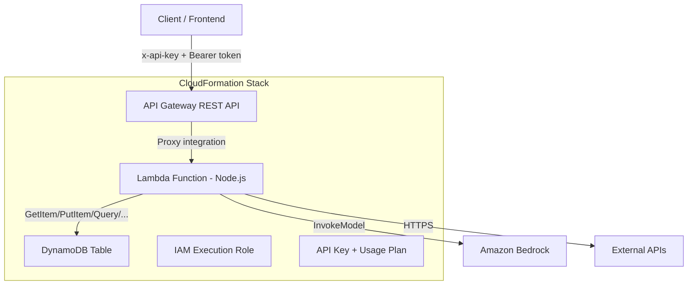

# Design Document: Serverless MVP Backend

## Overview

This design describes an MVP serverless backend on AWS consisting of:

- A single CloudFormation template defining all infrastructure
- An API Gateway REST API with API key enforcement and CORS support
- A monolith Node.js Lambda function handling all requests
- A DynamoDB single-table for persistence
- Integration with Amazon Bedrock via the Strands Agents SDK
- Simple Bearer token authentication (token = user ID)

The system is intentionally minimal — a skeleton for rapid iteration on business logic and data modeling.

## Architecture



### Request Flow

1. Client sends HTTP request with `x-api-key` header and `Authorization: Bearer {userId}` header
2. API Gateway validates the API key — rejects with 403 if invalid
3. API Gateway forwards request to Lambda via `{proxy+}` integration
4. Lambda extracts userId from Bearer token — rejects with 401 if missing/malformed
5. Lambda routes request by HTTP method + path
6. Lambda performs business logic (DynamoDB queries, Bedrock invocations, external API calls)
7. Lambda returns JSON response with appropriate status code and CORS headers

## Components and Interfaces

### 1. CloudFormation Template (`template.yaml`)

Single YAML file defining all resources:

| Resource | Type | Purpose |
|---|---|---|
| RestApi | AWS::ApiGateway::RestApi | HTTP entry point |
| ProxyResource | AWS::ApiGateway::Resource | `{proxy+}` catch-all path |
| ProxyMethod | AWS::ApiGateway::Method | ANY method with API key required |
| OptionsMethod | AWS::ApiGateway::Method | CORS preflight (no API key) |
| Deployment | AWS::ApiGateway::Deployment | API deployment |
| Stage | AWS::ApiGateway::Stage | Stage (parameterized) |
| ApiKey | AWS::ApiGateway::ApiKey | API key resource |
| UsagePlan | AWS::ApiGateway::UsagePlan | Usage plan for tracking |
| UsagePlanKey | AWS::ApiGateway::UsagePlanKey | Associates key with plan |
| LambdaFunction | AWS::Lambda::Function | Monolith handler |
| LambdaPermission | AWS::Lambda::Permission | Allows API GW to invoke Lambda |
| DynamoDBTable | AWS::DynamoDB::Table | Single-table persistence |
| LambdaRole | AWS::IAM::Role | Execution role with DDB + Bedrock + logs permissions |

Parameters: `StageName` (default: `dev`), `ProjectName` (default: `serverless-mvp`)

Outputs: API invoke URL, API key value

### 2. Lambda Function (`src/index.mjs`)

Entry point handler with the following internal structure:


```
src/
  index.mjs          — Lambda handler entry point
  auth.mjs           — Bearer token extraction/validation
  router.mjs         — HTTP method + path routing
  agent.mjs          — Strands Agents SDK integration
  db.mjs             — DynamoDB client helpers
```

#### Handler Interface

```javascript
// index.mjs
export async function handler(event, context) → { statusCode, headers, body }
```

The handler:
1. Adds CORS headers to every response
2. Calls `extractUserId(event)` — returns userId or throws 401
3. Calls `routeRequest(event, userId)` — dispatches to appropriate logic
4. Catches errors and returns structured JSON error responses

#### Auth Module Interface

```javascript
// auth.mjs
export function extractUserId(event) → string  // throws on missing/invalid token
```

Extracts userId from `event.headers.Authorization` (or `event.headers.authorization` — case-insensitive lookup). Validates the `Bearer ` prefix. Returns the portion after `"Bearer "`.

#### Router Module Interface

```javascript
// router.mjs
export async function routeRequest(event, userId) → { statusCode, body }
```

Matches `event.httpMethod` and `event.path` (or `event.resource`). Returns a stub response for MVP — the user will add real routes later.

#### Agent Module Interface

```javascript
// agent.mjs
import { Agent } from "strands-agents";
export async function invokeAgent(prompt, userId) → string
```

Creates a Strands Agent configured with Bedrock model, invokes it, returns the response text.

#### DB Module Interface

```javascript
// db.mjs
import { DynamoDBClient } from "@aws-sdk/client-dynamodb";
import { DynamoDBDocumentClient, GetCommand, PutCommand, QueryCommand, UpdateCommand, DeleteCommand } from "@aws-sdk/lib-dynamodb";

export const docClient;  // DynamoDB Document Client singleton
export async function getItem(pk, sk) → object | null
export async function putItem(item) → void
export async function queryItems(pk, skPrefix?) → object[]
export async function updateItem(pk, sk, updates) → object
export async function deleteItem(pk, sk) → void
```

Table name read from `process.env.TABLE_NAME` environment variable set by CloudFormation.

### 3. API Gateway

- REST API with `{proxy+}` resource
- ANY method on proxy resource → Lambda proxy integration, `apiKeyRequired: true`
- OPTIONS method on proxy resource → Mock integration returning CORS headers (no API key required)
- API key + usage plan for request tracking
- Stage deployed with parameterized name

### 4. CORS Configuration

CORS headers added at two levels:
- **OPTIONS preflight**: Mock integration in API Gateway returns 200 with CORS headers
- **All other responses**: Lambda adds CORS headers to every response

Headers:
```
Access-Control-Allow-Origin: *
Access-Control-Allow-Methods: GET, POST, PUT, DELETE, OPTIONS
Access-Control-Allow-Headers: Content-Type, Authorization, x-api-key
```

## Data Models

### DynamoDB Single Table Schema

| Attribute | Type | Description |
|---|---|---|
| PK | String (Partition Key) | Entity-prefixed partition key (e.g., `USER#userId`) |
| SK | String (Sort Key) | Entity-prefixed sort key (e.g., `PROFILE#userId`) |
| ...additional attributes | Varies | Entity-specific data fields |

Billing mode: `PAY_PER_REQUEST` (on-demand)
DeletionPolicy: `Retain`

The table schema is intentionally minimal — just PK and SK. The user will iterate on entity design (access patterns, GSIs) as the MVP evolves.

### Request/Response Models

#### Successful Response
```json
{
  "statusCode": 200,
  "headers": {
    "Content-Type": "application/json",
    "Access-Control-Allow-Origin": "*",
    "Access-Control-Allow-Methods": "GET, POST, PUT, DELETE, OPTIONS",
    "Access-Control-Allow-Headers": "Content-Type, Authorization, x-api-key"
  },
  "body": "{\"message\": \"...\"}"
}
```

#### Error Response
```json
{
  "statusCode": 401,
  "headers": { "...CORS headers..." },
  "body": "{\"error\": \"Unauthorized\", \"message\": \"Missing or invalid Authorization header\"}"
}
```

Status codes used: 200, 401, 403 (API GW), 404, 500


## Correctness Properties

*A property is a characteristic or behavior that should hold true across all valid executions of a system — essentially, a formal statement about what the system should do. Properties serve as the bridge between human-readable specifications and machine-verifiable correctness guarantees.*

### Property 1: Bearer token extraction round trip

*For any* non-empty string `userId`, constructing the header value `"Bearer " + userId` and passing it through `extractUserId` should return exactly `userId`.

**Validates: Requirements 3.1**

### Property 2: Invalid authorization headers are rejected

*For any* string that does not start with `"Bearer "`, passing it as the Authorization header value to `extractUserId` should throw an error (resulting in a 401 response).

**Validates: Requirements 3.3**

### Property 3: Router always returns a structured response

*For any* valid HTTP method (GET, POST, PUT, DELETE, PATCH) and any path string, calling `routeRequest` should return an object with a numeric `statusCode` and a string or object `body` — never throw an unhandled exception.

**Validates: Requirements 4.4**

### Property 4: All Lambda responses have valid structure with CORS headers

*For any* request processed by the Lambda handler (regardless of outcome — success, auth failure, routing miss, or internal error), the response object must contain a numeric `statusCode`, a `headers` object including `Access-Control-Allow-Origin`, `Access-Control-Allow-Methods`, and `Access-Control-Allow-Headers`, and a JSON-parseable `body` string.

**Validates: Requirements 4.5, 7.1**

### Property 5: Internal errors produce safe 500 responses

*For any* error thrown during request processing (DynamoDB failures, Bedrock failures, unexpected exceptions), the Lambda handler should return a 500 status code with a response body that does not contain stack traces, internal error messages, or AWS resource identifiers.

**Validates: Requirements 6.4**

## Error Handling

### Authentication Errors (401)
- Missing `Authorization` header → `{ "error": "Unauthorized", "message": "Missing Authorization header" }`
- Malformed token (no `Bearer ` prefix) → `{ "error": "Unauthorized", "message": "Invalid Authorization header format" }`

### API Key Errors (403)
- Handled by API Gateway natively — no Lambda code involved

### Not Found (404)
- Unmatched route → `{ "error": "Not Found", "message": "Route not found" }`

### Internal Server Errors (500)
- DynamoDB access failures → `{ "error": "Internal Server Error", "message": "An unexpected error occurred" }`
- Bedrock invocation failures → same generic message
- Any unhandled exception → same generic message
- No internal details (stack traces, resource ARNs) are ever exposed in error responses

### Error Handling Strategy
- The handler wraps all logic in a try/catch
- Auth errors are thrown and caught with specific status codes
- All other errors default to 500 with a generic message
- Every error response includes CORS headers

## Testing Strategy

### Unit Tests
Use a standard test runner (e.g., `vitest` or Node.js built-in test runner) for:
- Specific examples of Bearer token extraction (known inputs/outputs)
- CloudFormation template validation (resource types, parameters, outputs exist)
- OPTIONS preflight response structure
- Missing Authorization header returns 401
- Known route returns expected response

### Property-Based Tests
Use `fast-check` library for property-based testing:
- Minimum 100 iterations per property test
- Each test tagged with: **Feature: serverless-mvp-backend, Property {N}: {title}**
- Each correctness property (1–5) implemented as a single property-based test

Property test plan:
| Property | Generator Strategy |
|---|---|
| 1: Bearer token round trip | Generate arbitrary non-empty strings as userIds |
| 2: Invalid auth rejection | Generate arbitrary strings, filter out those starting with "Bearer " |
| 3: Router structured response | Generate from set of HTTP methods × arbitrary path strings |
| 4: Response structure + CORS | Generate full mock API Gateway events (valid and invalid auth, various paths) |
| 5: Safe 500 responses | Generate random Error objects, mock DDB/Bedrock clients to throw them |

### Test File Organization
```
tests/
  unit/
    auth.test.mjs
    router.test.mjs
    template.test.mjs
  property/
    auth.property.test.mjs
    handler.property.test.mjs
```

