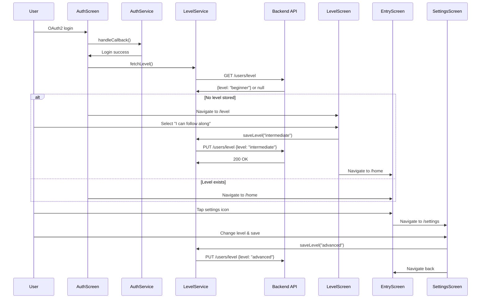
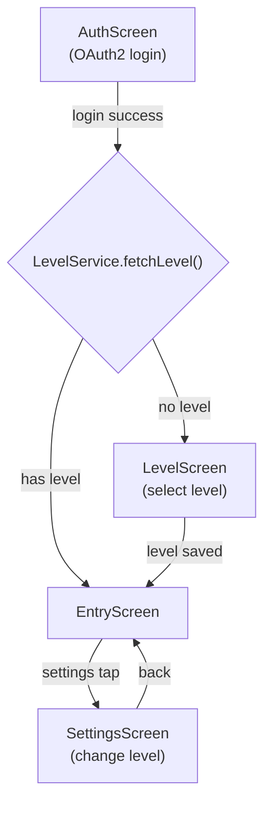

# Design Document: Arabic Level Selection

## Overview

This feature adds an Arabic proficiency level selection flow to the Quran Prep app. After OAuth2 login, the app checks whether the user has a stored Arabic level. If not, a full-screen Level Screen is shown before the Entry Screen. The user picks from three options ("I'm a beginner", "I can follow along", "I read with understanding") which map to `beginner`, `intermediate`, and `advanced` respectively. The selection is persisted to the backend via a new `LevelService`. A settings button on the Entry Screen lets users change their level at any time via a Settings Screen.

### Key Design Decisions

1. **LevelService follows SessionService pattern**: Accepts an `AuthService` instance, uses `getAuthHeaders()` for authentication, reads `BASE_URL` and `API_KEY` from `.env`, and accepts an optional `http.Client` for testability.
2. **In-memory level cache**: The fetched/saved Arabic level is stored in `LevelService._currentLevel` for the session. No local persistence needed since the app already redirects to AuthScreen on page refresh.
3. **Navigation gating in AuthScreen**: After successful OAuth2 callback, `AuthScreen` calls `LevelService.fetchLevel()`. Based on the result, it navigates to either `/level` or `/home`. This keeps the gate logic centralized.
4. **Shared widget for level options**: Both `LevelScreen` and `SettingsScreen` display the same three-option picker. A shared `LevelOptionPicker` widget avoids duplication.
5. **AuthService and LevelService passed via route arguments**: Consistent with the existing pattern where `AuthService` is passed to `EntryScreen` via `Navigator` arguments.

## Architecture



### Navigation Flow



## Components and Interfaces

### 1. LevelService (lib/services/level_service.dart)

New service following the `SessionService` pattern.

```dart
class LevelService {
  final AuthService _authService;
  String? _currentLevel; // 'beginner' | 'intermediate' | 'advanced' | null

  LevelService({required AuthService authService})
      : _authService = authService;

  /// Returns the currently cached Arabic level, or null if not set.
  String? get currentLevel => _currentLevel;

  /// Fetches the user's Arabic level from the backend.
  /// Returns the level string or null if none is set.
  /// On HTTP failure, returns null (treat as no level).
  Future<String?> fetchLevel({http.Client? client}) async { ... }

  /// Saves or updates the user's Arabic level via the backend.
  /// Updates _currentLevel on success. Throws on failure.
  Future<void> saveLevel(String level, {http.Client? client}) async { ... }
}
```

API calls use `getAuthHeaders()` from `AuthService` and include `x-api-key` from `.env`, matching the `SessionService` pattern.

### 2. LevelScreen (lib/screens/level_screen.dart)

Full-screen page shown on first login when no Arabic level is stored.

- Displays a heading (e.g. "What's your Arabic level?") using `AppTextStyles.h1`
- Renders three tappable option cards via the shared `LevelOptionPicker` widget
- Shows a "Continue" button at the bottom, disabled until an option is selected
- On confirm: calls `LevelService.saveLevel()`, then navigates to `/home`
- On API error: shows an error message below the button
- Receives `AuthService` and `LevelService` via route arguments

### 3. SettingsScreen (lib/screens/settings_screen.dart)

Screen accessible from the Entry Screen settings button.

- Displays the same three level options via `LevelOptionPicker`, pre-selecting the current level from `LevelService.currentLevel`
- Shows a "Save" button to persist changes
- On save: calls `LevelService.saveLevel()`, then navigates back
- On API error: shows an error message
- Provides a back button/arrow to return to Entry Screen
- Receives `AuthService` and `LevelService` via route arguments

### 4. LevelOptionPicker (lib/widgets/level_option_picker.dart)

Shared stateless widget used by both `LevelScreen` and `SettingsScreen`.

```dart
class LevelOptionPicker extends StatelessWidget {
  final String? selectedLevel;
  final ValueChanged<String> onSelected;

  const LevelOptionPicker({
    super.key,
    required this.selectedLevel,
    required this.onSelected,
  });
}
```

Renders three tappable cards:
| Label | Internal Value |
|-------|---------------|
| "I'm a beginner" | `beginner` |
| "I can follow along" | `intermediate` |
| "I read with understanding" | `advanced` |

Selected card gets a highlighted border (`AppColors.primary`) and background tint (`AppColors.primaryLight`). Unselected cards use `AppColors.border`.

### 5. AuthScreen (lib/screens/auth_screen.dart) — Updated

After successful `handleCallback()`:
1. Create `LevelService` with the authenticated `AuthService`
2. Call `await levelService.fetchLevel()`
3. If `levelService.currentLevel == null` → navigate to `/level` with both services as arguments
4. Else → navigate to `/home` with both services as arguments

### 6. EntryScreen (lib/screens/entry_screen.dart) — Updated

- Add a settings `IconButton` (e.g. `Icons.settings`) in the top action bar `Row`, next to the existing logout button
- On tap: navigate to `/settings` passing `AuthService` and `LevelService` as arguments
- Extract `LevelService` from route arguments alongside `AuthService`

### 7. main.dart — Updated Routes

Add two new routes:

```dart
routes: {
  '/': (_) => AuthScreen(oauthCallback: oauthCallback),
  '/home': (_) => const EntryScreen(),
  '/level': (_) => const LevelScreen(),
  '/settings': (_) => const SettingsScreen(),
  '/prep': (_) => const PrepScreen(),
  '/recitation': (_) => const RecitationScreen(),
  '/feedback': (_) => const FeedbackScreen(),
},
```

## Data Models

### Arabic Level Values

| Label | Internal Value | Description |
|-------|---------------|-------------|
| "I'm a beginner" | `beginner` | User is new to Arabic |
| "I can follow along" | `intermediate` | User can follow recitation |
| "I read with understanding" | `advanced` | User reads Arabic with comprehension |

### LevelService State

| Field | Type | Description |
|-------|------|-------------|
| `_currentLevel` | `String?` | Cached Arabic level for the session, null if not set |
| `_authService` | `AuthService` | For obtaining auth headers |

### API: Fetch Level

```
GET {BASE_URL}/users/level
Headers: Authorization: Bearer {access_token}, x-api-key: {API_KEY}
Response 200: { "level": "beginner" }
Response 200: { "level": null }  (no level set)
```

### API: Save/Update Level

```
PUT {BASE_URL}/users/level
Headers: Authorization: Bearer {access_token}, x-api-key: {API_KEY}, Content-Type: application/json
Body: { "level": "intermediate" }
Response 200: { "level": "intermediate" }
```

Note: Exact API endpoint paths will be confirmed later. The design uses placeholder paths that follow the existing `{BASE_URL}/...` convention.


## Correctness Properties

*A property is a characteristic or behavior that should hold true across all valid executions of a system — essentially, a formal statement about what the system should do. Properties serve as the bridge between human-readable specifications and machine-verifiable correctness guarantees.*

### Property 1: Confirmation button enabled state tracks selection

*For any* selection state (null, "beginner", "intermediate", or "advanced"), the confirmation/save button on the Level Screen should be enabled if and only if a non-null level is selected. When no option is selected, the button must be disabled.

**Validates: Requirements 1.6**

### Property 2: Post-login navigation routes based on level presence

*For any* authenticated user, after a successful OAuth2 login, if `LevelService.fetchLevel()` returns null (no stored level), the app should navigate to the Level Screen. If `fetchLevel()` returns a valid level string, the app should navigate directly to the Entry Screen.

**Validates: Requirements 2.2, 2.3, 4.3, 4.4**

### Property 3: Save-fetch level round trip

*For any* valid Arabic level value ("beginner", "intermediate", or "advanced"), saving that level via `LevelService.saveLevel()` and then fetching it via `LevelService.fetchLevel()` should return the same level value.

**Validates: Requirements 3.1, 3.2, 4.2**

### Property 4: Fetch level caches result locally

*For any* valid Arabic level returned by the backend API, after `LevelService.fetchLevel()` completes successfully, `LevelService.currentLevel` should equal the returned level value. When the API returns no level, `currentLevel` should be null.

**Validates: Requirements 4.2, 4.3**

### Property 5: Save level updates local cache

*For any* valid Arabic level value, after `LevelService.saveLevel()` completes successfully, `LevelService.currentLevel` should equal the saved level value.

**Validates: Requirements 3.2, 6.4**

## Error Handling

| Scenario | Handling |
|----------|----------|
| Fetch level API failure | `LevelService.fetchLevel()` returns null, treating the user as having no level. The Level Screen is shown. |
| Save level API failure | `LevelService.saveLevel()` throws an exception. The Level Screen / Settings Screen displays "Could not save your Arabic level. Please try again." |
| Network timeout during fetch/save | The `http` package throws a `ClientException`. Caught and surfaced as an error message on the respective screen. |
| Missing `BASE_URL` or `API_KEY` in `.env` | `LevelService` throws an exception before making the API call, same pattern as `SessionService`. |
| Invalid level value passed to `saveLevel` | `saveLevel` validates the input is one of the three valid values; throws `ArgumentError` for invalid input. |
| Route arguments missing on Level/Settings Screen | Redirect to AuthScreen (same pattern as EntryScreen's existing guard). |

## Testing Strategy

### Unit Tests

Unit tests cover specific examples, edge cases, and UI rendering:

- **LevelService**: `currentLevel` is null initially (7.4)
- **LevelService.fetchLevel**: Returns correct level when API responds with a level; returns null when API responds with no level; returns null when API call fails
- **LevelService.saveLevel**: Throws `ArgumentError` for invalid level values (e.g. empty string, "expert")
- **LevelScreen widget**: Heading text is rendered; three option labels are present ("I'm a beginner", "I can follow along", "I read with understanding"); confirmation button is present (1.1, 1.2, 1.5)
- **LevelScreen widget**: Tapping an option highlights it visually (1.4)
- **LevelScreen widget**: Selecting and confirming navigates to Entry Screen (2.4)
- **LevelScreen widget**: API failure shows error message (3.3)
- **SettingsScreen widget**: Three options rendered; current level is pre-selected (6.1, 6.2)
- **SettingsScreen widget**: Back navigation works (6.6)
- **SettingsScreen widget**: API failure shows error message (6.5)
- **EntryScreen**: Settings icon button is rendered alongside logout button (5.1)
- **EntryScreen**: Tapping settings navigates to Settings Screen (5.2)
- **AuthScreen**: After login, fetchLevel is called (2.1, 4.1)
- **Label mapping**: "I'm a beginner" → beginner, "I can follow along" → intermediate, "I read with understanding" → advanced (1.3)

### Property-Based Tests

Property-based tests use loop-based random generation inside standard `test()` blocks, running a minimum of 100 iterations per property. Each test is tagged with a comment referencing the design property.

- **Feature: arabic-level-selection, Property 1: Confirmation button enabled state tracks selection**
  Generate random selection states (null and the three valid level strings). For each state, render the Level Screen and verify the button's enabled state matches whether a selection exists.

- **Feature: arabic-level-selection, Property 2: Post-login navigation routes based on level presence**
  Generate random level states (null and valid level strings). Mock `LevelService.fetchLevel()` to return each state. Verify navigation target is `/level` when null, `/home` when non-null.

- **Feature: arabic-level-selection, Property 3: Save-fetch level round trip**
  For each of the three valid level values, mock the backend to echo back the saved value. Call `saveLevel()` then `fetchLevel()` and verify the returned value matches.

- **Feature: arabic-level-selection, Property 4: Fetch level caches result locally**
  Generate random valid level strings (including null). Mock the API to return each value. Call `fetchLevel()` and verify `currentLevel` matches the API response.

- **Feature: arabic-level-selection, Property 5: Save level updates local cache**
  For each valid level value, mock a successful API response. Call `saveLevel()` and verify `currentLevel` equals the saved value.

### Test Configuration

- Property-based tests: minimum 100 iterations per property via loop-based generation in standard `test()` blocks
- HTTP calls mocked using a custom `http.Client` passed via the `client` parameter (same pattern as `SessionService`)
- Widget tests use `WidgetTester` with mocked services passed as route arguments
