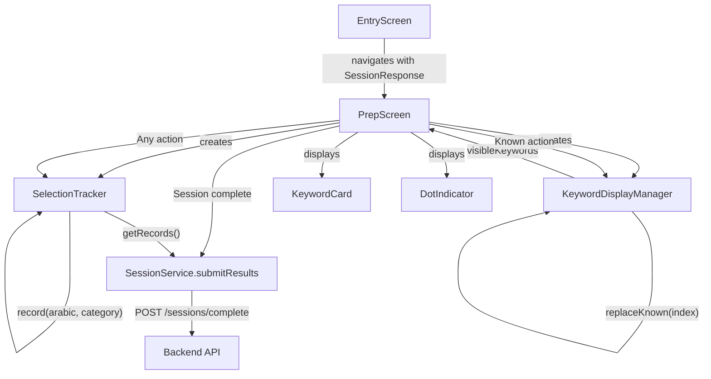
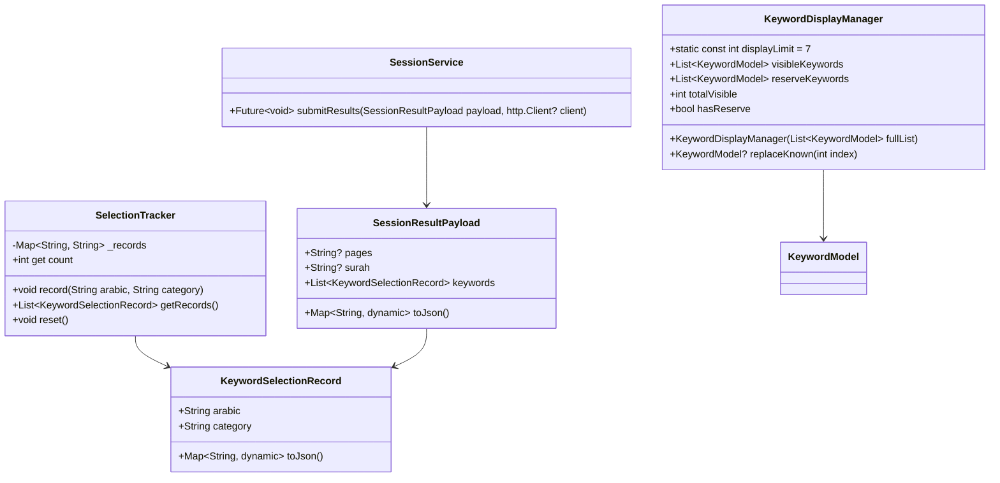

# Design Document: Keyword Display Limit

## Overview

This feature limits the prep screen to showing 7 keywords at a time from the full backend list, replaces "known" keywords with reserve keywords, tracks user categorizations (known/not_sure/review), and submits the complete selection results to the backend on session completion.

The implementation touches four areas:

1. **KeywordDisplayManager** — a pure-Dart class that manages the visible/reserve keyword split, handles replacements on "known" actions, and exposes the current visible set.
2. **SelectionTracker** — a pure-Dart class that records keyword categorizations (known, not_sure, review) keyed by the keyword's `arabic` field, with last-write-wins semantics.
3. **SessionService extension** — a new `submitResults()` method that POSTs the session scope and keyword selection records to the backend.
4. **PrepScreen refactor** — wiring the manager and tracker into the existing screen, updating the dot indicator and card counter to reflect the dynamic visible set.

Design decisions:

- **Pure-Dart logic classes**: `KeywordDisplayManager` and `SelectionTracker` are plain Dart classes with no Flutter dependency. This makes them trivially unit-testable and property-testable with `glados`.
- **Display limit as a named constant**: `KeywordDisplayManager.displayLimit = 7` is the single source of truth. All logic references this constant.
- **In-place replacement**: When a keyword is marked "known", the replacement keyword occupies the same index position. The card index does not advance, so the user sees the new keyword immediately.
- **Separation from UI state**: The prep screen delegates all keyword management to `KeywordDisplayManager` and all tracking to `SelectionTracker`. The screen only manages UI concerns (flip state, navigation).

## Architecture





## Components and Interfaces

### KeywordDisplayManager

**File:** `lib/services/keyword_display_manager.dart`

```dart
class KeywordDisplayManager {
  static const int displayLimit = 7;

  final List<KeywordModel> _fullList;
  late List<KeywordModel> _visible;
  late List<KeywordModel> _reserve;

  KeywordDisplayManager(List<KeywordModel> fullList) : _fullList = fullList {
    _visible = fullList.take(displayLimit).toList();
    _reserve = fullList.skip(displayLimit).toList();
  }

  List<KeywordModel> get visibleKeywords => List.unmodifiable(_visible);
  List<KeywordModel> get reserveKeywords => List.unmodifiable(_reserve);
  int get totalVisible => _visible.length;
  bool get hasReserve => _reserve.isNotEmpty;

  /// Removes the keyword at [index] from visible.
  /// If reserve is non-empty, inserts the next reserve keyword at the same index.
  /// If reserve is empty, the visible list shrinks by one.
  /// Returns the replacement keyword, or null if no replacement was available.
  KeywordModel? replaceKnown(int index);
}
```

- Constructor takes the full keyword list from the backend response.
- `replaceKnown` is the only mutation method. It handles both the replacement and shrink cases.
- Visible and reserve lists are exposed as unmodifiable views to prevent external mutation.

### SelectionTracker

**File:** `lib/services/selection_tracker.dart`

```dart
class SelectionTracker {
  final Map<String, String> _records = {};

  void record(String arabic, String category);
  List<KeywordSelectionRecord> getRecords();
  int get count => _records.length;
  void reset();
}
```

- Uses a `Map<String, String>` keyed by `arabic` field. Last-write-wins for duplicate categorizations.
- `getRecords()` returns a list of `KeywordSelectionRecord` for submission.
- `reset()` clears all records for a new session.

### KeywordSelectionRecord (Data Model)

**File:** `lib/models/keyword_selection_record.dart`

```dart
class KeywordSelectionRecord {
  final String arabic;
  final String category;

  const KeywordSelectionRecord({required this.arabic, required this.category});

  Map<String, dynamic> toJson() => {'arabic': arabic, 'category': category};

  factory KeywordSelectionRecord.fromJson(Map<String, dynamic> json);
}
```

### SessionResultPayload (Data Model)

**File:** `lib/models/session_result_payload.dart`

```dart
class SessionResultPayload {
  final String? pages;
  final String? surah;
  final List<KeywordSelectionRecord> keywords;

  const SessionResultPayload({this.pages, this.surah, required this.keywords});

  Map<String, dynamic> toJson();
}
```

- `toJson()` includes `pages` or `surah` (whichever is non-null) and the `keywords` list serialized via `KeywordSelectionRecord.toJson()`.

### SessionService Extension

**File:** `lib/services/session_service.dart` (existing file, add method)

```dart
Future<void> submitResults({
  required SessionResultPayload payload,
  http.Client? client,
}) async { ... }
```

- Sends HTTP POST to `{BASE_URL}/sessions/complete` with the payload as JSON body.
- Uses the same auth headers as `prepare()`.
- Throws `Exception` with status code on non-200 responses.
- Propagates network errors.

### PrepScreen Refactor

**File:** `lib/screens/prep_screen.dart` (existing file, modify)

Key changes:
- Instantiate `KeywordDisplayManager` with the full keyword list from route arguments.
- Instantiate `SelectionTracker` on screen init.
- On "Known" action: call `tracker.record(arabic, 'known')`, then `manager.replaceKnown(currentIndex)`. Stay on same card index.
- On "Not sure" action: call `tracker.record(arabic, 'not_sure')`, advance to next card.
- On "Review" action: call `tracker.record(arabic, 'review')`, advance to next card.
- Update card counter to show `"X of Y"` where Y = `manager.totalVisible`.
- Update `DotIndicator` count to `manager.totalVisible`.
- On last card action: call `sessionService.submitResults()` with the tracker records, then navigate to recitation screen.
- Pass `pages`/`surah` and `sessionId` through route arguments so they're available for submission.

## Data Models

### KeywordSelectionRecord

| Field      | Type     | Description                                      |
|------------|----------|--------------------------------------------------|
| `arabic`   | `String` | The keyword's arabic text (unique identifier)    |
| `category` | `String` | One of: `"known"`, `"not_sure"`, `"review"`      |

### SessionResultPayload

| Field      | Type                           | Description                                    |
|------------|--------------------------------|------------------------------------------------|
| `pages`    | `String?`                      | Page range if session was page-based           |
| `surah`    | `String?`                      | Surah name if session was surah-based          |
| `keywords` | `List<KeywordSelectionRecord>` | All keyword categorizations from the session   |

### API Request Shape (Session Complete)

```json
POST {BASE_URL}/sessions/complete
Headers:
  Content-Type: application/json
  Authorization: Bearer <user-token>
  x-api-key: <api-key>

Body:
{
  "pages": "50-54",
  "keywords": [
    {"arabic": "صَبْر", "category": "known"},
    {"arabic": "هُدًى", "category": "not_sure"},
    {"arabic": "تَقْوَى", "category": "review"}
  ]
}
```

### KeywordDisplayManager State Transitions

| State | Visible Count | Reserve Count | Trigger | Result |
|-------|--------------|---------------|---------|--------|
| Initial (≥7 keywords) | 7 | N-7 | Constructor | First 7 visible, rest in reserve |
| Initial (<7 keywords) | N | 0 | Constructor | All visible, no reserve |
| Known + reserve available | 7 | decreases by 1 | `replaceKnown(i)` | Keyword at i replaced, reserve shrinks |
| Known + reserve empty | decreases by 1 | 0 | `replaceKnown(i)` | Keyword at i removed, visible shrinks |


## Correctness Properties

*A property is a characteristic or behavior that should hold true across all valid executions of a system — essentially, a formal statement about what the system should do. Properties serve as the bridge between human-readable specifications and machine-verifiable correctness guarantees.*

### Property 1: Initial visible set is the first min(displayLimit, length) keywords

*For any* list of keywords, constructing a `KeywordDisplayManager` should produce a visible set equal to the first `min(displayLimit, length)` keywords from the full list, preserving order.

**Validates: Requirements 1.1, 1.2**

### Property 2: replaceKnown with reserve available inserts next reserve at same position

*For any* `KeywordDisplayManager` with a non-empty reserve list and any valid index in the visible list, calling `replaceKnown(index)` should result in the visible list having the same length, with the keyword at that index being the first keyword from the previous reserve list.

**Validates: Requirements 2.1, 2.2**

### Property 3: replaceKnown without reserve shrinks visible by one

*For any* `KeywordDisplayManager` with an empty reserve list and any valid index in the visible list, calling `replaceKnown(index)` should result in the visible list length decreasing by exactly one, and the removed keyword no longer appearing in the visible list.

**Validates: Requirements 2.1, 2.3**

### Property 4: Visible and reserve partition the full list in original order

*For any* `KeywordDisplayManager` after any sequence of `replaceKnown` operations, the concatenation of the visible keywords and the reserve keywords should be a subsequence of the original full list, and every keyword from the full list should appear in exactly one of: visible, reserve, or previously removed (known).

**Validates: Requirements 3.1, 3.2, 3.3**

### Property 5: Recording a category stores the correct category

*For any* keyword arabic string and any valid category ("known", "not_sure", "review"), calling `record(arabic, category)` on a `SelectionTracker` should result in `getRecords()` containing a record with that arabic string and that category.

**Validates: Requirements 7.1, 7.2, 7.3**

### Property 6: All recorded keywords are retrievable

*For any* sequence of distinct keyword arabic strings recorded with any categories, `getRecords()` should return a list containing a record for every recorded arabic string.

**Validates: Requirements 7.4, 9.2, 9.3**

### Property 7: One record per unique arabic string

*For any* sequence of `record()` calls (possibly with duplicates), the length of `getRecords()` should equal the number of unique arabic strings that were recorded.

**Validates: Requirements 7.5, 9.4**

### Property 8: Last-write-wins for duplicate recordings

*For any* keyword arabic string recorded multiple times with different categories, `getRecords()` should contain exactly one record for that arabic string, and its category should be the category from the last `record()` call for that arabic string.

**Validates: Requirements 7.6**

### Property 9: SessionResultPayload serialization round trip

*For any* valid `SessionResultPayload` (with either pages or surah set, and a non-empty list of `KeywordSelectionRecord` instances), serializing to JSON via `toJson()` and deserializing back should produce an equivalent payload with identical field values.

**Validates: Requirements 8.2, 8.3, 8.4**

### Property 10: Non-200 status codes throw with status code in message

*For any* HTTP status code in the range 100–599 excluding 200, when `SessionService.submitResults()` receives a response with that status code, it should throw an exception whose message contains the numeric status code.

**Validates: Requirements 8.5**

## Error Handling

| Scenario | Layer | Behavior |
|---|---|---|
| Full keyword list is empty | `KeywordDisplayManager` | Initializes with empty visible and empty reserve. No error. |
| `replaceKnown` called with out-of-bounds index | `KeywordDisplayManager` | Throws `RangeError` |
| `replaceKnown` called on empty visible list | `KeywordDisplayManager` | Throws `RangeError` (index out of bounds) |
| Invalid category string passed to `record()` | `SelectionTracker` | Records as-is (validation is caller's responsibility) |
| `BASE_URL` missing or empty | `SessionService.submitResults` | Throws `Exception('BASE_URL is not configured')` |
| `API_KEY` missing or empty | `SessionService.submitResults` | Throws `Exception('API_KEY is not configured')` |
| HTTP non-200 response on submit | `SessionService.submitResults` | Throws `Exception('Session submit failed: status <code>')` |
| Network error during submit | `SessionService.submitResults` | Propagates the underlying network exception |
| Both pages and surah null in payload | `SessionResultPayload.toJson` | Serializes without scope field (backend validates) |

## Testing Strategy

### Property-Based Tests

Use the `glados` package (already in dev_dependencies) for property-based tests. Each property test runs a minimum of 100 iterations with randomly generated inputs.

Each test must be tagged with a comment referencing the design property:

```dart
// Feature: keyword-display-limit, Property 1: Initial visible set is the first min(displayLimit, length) keywords
```

| Property | Test Description | Generator Strategy |
|---|---|---|
| Property 1 | Generate random keyword lists of length 0–20. Construct manager, verify visible = first min(7, len) keywords. | Random `List<KeywordModel>` with random arabic/translation/hint/type strings |
| Property 2 | Generate keyword lists of length > 7 and random valid indices 0–6. Call `replaceKnown`, verify visible length unchanged and keyword at index is the former first reserve. | Random lists of length 8–20, random index 0–6 |
| Property 3 | Generate keyword lists of length 1–7 (no reserve) and random valid indices. Call `replaceKnown`, verify visible length decreased by 1. | Random lists of length 1–7, random valid index |
| Property 4 | Generate keyword lists and random sequences of `replaceKnown` calls. After each call, verify visible + reserve is a subsequence of the original list. | Random lists, random sequences of valid indices |
| Property 5 | Generate random arabic strings and random categories from {"known", "not_sure", "review"}. Record and verify. | Random non-empty strings, random category selection |
| Property 6 | Generate random sequences of distinct arabic strings with random categories. Record all, verify all retrievable. | Random lists of unique strings |
| Property 7 | Generate random sequences of arabic strings (with duplicates). Record all, verify record count = unique count. | Random lists with intentional duplicates |
| Property 8 | Generate a random arabic string and a sequence of random categories. Record each, verify final category matches last. | Random string, random category sequence of length 2–5 |
| Property 9 | Generate random `SessionResultPayload` instances. Serialize to JSON, deserialize, verify equality. | Random pages/surah strings, random keyword selection records |
| Property 10 | Generate random non-200 status codes (100–599). Mock HTTP response, call `submitResults`, verify exception contains code. | Random integers in valid HTTP range excluding 200 |

### Unit Tests (Examples and Edge Cases)

- `KeywordDisplayManager` with exactly 7 keywords: visible = all 7, reserve = empty (edge case for Req 1.1)
- `KeywordDisplayManager` with 0 keywords: visible = empty, reserve = empty (edge case for Req 1.2)
- `KeywordDisplayManager.displayLimit` equals 7 (example for Req 6.1)
- `SelectionTracker` initializes with empty records (example for Req 9.1)
- `SelectionTracker.reset()` clears all records (example for Req 9.1)
- `SessionService.submitResults` sends POST to correct URL `{BASE_URL}/sessions/complete` (example for Req 8.1)
- `SessionService.submitResults` propagates network errors (example for Req 8.6)
- `SessionService.submitResults` uses correct auth headers (example for Req 8.1)

### Test Configuration

- Property-based testing library: `glados` (already in dev_dependencies)
- Minimum iterations per property: 100
- Test runner: `flutter test`
- Each property test file tagged with feature and property reference
- Mock HTTP client used for all service-level tests (both property and unit)
- Each correctness property is implemented by a single property-based test
