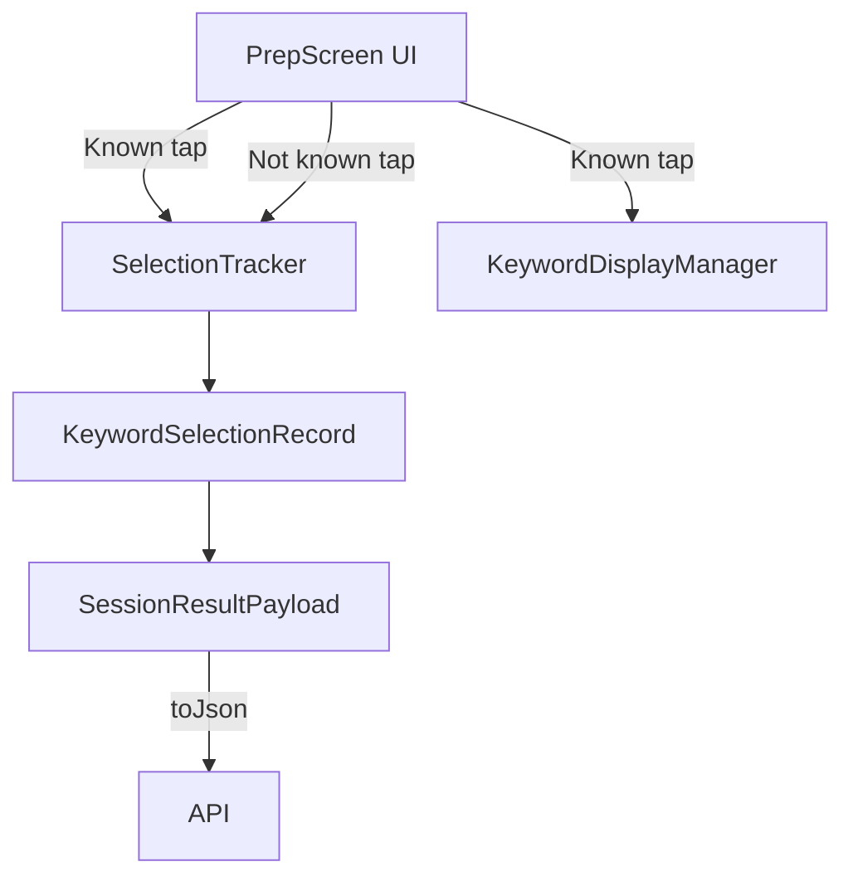

# Design Document: Keyword Rating Simplification

## Overview

This feature simplifies the keyword rating interaction on the prep screen from three buttons ("Known", "Not sure", "Review") to two buttons ("Known", "Not known"). The core motivation is that the distinction between "Not sure" and "Review" provides no meaningful behavioral difference — both advance to the next card without replacement. Collapsing them into a single "Not known" action reduces cognitive load and simplifies the codebase.

The change is purely a client-side refactor. It touches the UI layer (button rendering and state mapping), the service layer (status value recording), and the data model layer (status field values in records and payloads). The `KeywordDisplayManager` replacement logic is unaffected since it already only triggers on "Known".

## Architecture

The existing architecture remains unchanged. The feature modifies behavior within four existing components:



The data flow is:
1. User taps a rating button on `PrepScreen`
2. `PrepScreen` calls `SelectionTracker.record()` with status `"known"` or `"not_known"`
3. For "Known", `PrepScreen` also calls `KeywordDisplayManager.replaceKnown()` to swap the card
4. For "Not known", `PrepScreen` advances `currentIndex` without replacement
5. On session completion, `SelectionTracker.getRecords()` produces `KeywordSelectionRecord` objects
6. Records are packaged into `SessionResultPayload` and serialized to JSON for the API

## Components and Interfaces

### PrepScreen (`lib/screens/prep_screen.dart`)

Changes:
- Remove `_handleNotSureOrReview(String status)` method
- Add `_handleNotKnown()` method that records `"not_known"` and advances
- Update `_setCardState()` to map state value 1 → `_handleKnown()`, state value 2 → `_handleNotKnown()`
- Remove state value 3 handling
- Update button row from 3 buttons to 2: `"✓ Known"` (state 1) and `"✗ Not known"` (state 2)

Interface (unchanged public API — `PrepScreen` is a `StatefulWidget`):
```dart
// Internal state changes only
void _handleKnown()       // existing, unchanged
void _handleNotKnown()    // new, replaces _handleNotSureOrReview
void _setCardState(int)   // modified: only handles 1 and 2
```

### SelectionTracker (`lib/services/selection_tracker.dart`)

Changes:
- Add status validation in `record()` to only accept `"known"` and `"not_known"`
- Throw `ArgumentError` for any other status value

```dart
void record(String arabic, String translation, String status) {
  if (status != 'known' && status != 'not_known') {
    throw ArgumentError('Invalid status: $status. Must be "known" or "not_known".');
  }
  _records[arabic] = _TrackerEntry(translation: translation, status: status);
}
```

### KeywordSelectionRecord (`lib/models/keyword_selection_record.dart`)

Changes:
- Add status validation in `fromJson()` to only accept `"known"` and `"not_known"`
- Add status validation in the constructor

```dart
class KeywordSelectionRecord {
  static const validStatuses = {'known', 'not_known'};

  const KeywordSelectionRecord({
    required this.arabic,
    required this.translation,
    required this.status,
  }) : assert(validStatuses.contains(status));

  factory KeywordSelectionRecord.fromJson(Map<String, dynamic> json) {
    // ... existing null checks ...
    final status = json['status'] as String;
    if (!validStatuses.contains(status)) {
      throw FormatException('Invalid status: $status');
    }
    return KeywordSelectionRecord(arabic: ..., translation: ..., status: status);
  }
}
```

### KeywordDisplayManager (`lib/services/keyword_display_manager.dart`)

No changes required. The `replaceKnown()` method is already correctly scoped — it only fires on "Known" taps.

### SessionResultPayload (`lib/models/session_result_payload.dart`)

No structural changes. The payload already delegates serialization to `KeywordSelectionRecord.toJson()`. The status validation in `KeywordSelectionRecord` ensures only valid values flow through.

## Data Models

### KeywordSelectionRecord

| Field       | Type   | Values                    |
|-------------|--------|---------------------------|
| arabic      | String | Arabic keyword text       |
| translation | String | English translation       |
| status      | String | `"known"` or `"not_known"` |

Before: `status` accepted `"known"`, `"not_sure"`, `"review"`
After: `status` accepts only `"known"`, `"not_known"`

### Card State Mapping (PrepScreen internal)

| State Value | Button      | Behavior                          |
|-------------|-------------|-----------------------------------|
| 1           | "✓ Known"   | Record known, replace card        |
| 2           | "✗ Not known" | Record not_known, advance to next |

Before: State 2 = "Not sure", State 3 = "Review" (both advanced without replacement)
After: State 2 = "Not known" (advances without replacement), State 3 removed

### JSON Payload (unchanged structure)

```json
{
  "pages": "50-54",
  "durationSecs": 120,
  "keywords": [
    { "arabic": "صَبْر", "translation": "patience", "status": "known" },
    { "arabic": "هُدًى", "translation": "guidance", "status": "not_known" }
  ]
}
```


## Correctness Properties

*A property is a characteristic or behavior that should hold true across all valid executions of a system — essentially, a formal statement about what the system should do. Properties serve as the bridge between human-readable specifications and machine-verifiable correctness guarantees.*

### Property 1: SelectionTracker recording fidelity

*For any* keyword (arbitrary arabic string and translation) and *for any* valid status in `{"known", "not_known"}`, recording that keyword with that status and then retrieving records should produce a `KeywordSelectionRecord` whose `status` field equals the status that was recorded.

**Validates: Requirements 2.1, 3.1, 4.3**

### Property 2: SelectionTracker rejects invalid statuses

*For any* string that is not `"known"` and not `"not_known"`, calling `SelectionTracker.record()` with that string as the status should throw an `ArgumentError`.

**Validates: Requirements 4.1, 4.2**

### Property 3: "Not known" advances index without modifying visible list

*For any* keyword list of length ≥ 2 and *for any* current index that is not the last index, triggering the "Not known" action should increment `currentIndex` by 1 and leave the visible keyword list unchanged (same length, same elements, same order).

**Validates: Requirements 3.2, 6.3**

### Property 4: KeywordSelectionRecord serialization round trip

*For any* valid `KeywordSelectionRecord` (with arbitrary non-empty arabic, non-empty translation, and status in `{"known", "not_known"}`), calling `toJson()` then `fromJson()` on the result should produce a record with identical `arabic`, `translation`, and `status` fields.

**Validates: Requirements 5.2, 5.3**

## Error Handling

| Scenario | Component | Behavior |
|----------|-----------|----------|
| Invalid status passed to `SelectionTracker.record()` | SelectionTracker | Throws `ArgumentError` with descriptive message |
| Invalid status in JSON passed to `KeywordSelectionRecord.fromJson()` | KeywordSelectionRecord | Throws `FormatException` |
| Missing required fields in JSON | KeywordSelectionRecord | Throws `FormatException` (existing behavior, unchanged) |
| Empty keyword list on PrepScreen | PrepScreen | Shows "No keywords available" message (existing behavior, unchanged) |
| `replaceKnown()` called with out-of-range index | KeywordDisplayManager | Throws `RangeError` (existing behavior, unchanged) |

## Testing Strategy

### Unit Tests

Unit tests cover specific examples, edge cases, and UI behavior:

- **PrepScreen button rendering**: Verify that exactly two buttons ("✓ Known", "✗ Not known") appear when a card is flipped, and zero buttons appear when unflipped
- **PrepScreen old buttons removed**: Verify "Not sure" and "Review" labels do not appear in the widget tree
- **PrepScreen state mapping**: Verify state value 1 triggers known behavior, state value 2 triggers not-known behavior, state value 3 is not handled
- **Session completion on last card**: Verify both "Known" and "Not known" on the last card trigger navigation to `/recitation`
- **SelectionTracker rejects "not_sure"**: Specific example that `record("x", "y", "not_sure")` throws
- **SelectionTracker rejects "review"**: Specific example that `record("x", "y", "review")` throws
- **KeywordSelectionRecord rejects old statuses**: Verify `fromJson` with `"not_sure"` or `"review"` throws `FormatException`

### Property-Based Tests

Property-based tests use the `glados` package (already a dev dependency) with a minimum of 100 iterations per property. Each test is tagged with a comment referencing the design property.

- **Feature: keyword-rating-simplification, Property 1: SelectionTracker recording fidelity** — Generate random arabic/translation strings and a random valid status, record via `SelectionTracker`, verify the output record matches.
- **Feature: keyword-rating-simplification, Property 2: SelectionTracker rejects invalid statuses** — Generate random strings excluding "known" and "not_known", verify `record()` throws `ArgumentError`.
- **Feature: keyword-rating-simplification, Property 3: "Not known" advances index without modifying visible list** — Generate random keyword lists (length ≥ 2) and a random non-last index, simulate the "Not known" action, verify index incremented and visible list unchanged.
- **Feature: keyword-rating-simplification, Property 4: KeywordSelectionRecord serialization round trip** — Generate random valid `KeywordSelectionRecord` instances, verify `fromJson(toJson())` produces equivalent records.

### Test Configuration

- Library: `glados` ^1.1.1 (already in `pubspec.yaml` dev_dependencies)
- Minimum iterations: 100 per property test
- Each property test must include a comment: `// Feature: keyword-rating-simplification, Property {N}: {title}`
- Each correctness property is implemented by a single property-based test
