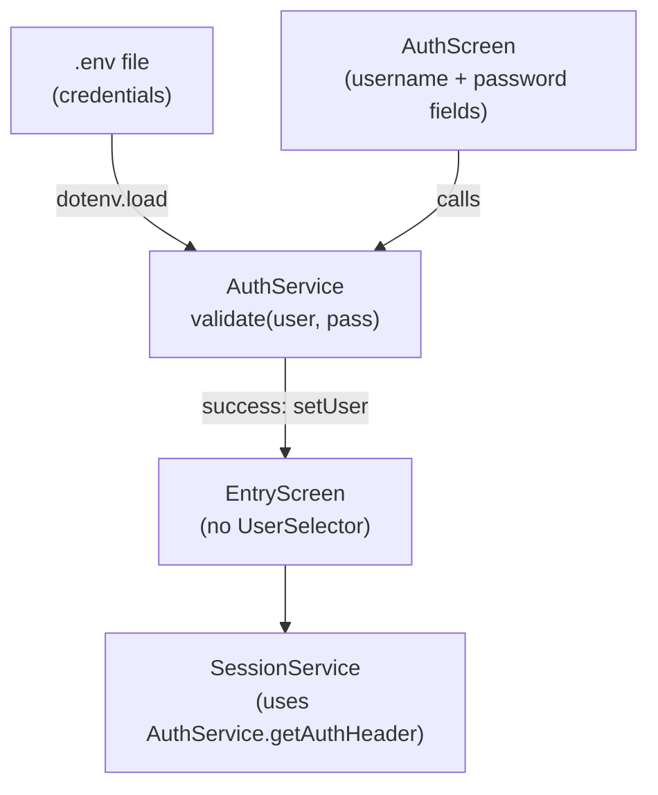

# Design Document: Login Authentication

## Overview

This design replaces the mock `UserSelectorWidget` pill-based authentication with a proper login flow. The existing `AuthScreen` shell gets wired up to validate username/password credentials against values stored in the `.env` file via an updated `AuthService`. On success, `AuthService.setUser` is called and the app navigates to `EntryScreen`. The `UserSelectorWidget` and its "MOCK USER" label are removed from `EntryScreen`.

All changes are frontend-only. No backend modifications are needed.

## Architecture



The flow is linear:

1. App starts → `AuthScreen` is the initial route (`/`).
2. User enters credentials → `AuthScreen` calls `AuthService.validate(username, password)`.
3. `AuthService.validate` reads expected credentials from `dotenv.env` and compares.
4. On match → `AuthService.setUser(username)` is called, then navigate to `/home`.
5. On mismatch → error message shown on `AuthScreen`.
6. `EntryScreen` receives the `AuthService` instance (already configured) via constructor.
7. `SessionService` continues to call `AuthService.getAuthHeader()` as before.

## Components and Interfaces

### 1. `.env` file — new credential entries

Six new keys are added (username + password per demo user):

```
LOGIN_USER_1=demo-user-1
LOGIN_PASS_1=test
LOGIN_USER_2=demo-user-2
LOGIN_PASS_2=Password1234#
LOGIN_USER_3=demo-user-3
LOGIN_PASS_3=Password1234#
```

### 2. `AuthService` — updated

```dart
class AuthService {
  static const List<String> validUsers = [
    'demo-user-1',
    'demo-user-2',
    'demo-user-3',
  ];

  static const String defaultUser = 'demo-user-1';

  String _currentUser = defaultUser;
  String get currentUser => _currentUser;

  /// Validates username/password against .env credentials.
  /// Returns true if a match is found, false otherwise.
  bool validate(String username, String password) {
    for (int i = 1; i <= 3; i++) {
      final envUser = dotenv.env['LOGIN_USER_$i'] ?? '';
      final envPass = dotenv.env['LOGIN_PASS_$i'] ?? '';
      if (username == envUser && password == envPass) {
        return true;
      }
    }
    return false;
  }

  void setUser(String userId) {
    if (!validUsers.contains(userId)) {
      throw ArgumentError('Invalid user: $userId');
    }
    _currentUser = userId;
  }

  String getAuthHeader() => 'Bearer $_currentUser';
}
```

The `validate` method loops through the three credential pairs in `.env`. It performs exact string comparison — no hashing needed since this is a local demo app with credentials already in plaintext in the env file.

### 3. `AuthScreen` — updated

The existing `AuthScreen` shell is updated to:

- Add `TextEditingController` instances for username and password fields.
- Add an `_errorMessage` state variable (nullable `String`).
- Instantiate `AuthService` and call `validate` on "Sign in" tap.
- On success: call `setUser`, then `Navigator.pushReplacementNamed(context, '/home')`.
- On failure: set `_errorMessage` to `"Invalid username or password"`.
- Disable the "Sign in" button when either field is empty (listen to controllers).
- Clear `_errorMessage` when either field changes.
- Show error text in red below the input fields when present.

### 4. `EntryScreen` — updated

- Remove the `UserSelectorWidget` import and usage.
- Remove the "MOCK USER" label and `UserSelectorWidget` from the `build` method.
- Accept `AuthService` as a constructor parameter instead of creating its own instance.
- Pass the received `AuthService` to `SessionService`.

### 5. `main.dart` — routing update

The `AuthService` instance is created in `QuranPrepApp` and threaded through:

```dart
routes: {
  '/': (_) => const AuthScreen(),
  '/home': (_) => EntryScreen(authService: authService),
  ...
}
```

Since `AuthScreen` creates its own `AuthService` and passes it forward via route arguments (or a shared instance), the simplest approach is:

- `AuthScreen` creates `AuthService`, validates, calls `setUser`.
- On success, navigates to `/home` passing `AuthService` as a route argument.
- `EntryScreen` extracts `AuthService` from `ModalRoute.of(context)!.settings.arguments`.

This avoids introducing a state management library for a single shared object.

### 6. `UserSelectorWidget` — removed

The file `lib/widgets/user_selector.dart` can be deleted or left unused. The import and usage in `EntryScreen` are removed.

## Data Models

No new data models are introduced. The credentials are simple string pairs read from environment variables. The existing `AuthService` fields (`_currentUser`, `validUsers`) remain unchanged.

| Entity | Fields | Storage |
|--------|--------|---------|
| Login credential | username (`String`), password (`String`) | `.env` file as `LOGIN_USER_N` / `LOGIN_PASS_N` |
| Current user | `_currentUser` (`String`) | In-memory on `AuthService` |


## Correctness Properties

*A property is a characteristic or behavior that should hold true across all valid executions of a system — essentially, a formal statement about what the system should do. Properties serve as the bridge between human-readable specifications and machine-verifiable correctness guarantees.*

### Property 1: Sign-in button enabled state tracks field emptiness

*For any* pair of strings (username, password), the "Sign in" button should be enabled if and only if both strings are non-empty. If either string is empty, the button must be disabled.

**Validates: Requirements 2.6**

### Property 2: Credential validation correctness

*For any* username/password string pair, `AuthService.validate(username, password)` should return `true` if and only if the pair exactly matches one of the credential entries loaded from the `.env` file (`LOGIN_USER_N` / `LOGIN_PASS_N` for N in 1..3). For all other pairs, it should return `false`.

**Validates: Requirements 3.1, 3.4**

## Error Handling

| Scenario | Handling |
|----------|----------|
| Invalid credentials | `AuthScreen` displays "Invalid username or password" in red text below the fields. Error clears when user edits either field. |
| Empty fields | "Sign in" button is disabled — no validation attempt occurs. |
| Missing `.env` keys | `dotenv.env['LOGIN_USER_N']` returns `null`, which defaults to empty string via `?? ''`. No match is possible, so login fails gracefully with the standard error message. |
| `AuthService.setUser` with invalid user | Throws `ArgumentError` — should not happen in normal flow since `validate` only returns true for known users. |

## Testing Strategy

### Unit Tests

Unit tests cover specific examples, edge cases, and UI behavior:

- `AuthService.validate` returns `true` for each of the three known credential pairs (3 example tests).
- `AuthService.validate` returns `false` for wrong password, wrong username, empty strings, swapped credentials.
- `AuthScreen` widget test: verify USERNAME and PASSWORD labels are rendered.
- `AuthScreen` widget test: password field is obscured by default; tapping toggle reveals it.
- `AuthScreen` widget test: "Sign in" button is disabled when fields are empty, enabled when both filled.
- `AuthScreen` widget test: failed login shows "Invalid username or password" error text.
- `AuthScreen` widget test: error clears when user types in either field.
- `AuthScreen` widget test: successful login navigates to `/home`.
- `EntryScreen` widget test: `UserSelectorWidget` and "MOCK USER" label are absent.
- `EntryScreen` receives `AuthService` with user already set and passes it to `SessionService`.

### Property-Based Tests

Property-based tests use the `dart_quickcheck` or `test` package with custom generators to verify universal properties. Each test runs a minimum of 100 iterations.

- **Feature: login-authentication, Property 1: Sign-in button enabled state tracks field emptiness**
  Generate random string pairs for username and password (including empty strings, whitespace, and valid text). For each pair, set the text controllers and verify the button's `onPressed` is non-null iff both strings are non-empty.

- **Feature: login-authentication, Property 2: Credential validation correctness**
  Generate random username/password string pairs. For each pair, call `AuthService.validate(username, password)`. Assert the result is `true` if and only if the pair matches one of the three known env credential entries. This covers both positive matches and negative rejections in a single property.

Since Dart's property-based testing ecosystem is limited, the property tests can be implemented using a loop-based approach with a custom random generator inside standard `test()` blocks, running at least 100 random inputs per property. Each test must be tagged with a comment referencing the design property number.
