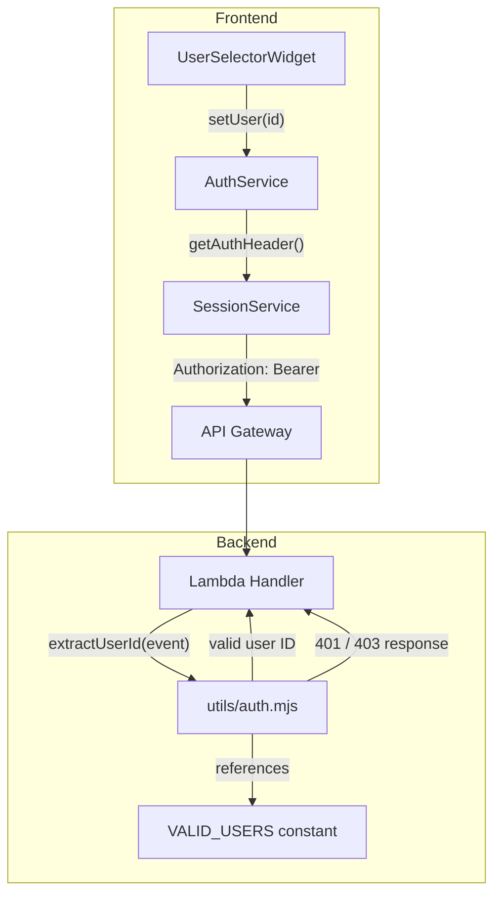

# Design Document: Mock Authentication

## Overview

This feature adds a lightweight mock authentication system to the Quran Prep app. It spans both the Flutter frontend and the AWS SAM/Lambda backend.

On the frontend, a new `AuthService` stores the currently selected mock user identity in memory (defaulting to `demo-user-1`). A `UserSelectorWidget` on the Entry Screen lets the user switch between three predefined identities. The `SessionService` is updated to pull the Bearer token from `AuthService` instead of using a hardcoded value.

On the backend, a shared utility module defines the valid mock user list and exports a `extractUserId` function. Each Lambda handler calls this function to parse the `Authorization` header, validate the token, and either return the user ID or respond with 401/403.

Key design decisions:
- **In-memory storage only**: No persistence needed for mock auth — the selection resets on app restart, which is fine for a development/demo tool.
- **AuthService as a singleton-like plain class**: Keeps things simple. No state management library needed for a single string value.
- **Shared backend constant**: The valid user list lives in one utility module (`utils/auth.mjs`) so all Lambda functions validate consistently.
- **Pill-style selector**: Reuses the same visual pattern as `FamiliarityPills` for consistency with the existing Entry Screen design.

## Architecture



## Components and Interfaces

### AuthService (Frontend)

**File:** `lib/services/auth_service.dart`

```dart
class AuthService {
  static const List<String> validUsers = [
    'demo-user-1',
    'demo-user-2',
    'demo-user-3',
  ];

  static const String defaultUser = 'demo-user-1';

  String _currentUser = defaultUser;

  String get currentUser => _currentUser;

  void setUser(String userId) {
    if (!validUsers.contains(userId)) {
      throw ArgumentError('Invalid user: $userId');
    }
    _currentUser = userId;
  }

  String getAuthHeader() => 'Bearer $_currentUser';
}
```

- Stores the selected mock user in a private field.
- `validUsers` is a static const list for UI consumption (populating the selector).
- `setUser` validates against the known list before storing.
- `getAuthHeader()` returns the formatted Bearer token string.

### UserSelectorWidget (Frontend)

**File:** `lib/widgets/user_selector.dart`

```dart
class UserSelectorWidget extends StatefulWidget {
  final AuthService authService;
  final ValueChanged<String>? onChanged;

  const UserSelectorWidget({
    super.key,
    required this.authService,
    this.onChanged,
  });
}
```

- Renders three pill-shaped options matching the `FamiliarityPills` pattern.
- Highlights the currently selected user with `AppColors.primaryLight` background and `AppColors.primary` border/text.
- Calls `authService.setUser(userId)` and `onChanged?.call(userId)` on tap.
- Initializes selection from `authService.currentUser`.

### SessionService Changes (Frontend)

**File:** `lib/services/session_service.dart`

The existing hardcoded `'Authorization': 'Bearer demo-user-1'` header is replaced:

```dart
class SessionService {
  final AuthService _authService;

  SessionService({required AuthService authService})
      : _authService = authService;

  Future<SessionResponse> prepare({...}) async {
    // ...
    final headers = {
      'Content-Type': 'application/json',
      'Authorization': _authService.getAuthHeader(),
      'x-api-key': apiKey,
    };
    // ...
  }
}
```

- `SessionService` now takes an `AuthService` dependency via constructor.
- The auth header is fetched dynamically per request.

### Backend Auth Utility

**File:** `backend/utils/auth.mjs`

```javascript
export const VALID_USERS = ['demo-user-1', 'demo-user-2', 'demo-user-3'];

export function extractUserId(event) {
  const authHeader = event.headers?.Authorization
    || event.headers?.authorization;

  if (!authHeader) {
    return {
      statusCode: 401,
      body: JSON.stringify({ error: 'Authentication required' }),
    };
  }

  const token = authHeader.replace(/^Bearer\s+/i, '');

  if (!VALID_USERS.includes(token)) {
    return {
      statusCode: 403,
      body: JSON.stringify({ error: 'Invalid user' }),
    };
  }

  return { userId: token };
}
```

- Returns an object with `userId` on success, or a full HTTP error response object on failure.
- Lambda handlers check for `statusCode` in the result to short-circuit with the error response.
- Case-insensitive header lookup handles API Gateway normalization.

### Lambda Handler Integration Pattern

Each Lambda handler uses `extractUserId` at the top:

```javascript
import { extractUserId } from './utils/auth.mjs';

export const handler = async (event) => {
  const authResult = extractUserId(event);
  if (authResult.statusCode) {
    return authResult;
  }
  const userId = authResult.userId;
  // ... rest of handler logic using userId
};
```

## Data Models

### Mock User Identity

| Field | Type | Description |
|---|---|---|
| User ID | `String` | One of `demo-user-1`, `demo-user-2`, `demo-user-3` |

### Authorization Header Format

```
Authorization: Bearer demo-user-1
```

The token value is the raw user ID string. No encoding, no JWT, no expiry.

### Backend extractUserId Return Types

**Success:**
```json
{ "userId": "demo-user-1" }
```

**Missing header (401):**
```json
{
  "statusCode": 401,
  "body": "{\"error\":\"Authentication required\"}"
}
```

**Invalid user (403):**
```json
{
  "statusCode": 403,
  "body": "{\"error\":\"Invalid user\"}"
}
```


## Correctness Properties

*A property is a characteristic or behavior that should hold true across all valid executions of a system — essentially, a formal statement about what the system should do. Properties serve as the bridge between human-readable specifications and machine-verifiable correctness guarantees.*

### Property 1: AuthService set/get round trip

*For any* valid mock user ID (one of `demo-user-1`, `demo-user-2`, `demo-user-3`), calling `setUser(userId)` and then reading `currentUser` should return that same user ID.

**Validates: Requirements 1.3, 2.1**

### Property 2: Auth header format

*For any* valid mock user ID set in `AuthService`, calling `getAuthHeader()` should return the string `"Bearer "` concatenated with that user ID, and no other format.

**Validates: Requirements 2.2**

### Property 3: SessionService uses dynamic auth header

*For any* valid mock user ID set in `AuthService`, when `SessionService` sends a request, the `Authorization` header in that request should equal `AuthService.getAuthHeader()`. Changing the user between requests should produce different headers.

**Validates: Requirements 3.1, 3.2**

### Property 4: Token extraction round trip

*For any* valid mock user ID, constructing an event with header `Authorization: Bearer <userId>` and passing it to `extractUserId` should return an object with `userId` equal to that user ID (no `statusCode` field).

**Validates: Requirements 4.1, 4.4**

### Property 5: Invalid token rejection

*For any* string that is not one of the three valid mock user IDs, constructing an event with header `Authorization: Bearer <string>` and passing it to `extractUserId` should return a response with `statusCode` 403 and a JSON body containing an error message.

**Validates: Requirements 4.3**

## Error Handling

| Scenario | Layer | Behavior |
|---|---|---|
| `setUser` called with invalid user ID | `AuthService` | Throws `ArgumentError('Invalid user: $userId')` |
| `Authorization` header missing from request | `extractUserId` (backend) | Returns `{ statusCode: 401, body: '{"error":"Authentication required"}' }` |
| Bearer token is not a valid mock user | `extractUserId` (backend) | Returns `{ statusCode: 403, body: '{"error":"Invalid user"}' }` |
| Backend returns 401 | `SessionService` (frontend) | Throws exception with status code — existing error handling covers this |
| Backend returns 403 | `SessionService` (frontend) | Throws exception with status code — existing error handling covers this |

## Testing Strategy

### Property-Based Tests

Use the `glados` package (already in dev_dependencies) for Dart property tests. For backend JavaScript tests, use `fast-check`. Each property test runs a minimum of 100 iterations.

Each test must be tagged with a comment referencing the design property:

```dart
// Feature: mock-authentication, Property 1: AuthService set/get round trip
```

| Property | Test Description | Generator Strategy |
|---|---|---|
| Property 1 | Set a random valid user, read it back, assert equality | Pick randomly from the 3 valid user IDs |
| Property 2 | Set a random valid user, call `getAuthHeader()`, assert it equals `"Bearer " + userId` | Pick randomly from the 3 valid user IDs |
| Property 3 | Set a random valid user in AuthService, call `SessionService.prepare()` with a mock client, capture the request, assert the Authorization header matches `getAuthHeader()` | Pick randomly from the 3 valid user IDs, generate random valid request params |
| Property 4 | Construct an event with `Authorization: Bearer <validUser>`, call `extractUserId`, assert result has `userId` field matching | Pick randomly from the 3 valid user IDs |
| Property 5 | Generate random strings excluding the 3 valid IDs, construct event with `Authorization: Bearer <string>`, call `extractUserId`, assert 403 response | Random alphanumeric strings filtered to exclude valid IDs |

### Unit Tests (Examples and Edge Cases)

- **AuthService** defaults to `demo-user-1` on construction (example for Req 2.3)
- **AuthService** throws `ArgumentError` for invalid user ID (edge case for Req 1.3)
- **UserSelectorWidget** renders exactly three options with correct labels (example for Req 1.1)
- **UserSelectorWidget** shows `demo-user-1` selected by default (example for Req 1.2)
- **extractUserId** returns 401 when Authorization header is missing (edge case for Req 4.2)
- **extractUserId** handles case-insensitive header name (`authorization` vs `Authorization`) (edge case for Req 4.1)
- **VALID_USERS** contains exactly `['demo-user-1', 'demo-user-2', 'demo-user-3']` (example for Req 5.1)

### Test Configuration

- Frontend property-based testing library: `glados` (already in dev_dependencies)
- Backend property-based testing library: `fast-check` (to be added to backend dev dependencies)
- Minimum iterations per property: 100
- Test runner (frontend): `flutter test`
- Test runner (backend): `node --test` or `jest`
- Each property test file tagged with feature and property reference
- Mock HTTP client used for SessionService tests
