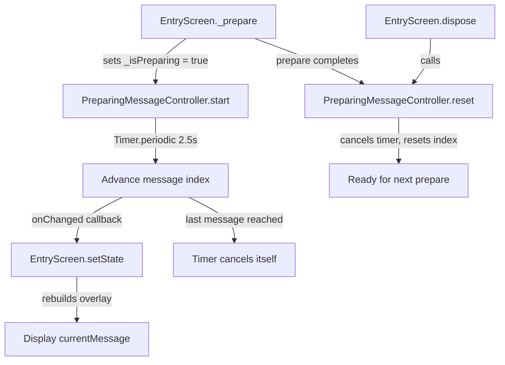
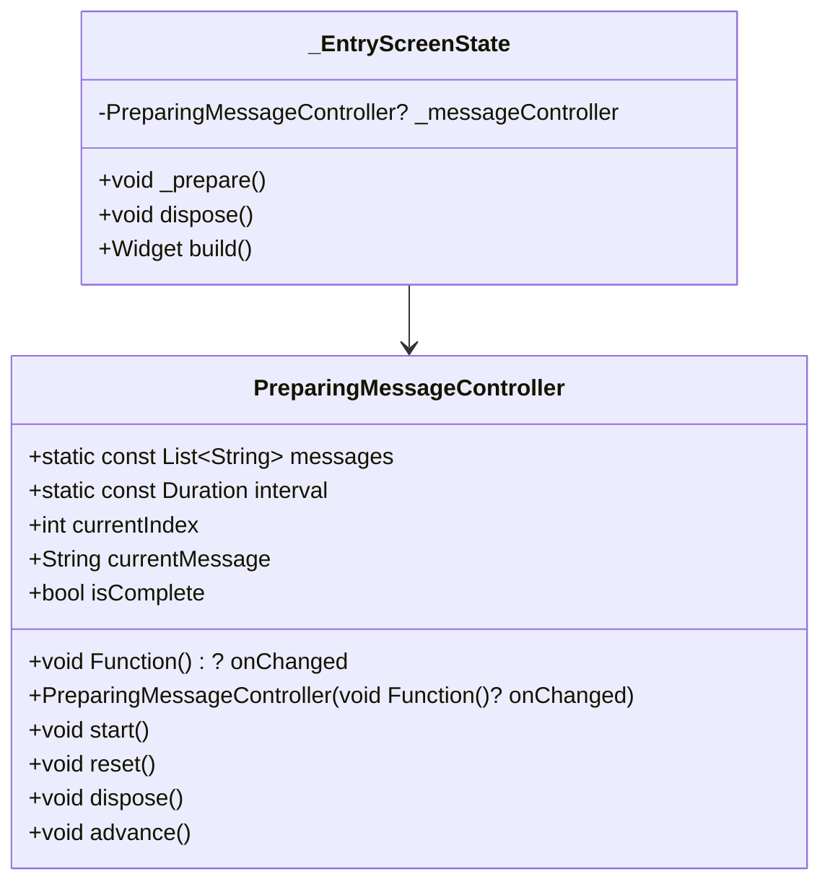

# Design Document: Prepare Loading Messages

## Overview

This feature adds cycling progress messages to the existing loading overlay on the Entry Screen. While `_isPreparing` is true, a text label appears below the `CircularProgressIndicator`, cycling through four predefined messages on a 2.5-second timer. The timer stops advancing once the last message is reached, and is cancelled when the prepare operation completes or the widget is disposed.

The implementation is intentionally minimal:

1. **Message cycling logic** — a pure-Dart class (`PreparingMessageController`) that manages the message list, current index, and timer lifecycle. No Flutter dependency, making it trivially testable with `glados`.
2. **Entry Screen integration** — wire the controller into `_EntryScreenState`, display the current message in the overlay, and ensure cleanup on completion/dispose.

Design decisions:

- **Pure-Dart controller**: Extracting the timer + index logic into a standalone class keeps the widget thin and makes property-based testing straightforward.
- **`Timer.periodic` with self-cancellation**: The timer advances the index each tick and cancels itself when the last message is reached. This avoids unnecessary ticks after the final message.
- **Callback-driven updates**: The controller accepts an `onChanged` callback so the widget can call `setState` without the controller depending on Flutter.

## Architecture





## Components and Interfaces

### PreparingMessageController

**File:** `lib/utils/preparing_message_controller.dart`

```dart
import 'dart:async';

class PreparingMessageController {
  static const List<String> messages = [
    'Analysing the passage…',
    'Identifying key vocabulary for your level…',
    'Ranking keywords by importance…',
    'Almost ready…',
  ];

  static const Duration interval = Duration(milliseconds: 2500);

  final void Function()? onChanged;
  Timer? _timer;
  int _currentIndex = 0;

  PreparingMessageController({this.onChanged});

  int get currentIndex => _currentIndex;
  String get currentMessage => messages[_currentIndex];
  bool get isComplete => _currentIndex >= messages.length - 1;

  /// Starts cycling. Resets index to 0 and begins a periodic timer.
  void start() {
    reset();
    _timer = Timer.periodic(interval, (_) => advance());
  }

  /// Advances to the next message. Cancels timer when last message is reached.
  void advance() {
    if (isComplete) return;
    _currentIndex++;
    if (isComplete) {
      _timer?.cancel();
      _timer = null;
    }
    onChanged?.call();
  }

  /// Cancels the timer and resets the index to 0.
  void reset() {
    _timer?.cancel();
    _timer = null;
    _currentIndex = 0;
  }

  /// Alias for reset — used in widget dispose.
  void dispose() => reset();
}
```

- `messages` and `interval` are static constants — single source of truth.
- `advance()` is public so it can be called directly in tests without needing real timers.
- `reset()` both cancels the timer and resets the index, covering both the "prepare completed" and "dispose" cases.

### EntryScreen Integration

**File:** `lib/screens/entry_screen.dart` (modify existing)

Key changes:

- Add a `PreparingMessageController` field initialized in `initState` (or lazily).
- In `_prepare()`: call `_messageController.start()` when setting `_isPreparing = true`.
- In the `finally` block of `_prepare()`: call `_messageController.reset()` before setting `_isPreparing = false`.
- In `dispose()`: call `_messageController.dispose()`.
- In the overlay widget: replace the plain `CircularProgressIndicator` with a `Column` containing the spinner and a `Text` widget showing `_messageController.currentMessage`, styled with `AppTextStyles.small` and `AppColors.textMuted` (or similar light style for readability on the dark overlay).

## Data Models

No new data models are required. The feature uses:

- `PreparingMessageController.messages` — a `static const List<String>` of four progress messages.
- `PreparingMessageController.interval` — a `static const Duration` of 2500ms.
- `PreparingMessageController.currentIndex` — an `int` tracking position in the message list.


## Correctness Properties

*A property is a characteristic or behavior that should hold true across all valid executions of a system — essentially, a formal statement about what the system should do. Properties serve as the bridge between human-readable specifications and machine-verifiable correctness guarantees.*

### Property 1: Start and reset always return to the first message

*For any* `PreparingMessageController` in any state (freshly constructed, mid-cycle, or at the last message), calling `start()` or `reset()` should set `currentIndex` to 0 and `currentMessage` to the first message in the list.

**Validates: Requirements 1.3, 2.3, 3.1, 3.3**

### Property 2: Advance increments the message index by one

*For any* `PreparingMessageController` whose `currentIndex` is less than `messages.length - 1`, calling `advance()` should increment `currentIndex` by exactly 1, and `currentMessage` should equal `messages[previousIndex + 1]`.

**Validates: Requirements 2.1**

### Property 3: Advance at the last message is idempotent

*For any* `PreparingMessageController` whose `currentIndex` equals `messages.length - 1`, calling `advance()` any number of times should leave `currentIndex` unchanged at `messages.length - 1` and `currentMessage` equal to the last message.

**Validates: Requirements 2.2**

### Property 4: All messages end with the ellipsis character

*For any* message in `PreparingMessageController.messages`, the message should end with the Unicode ellipsis character `…` (U+2026).

**Validates: Requirements 4.2**

## Error Handling

| Scenario | Layer | Behavior |
|---|---|---|
| `advance()` called after reaching last message | `PreparingMessageController` | No-op; index stays at last position |
| `reset()` called when no timer is active | `PreparingMessageController` | No-op; index resets to 0 safely |
| `start()` called while already running | `PreparingMessageController` | Cancels existing timer via `reset()`, then starts fresh |
| `dispose()` called multiple times | `PreparingMessageController` | Safe; `reset()` is idempotent |
| Widget disposed during prepare API call | `EntryScreen` | `dispose()` calls `_messageController.dispose()`, cancelling timer. The `finally` block in `_prepare()` checks `mounted` before calling `setState`. |

## Testing Strategy

### Property-Based Tests

Use the `glados` package (already in dev_dependencies) for property-based tests. Each property test runs a minimum of 100 iterations with randomly generated inputs.

Each test must be tagged with a comment referencing the design property:

```dart
// Feature: prepare-loading-messages, Property 1: Start and reset always return to the first message
```

| Property | Test Description | Generator Strategy |
|---|---|---|
| Property 1 | Generate a random number of `advance()` calls (0 to 10), apply them, then call `start()` or `reset()`. Verify `currentIndex == 0` and `currentMessage == messages[0]`. | Random int for advance count, random bool for start vs reset |
| Property 2 | Generate a random starting index from 0 to `messages.length - 2`. Advance to that index, then call `advance()` once. Verify index incremented by 1. | Random int in range `[0, messages.length - 2]` |
| Property 3 | Advance to the last message, then call `advance()` a random number of additional times (1 to 20). Verify index remains at `messages.length - 1`. | Random int for extra advance count |
| Property 4 | For each message in the static list, verify it ends with `…`. | Iterate over `PreparingMessageController.messages` |

### Unit Tests (Examples and Edge Cases)

- `PreparingMessageController.messages` contains exactly 4 messages in the specified order (example for Req 4.1)
- `PreparingMessageController.interval` equals `Duration(milliseconds: 2500)` (example for Req 2.1)
- Newly constructed controller has `currentIndex == 0` (example for Req 1.3)
- `onChanged` callback is invoked on each `advance()` call (example for Req 2.1)
- `onChanged` is not invoked when `advance()` is called at the last message (edge case for Req 2.2)
- Widget test: overlay displays `currentMessage` text below the spinner when `_isPreparing` is true (example for Req 1.1)
- Widget test: message text uses `AppTextStyles` and `AppColors` tokens (example for Req 1.2)
- Widget test: timer is cancelled when prepare completes before overlay is hidden (example for Req 3.2)

### Test Configuration

- Property-based testing library: `glados` (already in dev_dependencies)
- Minimum iterations per property: 100
- Test runner: `flutter test`
- Each property test file tagged with feature and property reference
- Each correctness property is implemented by a single property-based test
