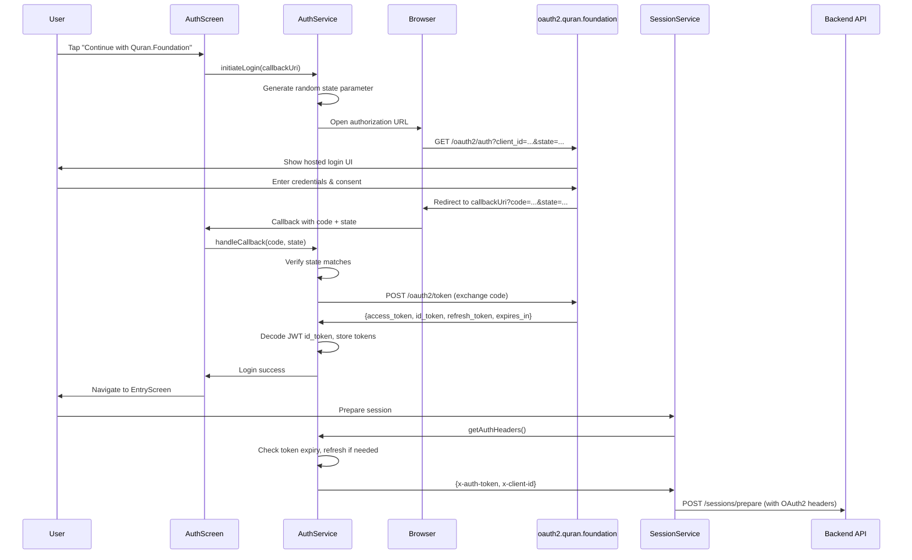
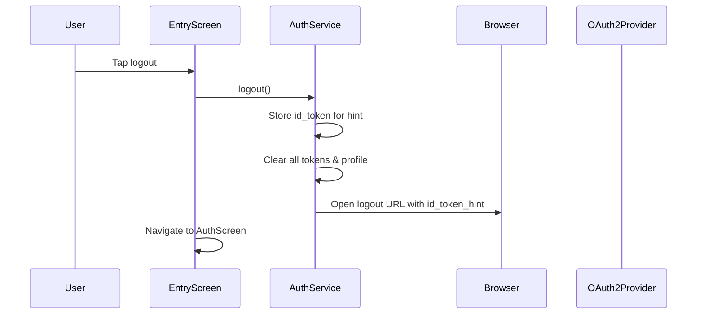

# Design Document: Quran OAuth2 Login

## Overview

This feature replaces the local `.env` credential-based authentication with Quran.com's hosted OAuth2 login UI. The current `AuthService.validate()` method checks username/password against `.env` entries; the new flow redirects the user to `https://oauth2.quran.foundation/oauth2/auth`, handles the callback with authorization code exchange, stores JWT tokens, and provides OAuth2 headers (`x-auth-token`, `x-client-id`) for API calls.

The existing mock authentication code in `AuthService`, `AuthScreen`, and `.env` is commented out (not deleted) to preserve it for reference or rollback.

### Key Design Decisions

1. **Browser-based OAuth2 via `url_launcher` + manual callback**: Since this is a Flutter web app, we use `url_launcher` to open the OAuth2 authorization URL in the same browser context and listen for the redirect via Flutter's web URL handling. This avoids native-only packages and keeps the dependency footprint small.
2. **JWT decoding without verification**: The `id_token` is received directly from the OAuth2 provider over HTTPS during the token exchange, so we decode the JWT payload using base64 without cryptographic signature verification. We use a lightweight helper rather than adding a full JWT library.
3. **Token storage in memory**: Tokens are stored in `AuthService` instance fields. Since this is a web app where page refresh loses state anyway (the app already redirects to AuthScreen on refresh), in-memory storage is sufficient and avoids browser storage security concerns.
4. **Proactive token refresh**: Before each API call, `AuthService` checks if the access token is expired or within 60 seconds of expiry and refreshes automatically.

## Architecture



### Logout Flow



## Components and Interfaces

### AuthService (lib/services/auth_service.dart)

The existing class is refactored. Mock code is commented out. New OAuth2 methods are added.

```dart
class AuthService {
  // --- Commented-out mock auth code (preserved for reference) ---
  // static const List<String> validUsers = [...];
  // static const String defaultUser = '...';
  // String _currentUser = defaultUser;
  // String get currentUser => _currentUser;
  // bool validate(String username, String password) { ... }
  // void setUser(String userId) { ... }
  // String getAuthHeader() => 'Bearer $_currentUser';

  // --- OAuth2 configuration (read from .env) ---
  late final String _tokenHost;
  late final String _clientId;
  late final String _clientSecret;
  late final String _scopes;

  // --- Token storage ---
  String? _accessToken;
  String? _idToken;
  String? _refreshToken;
  DateTime? _tokenExpiry;

  // --- User profile (decoded from JWT id_token) ---
  Map<String, dynamic>? _userProfile; // {sub, name, email}

  // --- CSRF state ---
  String? _pendingState;

  AuthService() {
    _tokenHost = dotenv.env['TOKEN_HOST'] ?? '';
    _clientId = dotenv.env['CLIENT_ID'] ?? '';
    _clientSecret = dotenv.env['CLIENT_SECRET'] ?? '';
    _scopes = dotenv.env['SCOPES'] ?? '';
  }

  bool get isAuthenticated => _accessToken != null && _tokenExpiry != null;
  Map<String, dynamic>? get userProfile => _userProfile;

  /// Builds the authorization URL and generates a CSRF state parameter.
  ({String url, String state}) buildAuthorizationUrl(String redirectUri);

  /// Handles the OAuth2 callback: verifies state, exchanges code for tokens.
  Future<void> handleCallback(String code, String state, String redirectUri);

  /// Returns OAuth2 headers for API calls. Refreshes token if needed.
  Future<Map<String, String>> getAuthHeaders();

  /// Refreshes the access token using the refresh token.
  Future<void> refreshAccessToken();

  /// Clears tokens and returns the logout URL.
  String logout(String postLogoutRedirectUri);
}
```

### AuthScreen (lib/screens/auth_screen.dart)

The existing username/password form is commented out. Replaced with a single "Continue with Quran.Foundation" button.

```dart
class _AuthScreenState extends State<AuthScreen> {
  final AuthService _authService = AuthService();
  bool _isLoading = false;
  String? _errorMessage;

  // --- Commented-out mock auth UI code ---
  // TextEditingController _usernameController, _passwordController
  // bool _obscurePassword, _isButtonEnabled
  // _onFieldChanged(), _inputDecoration(), username/password fields,
  // "Forgot password?" link, "Sign up" hint row, "Sign in" button

  Future<void> _startOAuthLogin() async { ... }
  void _handleOAuthCallback(Uri uri) { ... }
}
```

### SessionService (lib/services/session_service.dart)

Updated to use `await _authService.getAuthHeaders()` instead of `_authService.getAuthHeader()`.

```dart
// Before (commented out):
// 'Authorization': _authService.getAuthHeader(),

// After:
final authHeaders = await _authService.getAuthHeaders();
final headers = {
  'Content-Type': 'application/json',
  ...authHeaders,
  'x-api-key': apiKey,
};
```

### EntryScreen (lib/screens/entry_screen.dart)

A logout button is added to the app bar area. On tap, it calls `_authService!.logout(redirectUri)`, opens the logout URL, and navigates to `AuthScreen`.

### JWT Decode Helper

A lightweight utility function to decode the JWT payload without signature verification:

```dart
/// Decodes a JWT token's payload section (base64url-encoded JSON).
/// Does NOT verify the signature — safe when token is received over HTTPS
/// directly from the OAuth2 provider.
Map<String, dynamic> decodeJwtPayload(String jwt) {
  final parts = jwt.split('.');
  if (parts.length != 3) throw FormatException('Invalid JWT format');
  final payload = parts[1];
  final normalized = base64Url.normalize(payload);
  final decoded = utf8.decode(base64Url.decode(normalized));
  return jsonDecode(decoded) as Map<String, dynamic>;
}
```

## Data Models

### Token State (stored in AuthService)

| Field | Type | Source |
|-------|------|--------|
| `_accessToken` | `String?` | Token exchange response `access_token` |
| `_idToken` | `String?` | Token exchange response `id_token` |
| `_refreshToken` | `String?` | Token exchange response `refresh_token` |
| `_tokenExpiry` | `DateTime?` | Computed: `DateTime.now().add(Duration(seconds: expires_in))` |

### User Profile (decoded from JWT id_token)

| Field | Type | JWT Claim |
|-------|------|-----------|
| `sub` | `String` | Subject identifier (user ID) |
| `name` | `String` | Display name |
| `email` | `String` | Email address |

### OAuth2 Token Exchange Request

```
POST {TOKEN_HOST}/oauth2/token
Content-Type: application/x-www-form-urlencoded

grant_type=authorization_code
code={authorization_code}
redirect_uri={callback_uri}
client_id={CLIENT_ID}
client_secret={CLIENT_SECRET}
```

### OAuth2 Token Refresh Request

```
POST {TOKEN_HOST}/oauth2/token
Content-Type: application/x-www-form-urlencoded

grant_type=refresh_token
refresh_token={refresh_token}
client_id={CLIENT_ID}
client_secret={CLIENT_SECRET}
```

### OAuth2 Logout URL

```
GET {TOKEN_HOST}/oauth2/sessions/logout
  ?post_logout_redirect_uri={redirect_uri}
  &id_token_hint={id_token}
```

### .env File (Updated)

```dotenv
BASE_URL=https://x6eokpc51h.execute-api.us-east-1.amazonaws.com/dev
API_KEY=...

# --- OAuth2 Configuration ---
TOKEN_HOST=https://oauth2.quran.foundation
CLIENT_ID=<your-client-id>
CLIENT_SECRET=<your-client-secret>
SCOPES=openid offline_access profile email bookmark collection user
SESSION_SECRET=<your-session-secret>

# --- Mock credentials (replaced by OAuth2 authentication) ---
# LOGIN_USER_1=demo-user-1
# LOGIN_PASS_1=test
# LOGIN_USER_2=demo-user-2
# LOGIN_PASS_2="Password1234#"
# LOGIN_USER_3=demo-user-3
# LOGIN_PASS_3="Password1234#"
```


## Correctness Properties

*A property is a characteristic or behavior that should hold true across all valid executions of a system — essentially, a formal statement about what the system should do. Properties serve as the bridge between human-readable specifications and machine-verifiable correctness guarantees.*

### Property 1: Authorization URL contains all required parameters

*For any* OAuth2 configuration (token host, client ID, scopes) and any redirect URI, the authorization URL built by `AuthService.buildAuthorizationUrl()` should contain query parameters `client_id`, `redirect_uri`, `response_type=code`, `scope`, and `state`, where `state` is a non-empty string.

**Validates: Requirements 3.2, 3.3**

### Property 2: State parameter uniqueness

*For any* two invocations of `buildAuthorizationUrl()`, the generated state parameters should be distinct (no collisions).

**Validates: Requirements 3.2**

### Property 3: State verification — matching state succeeds, mismatched state rejects

*For any* generated state parameter from `buildAuthorizationUrl()` and any returned state string, `handleCallback()` should succeed if and only if the returned state equals the generated state. A mismatched state should result in an error.

**Validates: Requirements 4.1, 4.2**

### Property 4: Token exchange request formation

*For any* valid authorization code, redirect URI, and OAuth2 configuration, the token exchange POST request should contain `grant_type=authorization_code`, `code`, `redirect_uri`, `client_id`, and `client_secret` as form-encoded parameters.

**Validates: Requirements 4.3**

### Property 5: Successful token exchange stores all tokens

*For any* valid token response containing `access_token`, `id_token`, `refresh_token`, and `expires_in`, after `handleCallback()` completes, `AuthService` should have all four fields populated and `_tokenExpiry` should be in the future.

**Validates: Requirements 4.4**

### Property 6: JWT payload decode round trip

*For any* map containing `sub`, `name`, and `email` string values, encoding that map as a JWT payload (base64url JSON) and decoding it with `decodeJwtPayload()` should produce an equivalent map. Furthermore, the extracted user profile should contain the original `sub`, `name`, and `email` values.

**Validates: Requirements 5.1, 5.2, 5.3**

### Property 7: Auth headers contain correct token and client ID

*For any* stored access token and client ID, `getAuthHeaders()` should return a map where `x-auth-token` equals the access token and `x-client-id` equals the client ID.

**Validates: Requirements 6.1**

### Property 8: Expired token triggers refresh before returning headers

*For any* token state where the access token expiry is within 60 seconds of the current time, calling `getAuthHeaders()` should trigger a refresh and return headers with the new access token. After refresh, the stored token expiry should be further in the future than before.

**Validates: Requirements 7.1, 7.2**

### Property 9: Failed refresh clears all tokens

*For any* token state where a refresh is needed but the refresh request fails, after the failure, `AuthService` should have `_accessToken`, `_idToken`, `_refreshToken`, and `_tokenExpiry` all set to null, and `isAuthenticated` should be false.

**Validates: Requirements 7.3**

### Property 10: Logout clears all tokens and builds correct logout URL

*For any* stored token state (access token, id token, refresh token, user profile) and any post-logout redirect URI, calling `logout()` should: (a) clear all stored tokens and user profile so `isAuthenticated` is false, and (b) return a URL containing `post_logout_redirect_uri` and `id_token_hint` as query parameters pointing to the OAuth2 provider's logout endpoint.

**Validates: Requirements 8.2, 8.3**

## Error Handling

| Scenario | Handling |
|----------|----------|
| `.env` missing OAuth2 keys | `AuthService` constructor reads empty strings; `buildAuthorizationUrl()` will produce an invalid URL. The OAuth2 provider will reject the request and the user sees an error on the auth screen. |
| User cancels browser login | `AuthScreen` catches the cancellation and returns to idle state with the button re-enabled. No tokens are stored. |
| State parameter mismatch (CSRF) | `handleCallback()` throws an exception. `AuthScreen` displays "Authentication failed: invalid state". |
| Token exchange HTTP failure | `handleCallback()` throws an exception. `AuthScreen` displays "Authentication failed: could not exchange code for tokens". |
| Token exchange returns malformed JSON | `jsonDecode` throws `FormatException`. `AuthScreen` displays a generic authentication error. |
| JWT `id_token` has invalid format | `decodeJwtPayload()` throws `FormatException`. The login still succeeds (tokens are stored) but `_userProfile` remains null. |
| Token refresh failure | `refreshAccessToken()` clears all tokens. The next call to `getAuthHeaders()` will find `isAuthenticated == false`. The calling screen should redirect to `AuthScreen`. |
| Network timeout during token exchange/refresh | The `http` package throws a `ClientException`. Caught and surfaced as an error message. |

## Testing Strategy

### Property-Based Testing

Use the `glados` package (already in dev dependencies) for property-based testing. Each property test runs a minimum of 100 iterations.

Each test is tagged with a comment referencing the design property:
```dart
// Feature: quran-oauth2-login, Property 1: Authorization URL contains all required parameters
```

Property tests to implement:

1. **Authorization URL formation** (Property 1): Generate random client IDs, token hosts, scopes, and redirect URIs. Verify the URL contains all required query parameters.
2. **State uniqueness** (Property 2): Generate N authorization URLs and verify all state parameters are distinct.
3. **State verification** (Property 3): Generate random state strings. Verify matching states succeed and mismatched states throw.
4. **Token exchange request formation** (Property 4): Generate random codes, redirect URIs, and configs. Verify the request body contains all required fields.
5. **Token storage after exchange** (Property 5): Generate random token responses. Verify all fields are stored and expiry is in the future.
6. **JWT decode round trip** (Property 6): Generate random maps with sub/name/email strings. Encode as JWT, decode, verify equivalence.
7. **Auth headers correctness** (Property 7): Generate random access tokens and client IDs. Verify header map keys and values.
8. **Expired token refresh** (Property 8): Generate token states with various expiry times near now. Verify refresh is triggered when within 60s.
9. **Failed refresh clears tokens** (Property 9): Generate token states and simulate refresh failure. Verify all tokens are null.
10. **Logout clears state and builds URL** (Property 10): Generate random token states and redirect URIs. Verify tokens cleared and URL correct.

### Unit Testing

Unit tests cover specific examples, edge cases, and integration points:

- **AuthService initialization**: Verify env vars are read correctly with known values.
- **JWT decode edge cases**: Empty string, single-part string, missing claims, non-base64 payload.
- **AuthScreen widget**: Verify "Continue with Quran.Foundation" button renders; verify loading indicator shows during auth flow; verify error message displays in red.
- **EntryScreen logout button**: Verify logout icon renders; verify navigation to AuthScreen after logout.
- **SessionService header integration**: Verify API calls use `x-auth-token` and `x-client-id` instead of `Authorization: Bearer`.
- **Cancel flow**: Verify AuthScreen returns to idle state when login is cancelled.
- **Token refresh edge case**: Token exactly at 60-second boundary triggers refresh; token at 61 seconds does not.

### Test Configuration

- Property-based tests: minimum 100 iterations per property via `glados`
- HTTP calls mocked using a custom `http.Client` passed via the existing `client` parameter pattern (already used in `SessionService`)
- `.env` values mocked by setting `dotenv.testLoad()` or by injecting configuration via constructor parameters
