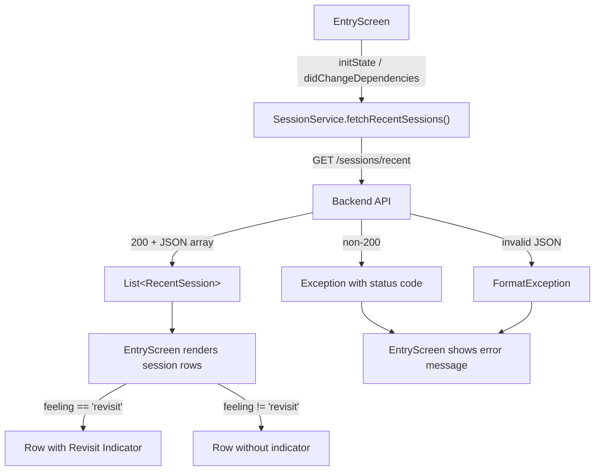

# Design Document: Recent Sessions Display

## Overview

This feature replaces the hardcoded recent session rows on the Entry Screen with live data fetched from `GET {BASE_URL}/sessions/recent`. The implementation spans three layers:

1. **Data model** — a new `RecentSession` class in `lib/models/recent_session.dart` that parses each JSON object from the API response.
2. **Service layer** — a new `fetchRecentSessions` method on `SessionService` that performs the GET request and returns a `List<RecentSession>`.
3. **UI layer** — the Entry Screen replaces its hardcoded `_recentRow` calls with a stateful section that shows a loading indicator, error message, empty-state message, or the list of sessions with an optional revisit indicator.

The design follows the same patterns already established by `prepare()`, `submitResults()`, and `submitFeeling()` in `SessionService`, and mirrors the loading/error state handling already present in `EntryScreen` for surah data.

## Architecture



Design decisions:

- **Reuse existing service pattern**: `fetchRecentSessions` follows the same header construction, env-var validation, optional `http.Client` injection, and error handling as the existing `prepare()` method. This keeps the codebase consistent and testable.
- **Dedicated model class**: `RecentSession` gets its own file with `fromJson`/`toJson` for clean separation and testability. The `createdAt` field is parsed as `DateTime` to enable relative date formatting.
- **Relative date formatting in a pure function**: A standalone `formatRelativeDate` function converts a `DateTime` to a human-readable string ("Today", "Yesterday", "3 days ago", etc.). Keeping it pure makes it easy to property-test without widget infrastructure.
- **Loading/error/empty states in the UI**: The recent sessions section uses the same `_isLoading` / `_error` pattern already used for surah loading, extended with a `_recentSessions` list and `_isLoadingRecent` / `_recentError` state variables.
- **Revisit indicator via updated `_recentRow`**: The existing static `_recentRow` method gains an optional `showRevisit` parameter. When true, a small styled label is appended to the row.

## Components and Interfaces

### RecentSession Model (New)

**File:** `lib/models/recent_session.dart`

```dart
class RecentSession {
  final String sessionId;
  final String pages;
  final String feeling;
  final DateTime createdAt;

  const RecentSession({
    required this.sessionId,
    required this.pages,
    required this.feeling,
    required this.createdAt,
  });

  factory RecentSession.fromJson(Map<String, dynamic> json) { ... }
  Map<String, dynamic> toJson() { ... }
}
```

- `fromJson` validates that all four required fields are present and non-null, throwing `FormatException` for missing fields (consistent with `SessionResponse.fromJson` and `Surah.fromJson`).
- `createdAt` is parsed from an ISO 8601 string via `DateTime.parse`.
- `toJson` serializes back to the same JSON shape, enabling round-trip testing.

### SessionService.fetchRecentSessions (New Method)

**File:** `lib/services/session_service.dart`

```dart
Future<List<RecentSession>> fetchRecentSessions({http.Client? client}) async { ... }
```

- Reads `BASE_URL` and `API_KEY` from `dotenv.env`. Throws if missing/empty (same pattern as existing methods).
- Sends `GET {BASE_URL}/sessions/recent` with `Authorization` from `_authService.getAuthHeader()` and `x-api-key` headers.
- On 200: decodes JSON body as a `List`, maps each element through `RecentSession.fromJson`, returns the list.
- On non-200: throws `Exception('Fetch recent sessions failed: status ${response.statusCode}')`.
- On JSON parse failure: the `FormatException` from `jsonDecode` propagates naturally.
- Accepts optional `http.Client` for testability.

### formatRelativeDate (New Pure Function)

**File:** `lib/utils/date_utils.dart`

```dart
String formatRelativeDate(DateTime date, {DateTime? now}) { ... }
```

- Computes the difference in calendar days between `date` and `now` (defaults to `DateTime.now()`).
- Returns: "Today" (0 days), "Yesterday" (1 day), "{n} days ago" (2–6 days), "1 week ago" (7–13 days), "{n} weeks ago" (14+ days).
- The optional `now` parameter enables deterministic testing.

### EntryScreen (Modified)

**File:** `lib/screens/entry_screen.dart`

Changes:
- New state variables: `List<RecentSession>? _recentSessions`, `bool _isLoadingRecent = true`, `String? _recentError`.
- In `didChangeDependencies`, after creating `_sessionService`, call `_loadRecentSessions()`.
- `_loadRecentSessions()` calls `_sessionService!.fetchRecentSessions()`, updates state on success/failure.
- The "CONTINUE WHERE YOU LEFT OFF" section renders based on state:
  - Loading: `CircularProgressIndicator` (small, centered).
  - Error: short error text in `AppColors.textMuted`.
  - Empty list: "No recent sessions" text in `AppColors.textMuted`.
  - Data: maps `_recentSessions` to `_recentRow` calls with `formatRelativeDate` for the date and `showRevisit: session.feeling == 'revisit'`.
- Remove the two hardcoded `_recentRow(...)` calls.
- Update `_recentRow` signature to accept an optional `showRevisit` boolean. When true, display a small "Revisit" label styled with `AppColors.primary` on a `AppColors.primaryLight` background.

## Data Models

### API Request

```
GET {BASE_URL}/sessions/recent
Headers:
  Authorization: Bearer <user-id>
  x-api-key: <api-key>
```

### API Response (200)

```json
[
  {
    "sessionId": "abc-123",
    "pages": "Pages 50–54",
    "feeling": "smooth",
    "createdAt": "2025-01-15T10:30:00Z"
  },
  {
    "sessionId": "def-456",
    "pages": "Pages 12–15",
    "feeling": "revisit",
    "createdAt": "2025-01-13T08:00:00Z"
  }
]
```

### RecentSession Fields

| Field | Type | Description |
|---|---|---|
| `sessionId` | `String` | Unique session identifier |
| `pages` | `String` | Human-readable page range (e.g. "Pages 50–54") |
| `feeling` | `String` | One of `smooth`, `struggled`, `revisit` |
| `createdAt` | `DateTime` | ISO 8601 timestamp of when the session was created |

### Relative Date Mapping

| Days Ago | Display String |
|---|---|
| 0 | "Today" |
| 1 | "Yesterday" |
| 2–6 | "{n} days ago" |
| 7–13 | "1 week ago" |
| 14+ | "{n} weeks ago" |


## Correctness Properties

*A property is a characteristic or behavior that should hold true across all valid executions of a system — essentially, a formal statement about what the system should do. Properties serve as the bridge between human-readable specifications and machine-verifiable correctness guarantees.*

### Property 1: GET request construction correctness

*For any* valid BASE_URL string, any user ID (producing an auth header), and any API key, calling `fetchRecentSessions` should produce a GET request where: (a) the URL equals `{BASE_URL}/sessions/recent`, (b) the headers include an `Authorization` header matching the auth service output, and (c) the headers include the `x-api-key` header matching the configured API key.

**Validates: Requirements 1.2, 1.3**

### Property 2: RecentSession JSON round-trip

*For any* valid `RecentSession` instance (with non-empty sessionId, non-empty pages, a feeling value from `{smooth, struggled, revisit}`, and a valid DateTime), serializing it via `toJson` and then deserializing via `RecentSession.fromJson` should produce an equivalent object with identical field values.

**Validates: Requirements 2.1, 2.3**

### Property 3: Non-200 status codes produce exceptions with status code

*For any* HTTP status code in the range 100–599 excluding 200, when `fetchRecentSessions` receives a response with that status code, it should throw an exception whose message contains the numeric status code.

**Validates: Requirements 2.4**

### Property 4: Invalid JSON throws parsing error

*For any* string that is not valid JSON (e.g. random alphanumeric strings, partial brackets, XML fragments), when the API returns a 200 response with that body, `fetchRecentSessions` should throw a `FormatException`.

**Validates: Requirements 2.5**

### Property 5: Relative date formatting correctness

*For any* `DateTime` value and a fixed reference `now`, `formatRelativeDate(date, now: now)` should return: "Today" when the difference is 0 days, "Yesterday" when 1 day, "{n} days ago" when 2–6 days, "1 week ago" when 7–13 days, and "{n} weeks ago" when 14+ days. The returned string should always be non-empty and the numeric value in the string (when present) should match the computed day/week difference.

**Validates: Requirements 3.2**

### Property 6: Revisit indicator shown if and only if feeling is 'revisit'

*For any* `RecentSession`, the revisit indicator should be displayed alongside the session row if and only if `session.feeling == 'revisit'`. Sessions with feeling values `smooth` or `struggled` should never show the indicator.

**Validates: Requirements 4.1, 4.2**

## Error Handling

| Scenario | Layer | Behavior |
|---|---|---|
| `BASE_URL` missing or empty in `.env` | `SessionService.fetchRecentSessions` | Throws `Exception('BASE_URL is not configured')` |
| `API_KEY` missing or empty in `.env` | `SessionService.fetchRecentSessions` | Throws `Exception('API_KEY is not configured')` |
| HTTP non-200 response | `SessionService.fetchRecentSessions` | Throws `Exception('Fetch recent sessions failed: status <code>')` |
| Response body is not valid JSON | `SessionService.fetchRecentSessions` | `FormatException` propagates from `jsonDecode` |
| JSON element missing required field | `RecentSession.fromJson` | Throws `FormatException('Missing required field: <name>')` |
| `createdAt` is not a valid ISO 8601 string | `RecentSession.fromJson` | `FormatException` propagates from `DateTime.parse` |
| Network error (no connectivity, timeout) | `SessionService.fetchRecentSessions` | Propagates the underlying `SocketException` / `ClientException` |
| `fetchRecentSessions` throws any exception | `EntryScreen._loadRecentSessions` | Catches error, sets `_recentError` state, displays error message in UI |
| API returns empty array `[]` | `EntryScreen` | Displays "No recent sessions" message |

## Testing Strategy

### Property-Based Tests

Use the `glados` package (already in dev_dependencies) for property tests. Each property test runs a minimum of 100 iterations with randomly generated inputs.

Each test must be tagged with a comment referencing the design property:

```dart
// Feature: recent-sessions-display, Property 1: GET request construction correctness
```

| Property | Test Description | Generator Strategy |
|---|---|---|
| Property 1 | Generate random BASE_URL strings, user IDs, and API keys. Call `fetchRecentSessions` with a mock HTTP client, capture the request, and assert URL path, Authorization header, and x-api-key header. | Random non-empty alphanumeric strings for BASE_URL, user ID, API key |
| Property 2 | Generate random `RecentSession` instances. Serialize via `toJson`, deserialize via `fromJson`, assert all fields match. | Random non-empty strings for sessionId/pages, random choice from valid feelings, random `DateTime` values |
| Property 3 | Generate random integers in 100–599 excluding 200. Mock HTTP response with that status code. Call `fetchRecentSessions`, assert exception message contains the code. | Random non-200 HTTP status codes |
| Property 4 | Generate random strings that are not valid JSON. Mock a 200 response with that body. Call `fetchRecentSessions`, assert `FormatException` is thrown. | Random alphanumeric strings, partial brackets, XML-like strings |
| Property 5 | Generate random `DateTime` pairs (date and now) where date <= now. Call `formatRelativeDate`, assert the returned string matches the expected category based on the day difference. | Random DateTime pairs with date in the past relative to now |
| Property 6 | Generate random `RecentSession` instances with random feeling values. Assert that the revisit indicator visibility equals `(feeling == 'revisit')`. | Random sessions with feeling drawn from `{smooth, struggled, revisit}` |

### Unit Tests (Examples and Edge Cases)

Unit tests cover specific examples, integration points, and edge cases:

- **EntryScreen calls fetchRecentSessions on load**: When the screen initializes with a valid AuthService, `fetchRecentSessions` is called (example for Req 3.1)
- **Loading indicator shown during fetch**: While `fetchRecentSessions` is pending, a `CircularProgressIndicator` is visible in the recent sessions section (example for Req 3.4)
- **Error message shown on fetch failure**: When `fetchRecentSessions` throws, an error message replaces the session rows (example for Req 3.5)
- **Empty state message**: When the API returns `[]`, "No recent sessions" text is displayed (edge case for Req 3.6)
- **Session order preserved**: Sessions are rendered in the same order as returned by the API (example for Req 3.3)
- **BASE_URL missing**: `fetchRecentSessions` throws descriptive error when BASE_URL is not configured (edge case for Req 1.4)
- **API_KEY missing**: `fetchRecentSessions` throws descriptive error when API_KEY is not configured (edge case for Req 1.5)
- **Hardcoded rows removed**: The Entry Screen source no longer contains "Pages 50–54" or "Pages 12–15" literals (code verification for Req 5.1)

### Test Configuration

- Property-based testing library: `glados` (already in dev_dependencies)
- Minimum iterations per property: 100
- Test runner: `flutter test`
- Each property test file tagged with feature and property reference
- Mock HTTP client used for all service-level tests (both property and unit)
- Each correctness property is implemented by a single property-based test
