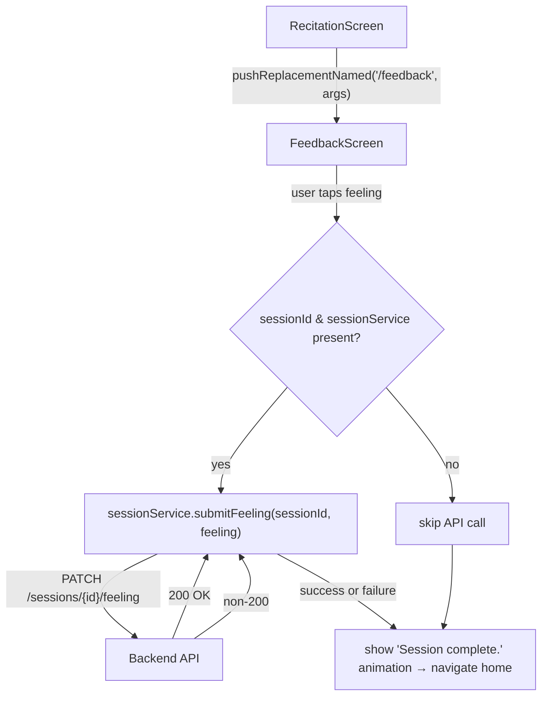

# Design Document: Session Feeling API

## Overview

This feature connects the post-recitation feedback screen to the backend by calling `PATCH /sessions/{sessionId}/feeling` with the user's selected feeling value. Currently the `FeedbackScreen` is cosmetic — it shows three options and animates to the home screen without persisting anything. After this change, tapping a feeling option fires a PATCH request through `SessionService`, and the existing animation/navigation flow continues regardless of API success or failure.

The implementation touches three areas:
1. **Service layer** — a new `submitFeeling` method on `SessionService` that sends the PATCH request with the correct headers and body.
2. **Feedback screen** — `FeedbackScreen` accepts `sessionId` and `sessionService` via navigation arguments, maps UI selections to feeling values, and calls `submitFeeling` on tap.
3. **Navigation wiring** — `RecitationScreen` passes `sessionId` and `sessionService` as arguments when navigating to `/feedback`.

## Architecture



Design decisions:

- **Fire-and-forget API call**: The PATCH call is awaited but failures are caught and swallowed. The user's flow is never blocked by a network error — the animation and navigation always proceed. This matches the existing pattern where `RecitationScreen` catches `submitResults` errors and continues.
- **Navigation arguments for dependency passing**: `sessionId` and `sessionService` are passed via `Navigator.pushReplacementNamed` arguments, consistent with how `RecitationScreen` already receives its `SessionService` instance via route arguments.
- **Graceful degradation when arguments are missing**: If `sessionId` or `sessionService` is null (e.g., deep link or test scenario), the screen behaves exactly as it does today — no API call, just animation and navigation.
- **Feeling value mapping via a static map**: A `Map<int, String>` maps option indices (0, 1, 2) to API values (`smooth`, `struggled`, `revisit`). This keeps the mapping explicit and easy to test.
- **Reuse existing header pattern**: `submitFeeling` constructs headers identically to `prepare()` and `submitResults()` — `Content-Type`, `Authorization` from `AuthService`, and `x-api-key` from `.env`.

## Components and Interfaces

### SessionService.submitFeeling (New Method)

**File:** `lib/services/session_service.dart`

```dart
Future<void> submitFeeling({
  required String sessionId,
  required String feeling,
  http.Client? client,
}) async { ... }
```

- Validates `feeling` is one of `smooth`, `struggled`, `revisit`. Throws `ArgumentError` otherwise.
- Reads `BASE_URL` and `API_KEY` from `dotenv.env`. Throws if missing/empty.
- Sends `PATCH {BASE_URL}/sessions/{sessionId}/feeling` with JSON body `{"feeling": "<value>"}`.
- Sets `Content-Type: application/json`, `Authorization` from `_authService.getAuthHeader()`, and `x-api-key` headers.
- Throws `Exception` with status code on non-200 responses.
- Accepts optional `http.Client` for testability, consistent with existing methods.

### FeedbackScreen (Modified)

**File:** `lib/screens/feedback_screen.dart`

Changes:
- In `didChangeDependencies`, extract `sessionId` (String?) and `sessionService` (SessionService?) from route arguments.
- Add a static `feelingMap` mapping option index to feeling value: `{0: 'smooth', 1: 'struggled', 2: 'revisit'}`.
- In `_submit`, if both `sessionId` and `_sessionService` are non-null, call `_sessionService!.submitFeeling(sessionId: _sessionId!, feeling: feelingMap[_selected]!)` inside a try/catch. On failure, `debugPrint` the error and continue.
- The animation and navigation logic remains unchanged.

### RecitationScreen (Modified)

**File:** `lib/screens/recitation_screen.dart`

Changes:
- In `_onDone`, pass `sessionId` and `sessionService` as arguments to `Navigator.pushReplacementNamed`:
  ```dart
  Navigator.pushReplacementNamed(
    context,
    '/feedback',
    arguments: {
      'sessionId': _sessionId,
      'sessionService': _sessionService,
    },
  );
  ```
- The `sessionId` is already available from the `SessionResponse` returned by the prepare call (passed through from `PrepScreen`).

### main.dart Route (Modified)

**File:** `lib/main.dart`

The `/feedback` route changes from a const constructor to extracting arguments:
```dart
'/feedback': (context) {
  final args = ModalRoute.of(context)?.settings.arguments as Map<String, dynamic>?;
  return FeedbackScreen(
    sessionId: args?['sessionId'] as String?,
    sessionService: args?['sessionService'] as SessionService?,
  );
},
```

Alternatively, `FeedbackScreen` can extract arguments internally via `didChangeDependencies` to keep the route definition simple. The latter approach is consistent with how `RecitationScreen` handles its arguments.

## Data Models

### API Request

```
PATCH {BASE_URL}/sessions/{sessionId}/feeling
Headers:
  Content-Type: application/json
  Authorization: Bearer <user-id>
  x-api-key: <api-key>

Body:
{
  "feeling": "smooth" | "struggled" | "revisit"
}
```

### Feeling Value Mapping

| UI Option Label       | Option Index | API Feeling Value |
|-----------------------|-------------|-------------------|
| Smooth                | 0           | `smooth`          |
| Struggled a little    | 1           | `struggled`       |
| Need to revisit       | 2           | `revisit`         |

### No new data models are needed

The request body is a simple `{"feeling": "<value>"}` map constructed inline. The response body is not used — only the status code matters. No new model classes are required.


## Correctness Properties

*A property is a characteristic or behavior that should hold true across all valid executions of a system — essentially, a formal statement about what the system should do. Properties serve as the bridge between human-readable specifications and machine-verifiable correctness guarantees.*

### Property 1: PATCH request construction correctness

*For any* valid session ID string and any valid feeling value (`smooth`, `struggled`, or `revisit`), calling `submitFeeling` should produce a PATCH request where: (a) the URL ends with `/sessions/{sessionId}/feeling`, (b) the JSON body contains exactly `{"feeling": "<value>"}`, and (c) the headers include `Content-Type: application/json`, an `Authorization` header, and an `x-api-key` header.

**Validates: Requirements 2.2, 2.3**

### Property 2: Invalid feeling values are rejected

*For any* string that is not one of `smooth`, `struggled`, or `revisit`, calling `submitFeeling` with that string as the feeling value should throw an `ArgumentError` before making any network request.

**Validates: Requirements 2.4**

### Property 3: Non-200 status codes produce exceptions with status code

*For any* HTTP status code in the range 100–599 excluding 200, when `submitFeeling` receives a response with that status code, it should throw an exception whose message contains the numeric status code.

**Validates: Requirements 2.5**

## Error Handling

| Scenario | Layer | Behavior |
|---|---|---|
| `BASE_URL` missing or empty in `.env` | `SessionService.submitFeeling` | Throws `Exception('BASE_URL is not configured')` |
| `API_KEY` missing or empty in `.env` | `SessionService.submitFeeling` | Throws `Exception('API_KEY is not configured')` |
| `feeling` is not `smooth`, `struggled`, or `revisit` | `SessionService.submitFeeling` | Throws `ArgumentError('Invalid feeling value: <value>')` |
| HTTP non-200 response | `SessionService.submitFeeling` | Throws `Exception('Submit feeling failed: status <code>')` |
| Network error (no connectivity, timeout) | `SessionService.submitFeeling` | Propagates the underlying `SocketException` / `ClientException` unmodified |
| `sessionId` is null in `FeedbackScreen` | `FeedbackScreen` | Skips API call, proceeds with animation and navigation |
| `sessionService` is null in `FeedbackScreen` | `FeedbackScreen` | Skips API call, proceeds with animation and navigation |
| `submitFeeling` throws any exception | `FeedbackScreen._submit` | Catches error, logs via `debugPrint`, proceeds with animation and navigation |

## Testing Strategy

### Property-Based Tests

Use the `glados` package (already in dev_dependencies) for property tests. Each property test runs a minimum of 100 iterations with randomly generated inputs.

Each test must be tagged with a comment referencing the design property:

```dart
// Feature: session-feeling-api, Property 1: PATCH request construction correctness
```

| Property | Test Description | Generator Strategy |
|---|---|---|
| Property 1 | Generate random non-empty session ID strings and pick a random valid feeling value. Call `submitFeeling` with a mock HTTP client, capture the request, and assert the URL path, JSON body, and all three headers are correct. | Random non-empty alphanumeric strings for sessionId; random choice from `['smooth', 'struggled', 'revisit']` for feeling |
| Property 2 | Generate random strings, filter out the three valid values. Call `submitFeeling` and assert it throws `ArgumentError` without making any HTTP request. | Random strings excluding `smooth`, `struggled`, `revisit` |
| Property 3 | Generate random integers in 100–599 excluding 200. Mock HTTP response with that status code. Call `submitFeeling`, assert exception message contains the code. | Random non-200 HTTP status codes |

### Unit Tests (Examples and Edge Cases)

Unit tests cover specific examples, integration points, and edge cases:

- **Feeling mapping**: Tapping option index 0 maps to `smooth`, index 1 maps to `struggled`, index 2 maps to `revisit` (examples for Req 3.1, 3.2, 3.3)
- **FeedbackScreen calls submitFeeling**: When sessionId and sessionService are provided, tapping a feeling option calls `submitFeeling` with the correct arguments (example for Req 4.1)
- **Success flow**: After `submitFeeling` succeeds, the "Session complete." animation displays and navigation to home occurs (example for Req 4.2)
- **Failure resilience**: When `submitFeeling` throws, the animation and navigation still proceed (edge case for Req 4.3)
- **Missing sessionId**: When sessionId is null, no API call is made and the screen behaves normally (edge case for Req 1.3)
- **Missing sessionService**: When sessionService is null, no API call is made and the screen behaves normally (edge case for Req 5.3)
- **BASE_URL missing**: `submitFeeling` throws descriptive error when BASE_URL is not configured (edge case)
- **API_KEY missing**: `submitFeeling` throws descriptive error when API_KEY is not configured (edge case)

### Test Configuration

- Property-based testing library: `glados` (already in dev_dependencies)
- Minimum iterations per property: 100
- Test runner: `flutter test`
- Each property test file tagged with feature and property reference
- Mock HTTP client used for all service-level tests (both property and unit)
- Each correctness property is implemented by a single property-based test
