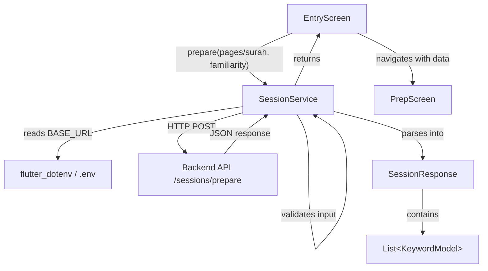

# Design Document: Session Prepare API

## Overview

This feature integrates the session preparation API into the Quran Prep app. A new `SessionService` sends a POST request to `{BASE_URL}/sessions/prepare` with either page numbers or a surah name plus a familiarity level. The response is parsed into structured Dart models (`SessionResponse` and `KeywordModel`). The API base URL is loaded at runtime from a `.env` file using the `flutter_dotenv` package. A `.env.example` file is committed for developer onboarding, and `.env` is gitignored.

The implementation touches four areas:
1. **Environment configuration** — `.env` / `.env.example` files and a dotenv loading step in `main.dart`.
2. **Data models** — `SessionResponse` and `KeywordModel` in `lib/models/`.
3. **Service layer** — `SessionService` in `lib/services/session_service.dart` handling request construction, validation, HTTP call, and response parsing.
4. **Package dependencies** — adding `flutter_dotenv` to `pubspec.yaml`.

## Architecture



Design decisions:

- **`flutter_dotenv` for env loading**: The project already uses `http`; adding `flutter_dotenv` is the standard Flutter approach for `.env` files. It loads once at app startup and provides synchronous access to values thereafter.
- **Validation before network call**: `SessionService` validates that exactly one of `pages` or `surah` is provided before making the HTTP request. This prevents unnecessary network round-trips for invalid inputs.
- **Immutable data models**: `SessionResponse` and `KeywordModel` use `final` fields and `const` constructors, consistent with the existing `Surah` model pattern.
- **Optional `http.Client` parameter**: Following the pattern in `SurahService`, the `SessionService.prepare()` method accepts an optional `http.Client` for testability with mock clients.
- **Hard-coded auth token**: The requirements specify `Bearer demo-user-1`. This is a placeholder for a future auth system and is kept as a constant in the service.

## Components and Interfaces

### KeywordModel (Data Model)

**File:** `lib/models/keyword_model.dart`

```dart
class KeywordModel {
  final String arabic;
  final String translation;
  final String hint;
  final String type;

  const KeywordModel({
    required this.arabic,
    required this.translation,
    required this.hint,
    required this.type,
  });

  factory KeywordModel.fromJson(Map<String, dynamic> json);
}
```

- `fromJson` extracts `arabic`, `translation`, `hint`, and `type` from the JSON map.
- Throws `FormatException` with a descriptive message naming the missing field when any required field is missing or null.

### SessionResponse (Data Model)

**File:** `lib/models/session_response.dart`

```dart
class SessionResponse {
  final String sessionId;
  final List<String> overview;
  final List<KeywordModel> keywords;

  const SessionResponse({
    required this.sessionId,
    required this.overview,
    required this.keywords,
  });

  factory SessionResponse.fromJson(Map<String, dynamic> json);
}
```

- `fromJson` extracts `sessionId` (String), `overview` (List\<String\>), and `keywords` (List\<KeywordModel\>).
- Throws `FormatException` with a descriptive message when any required field is missing or null.

### SessionService

**File:** `lib/services/session_service.dart`

```dart
class SessionService {
  Future<SessionResponse> prepare({
    List<int>? pages,
    String? surah,
    required String familiarity,
    http.Client? client,
  });
}
```

- **Validation**: Throws `ArgumentError` if both `pages` and `surah` are provided, or if neither is provided.
- **Request construction**: Builds a JSON body with `familiarity` and either `pages` or `surah`. Sets `Content-Type: application/json` and `Authorization: Bearer demo-user-1` headers.
- **URL**: Reads `BASE_URL` from `dotenv.env` and appends `/sessions/prepare`.
- **Error handling**: Throws `Exception` with status code on non-200 responses. Throws `FormatException` on JSON parse failures. Propagates network errors.

### Environment Configuration

**Files:**
- `.env` — contains `BASE_URL=https://your-api-url.com` (gitignored)
- `.env.example` — contains `BASE_URL=https://your-api-url.com` (committed)
- `.gitignore` — add `.env` entry
- `lib/main.dart` — add `await dotenv.load()` before `runApp()`

### main.dart Changes

```dart
import 'package:flutter_dotenv/flutter_dotenv.dart';

Future<void> main() async {
  await dotenv.load();
  runApp(const QuranPrepApp());
}
```

The `dotenv.load()` call reads `.env` at startup. If `BASE_URL` is missing or empty, `SessionService` throws a descriptive error at call time.

## Data Models

### KeywordModel

| Field         | Type     | JSON Source            | Description                     |
|---------------|----------|------------------------|---------------------------------|
| `arabic`      | `String` | `json['arabic']`       | Arabic keyword text             |
| `translation` | `String` | `json['translation']`  | English translation             |
| `hint`        | `String` | `json['hint']`         | Contextual usage hint           |
| `type`        | `String` | `json['type']`         | Keyword type (e.g. "focus", "advanced") |

### SessionResponse

| Field       | Type                  | JSON Source           | Description                        |
|-------------|-----------------------|-----------------------|------------------------------------|
| `sessionId` | `String`              | `json['sessionId']`   | Unique session identifier          |
| `overview`  | `List<String>`        | `json['overview']`    | Summary sentences for the passage  |
| `keywords`  | `List<KeywordModel>`  | `json['keywords']`    | Keyword objects for flashcards     |

### API Request Shape

```json
POST {BASE_URL}/sessions/prepare
Headers:
  Content-Type: application/json
  Authorization: Bearer demo-user-1

Body (pages variant):
{
  "pages": [50, 51, 52],
  "familiarity": "new"
}

Body (surah variant):
{
  "surah": "Al-Baqarah",
  "familiarity": "review"
}
```

### API Response Shape

```json
{
  "sessionId": "abc-123",
  "overview": [
    "This passage discusses trials faced by believers.",
    "It addresses the consequences of turning away from guidance."
  ],
  "keywords": [
    {
      "arabic": "صَبْر",
      "translation": "Patience / Steadfastness",
      "hint": "Used when enduring hardship with faith",
      "type": "focus"
    }
  ]
}
```


## Correctness Properties

*A property is a characteristic or behavior that should hold true across all valid executions of a system — essentially, a formal statement about what the system should do. Properties serve as the bridge between human-readable specifications and machine-verifiable correctness guarantees.*

### Property 1: Request body construction correctness

*For any* valid familiarity string and either a non-empty list of page numbers or a non-empty surah name string, the JSON request body constructed by `SessionService` should contain the `familiarity` field with the provided value, and exactly one of `pages` or `surah` with the provided value. No extra fields beyond these should be present.

**Validates: Requirements 2.3, 2.4, 2.5**

### Property 2: SessionResponse JSON parsing round trip

*For any* valid `SessionResponse` (containing a non-empty `sessionId` string, a list of overview strings, and a list of `KeywordModel` instances each with non-empty `arabic`, `translation`, `hint`, and `type` strings), converting it to a JSON map and parsing it back via `SessionResponse.fromJson` should produce an equivalent `SessionResponse` with identical field values.

**Validates: Requirements 3.1, 3.2, 3.3, 3.4, 3.5, 3.6**

### Property 3: Missing or null required fields produce descriptive errors

*For any* JSON map where at least one required field (`sessionId`, `overview`, `keywords`, or within a keyword: `arabic`, `translation`, `hint`, `type`) is either missing or set to null, calling the corresponding `fromJson` factory should throw an error whose message identifies the missing field.

**Validates: Requirements 3.7**

### Property 4: Non-200 status codes produce exceptions with status code

*For any* HTTP status code in the range 100–599 excluding 200, when `SessionService.prepare()` receives a response with that status code, it should throw an exception whose message contains the numeric status code.

**Validates: Requirements 4.1**

### Property 5: Invalid JSON responses produce parsing errors

*For any* string that is not valid JSON, when `SessionService.prepare()` receives it as a response body with a 200 status code, it should throw an error indicating a parsing failure.

**Validates: Requirements 4.3**

### Property 6: Input validation — exactly one of pages or surah required

*For any* call to `SessionService.prepare()` where both `pages` and `surah` are provided, or where neither is provided, the service should throw a validation error before making any network request.

**Validates: Requirements 5.1, 5.2**

## Error Handling

| Scenario | Layer | Behavior |
|---|---|---|
| `BASE_URL` missing or empty in `.env` | `SessionService` | Throws descriptive error: "BASE_URL is not configured" |
| Both `pages` and `surah` provided | `SessionService` (validation) | Throws `ArgumentError`: "Only one of pages or surah is allowed" |
| Neither `pages` nor `surah` provided | `SessionService` (validation) | Throws `ArgumentError`: "Either pages or surah is required" |
| HTTP non-200 response | `SessionService` | Throws `Exception('Session prepare failed: status <code>')` |
| Network error (no connectivity, timeout) | `SessionService` | Propagates the underlying `SocketException` / `ClientException` unmodified |
| Response body is not valid JSON | `SessionService` | Throws `FormatException` indicating JSON parsing failure |
| JSON missing required field / null value | `SessionResponse.fromJson` / `KeywordModel.fromJson` | Throws `FormatException` with message naming the missing field |

Validation errors are thrown synchronously before any network call. HTTP and parsing errors are thrown after the network call returns. Network errors propagate as-is for the caller to handle.

## Testing Strategy

### Property-Based Tests

Use the `glados` package (Dart property-based testing library already in dev_dependencies) for property tests. Each property test runs a minimum of 100 iterations with randomly generated inputs.

Each test must be tagged with a comment referencing the design property:

```dart
// Feature: session-prepare-api, Property 2: SessionResponse JSON parsing round trip
```

| Property | Test Description | Generator Strategy |
|---|---|---|
| Property 1 | Generate random familiarity strings and either random page number lists or random surah name strings. Build the request body, assert it contains exactly the expected fields with correct values. | Random non-empty strings for familiarity/surah, random non-empty `List<int>` for pages |
| Property 2 | Generate random `SessionResponse` instances (random sessionId, random overview lists, random keyword lists). Convert to JSON map, parse via `fromJson`, assert field equality. | Random non-empty strings for all fields, random-length lists |
| Property 3 | Generate valid JSON maps then randomly remove or null-ify one required field. Call `fromJson`, assert it throws and the error message contains the field name. | Start from valid JSON, apply random field removal/nullification |
| Property 4 | Generate random integers in 100–599 excluding 200. Mock HTTP response with that status code. Call `prepare()`, assert exception message contains the code. | Random non-200 HTTP status codes |
| Property 5 | Generate random strings that are not valid JSON (e.g., random alphanumeric strings, truncated JSON). Mock HTTP 200 response with that body. Call `prepare()`, assert it throws a parsing error. | Random non-JSON strings |
| Property 6 | Generate random pages lists and surah strings. Call `prepare()` with both provided, assert it throws. Call with neither provided, assert it throws. | Random valid inputs for both fields |

### Unit Tests (Examples and Edge Cases)

Unit tests cover specific examples, integration points, and edge cases:

- **SessionService** sends POST to correct URL `{BASE_URL}/sessions/prepare` (example for Req 2.1, using mock client)
- **SessionService** sets `Authorization: Bearer demo-user-1` header (example for Req 2.2)
- **SessionService** sets `Content-Type: application/json` header (example for Req 2.6)
- **SessionService** throws when `BASE_URL` is missing or empty (example for Req 1.4)
- **SessionService** propagates network errors (example for Req 4.2)
- **SessionResponse.fromJson** with a realistic API response snippet (example for Req 3.1)
- **KeywordModel.fromJson** with a realistic keyword JSON (example for Req 3.5)
- **Input validation**: neither pages nor surah provided (edge case for Req 5.1)
- **Input validation**: both pages and surah provided (edge case for Req 5.2)

### Test Configuration

- Property-based testing library: `glados` (already in dev_dependencies)
- Minimum iterations per property: 100
- Test runner: `flutter test`
- Each property test file tagged with feature and property reference
- Mock HTTP client used for all service-level tests (both property and unit)
