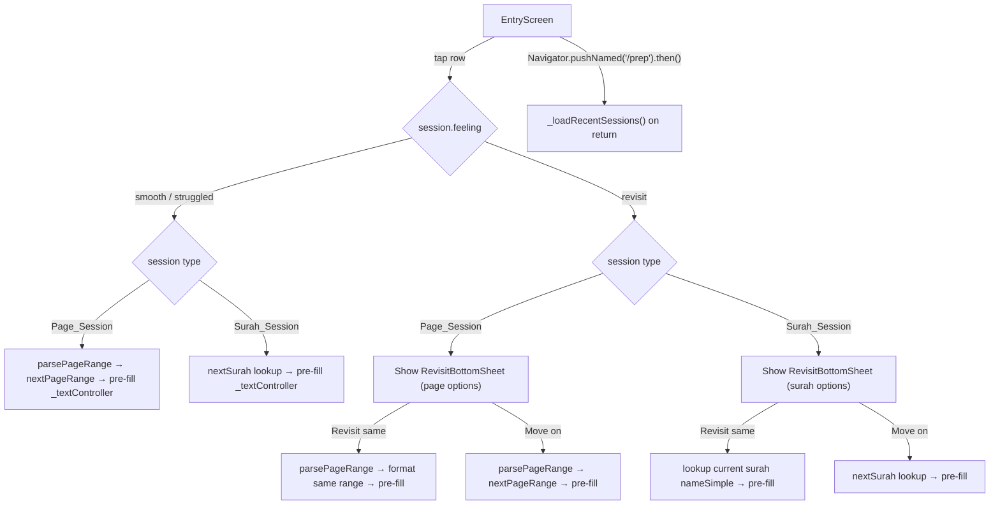

# Design Document: Session Quick Resume

## Overview

This feature makes recent session rows on the Entry Screen tappable, enabling users to quickly resume from where they left off. It extends the existing `recent-sessions-display` spec by:

1. **Model update** — `RecentSession` gains an optional `pages` (String?) and optional `surah` (int?) field, replacing the current required `pages` String. Exactly one must be present.
2. **Display logic** — Page sessions show the `pages` string; surah sessions look up `nameSimple` from the already-loaded `_surahs` list.
3. **Page utilities** — A new `lib/utils/page_utils.dart` provides `parsePageRange` (extracts start/end/span from a pages string) and `nextPageRange` (computes the next contiguous range).
4. **Next surah logic** — Simple N+1 with wrap from 114→1, looked up in `_surahs`.
5. **Tap handlers** — Non-revisit sessions pre-fill `_textController` with the next content. Revisit sessions show a bottom sheet with "revisit same" / "move on" options.
6. **Re-fetch on return** — The Entry Screen re-fetches recent sessions every time the user navigates back (using `Navigator.pushNamed` future resolution or route-aware callback).

## Architecture



Design decisions:

- **`pages` becomes optional** — The API returns either `pages` or `surah`, never both. Making both optional with a validation check in `fromJson` (at least one must be present) is the cleanest approach. This is a breaking change to the model but aligns with the actual API contract.
- **Pure utility functions for page parsing** — `parsePageRange` and `nextPageRange` are pure functions in `lib/utils/page_utils.dart`, making them trivially testable without widget infrastructure. They handle the "Pages 50–54" format from the API as well as raw "50-54" format.
- **Surah lookup via existing `_surahs` list** — No new API call needed. The `_surahs` list is already loaded at startup. We use `firstWhere` with an `orElse` fallback.
- **Bottom sheet as a standalone widget** — `RevisitBottomSheet` is a stateless widget in `lib/widgets/revisit_bottom_sheet.dart`. It receives the two option labels and returns the user's choice via `Navigator.pop`. This keeps the Entry Screen tap handler clean.
- **Re-fetch via `.then()` on `Navigator.pushNamed`** — When the user navigates to `/prep`, the returned `Future` resolves when they come back. At that point we call `_loadRecentSessions()` again. This is simpler than `RouteAware` and covers the main flow (feedback screen pops back to `/home`). We also re-fetch in `didChangeDependencies` by removing the `_didExtractArgs` guard on the fetch call — but the simpler `.then()` approach on the push is cleaner and more targeted.
- **`_recentRow` becomes an instance method** — Currently `_recentRow` is static. To attach an `onTap` callback that accesses instance state (`_textController`, `_surahs`), it needs to become an instance method or accept callbacks. We'll make it an instance method and wrap the row in an `InkWell` for tap feedback.

## Components and Interfaces

### RecentSession Model (Modified)

**File:** `lib/models/recent_session.dart`

```dart
class RecentSession {
  final String sessionId;
  final String? pages;    // was: required String pages
  final int? surah;       // NEW
  final String feeling;
  final DateTime createdAt;

  const RecentSession({
    required this.sessionId,
    this.pages,
    this.surah,
    required this.feeling,
    required this.createdAt,
  });

  factory RecentSession.fromJson(Map<String, dynamic> json) {
    // Validate at least one of pages/surah is present
    if (json['pages'] == null && json['surah'] == null) {
      throw FormatException('Either pages or surah must be present');
    }
    // ... parse fields
  }

  Map<String, dynamic> toJson() { ... }
}
```

Changes from current model:
- `pages` changes from `required String` to `String?`
- New `surah` field of type `int?`
- `fromJson` validates that at least one of `pages`/`surah` is present

### Page Utilities (New)

**File:** `lib/utils/page_utils.dart`

```dart
/// Parses a pages string into (start, end, span).
/// Accepts formats: "Pages 50–54", "Pages 50", "50-54", "50".
/// Returns null if the string cannot be parsed.
({int start, int end, int span})? parsePageRange(String pages);

/// Computes the next contiguous page range string.
/// Given start, end, span: returns "{end+1}-{end+span}" or "{end+1}" if span == 1.
String nextPageRange(int start, int end, int span);

/// Formats a parsed range back to a string: "{start}-{end}" or "{start}" if start == end.
String formatPageRange(int start, int end);
```

- `parsePageRange` uses a regex to strip the optional "Pages " prefix, then matches `(\d+)[\s]*[-–][\s]*(\d+)` for ranges or `(\d+)` for single pages.
- `nextPageRange` is pure arithmetic: `nextStart = end + 1`, `nextEnd = end + span`. If span is 1, returns just `"$nextStart"`.
- `formatPageRange` produces `"$start-$end"` or `"$start"` when start == end.

### Next Surah Logic

Inline in `_EntryScreenState`, not a separate utility (it depends on `_surahs`):

```dart
/// Returns the nameSimple of surah (id + 1), wrapping 114 → 1.
/// Returns null if the next surah can't be found in _surahs.
String? _nextSurahName(int currentSurahId) {
  final nextId = currentSurahId >= 114 ? 1 : currentSurahId + 1;
  final surah = _surahs?.firstWhere((s) => s.id == nextId, orElse: () => ???);
  // Use try/catch with firstWhere (no orElse) or use indexWhere
}
```

We'll use a helper that returns `null` on not-found:

```dart
String? _surahName(int id) {
  final idx = _surahs?.indexWhere((s) => s.id == id) ?? -1;
  return idx >= 0 ? _surahs![idx].nameSimple : null;
}

String? _nextSurahName(int currentId) {
  final nextId = currentId >= 114 ? 1 : currentId + 1;
  return _surahName(nextId);
}
```

### RevisitBottomSheet (New Widget)

**File:** `lib/widgets/revisit_bottom_sheet.dart`

```dart
class RevisitBottomSheet extends StatelessWidget {
  final String revisitLabel;  // e.g. "Revisit same pages" or "Revisit same surah"
  final String moveOnLabel;   // always "Move on"

  const RevisitBottomSheet({
    super.key,
    required this.revisitLabel,
    required this.moveOnLabel,
  });

  @override
  Widget build(BuildContext context) {
    // Returns 'revisit' or 'moveOn' via Navigator.pop
  }
}
```

Styled consistently with the app's design language:
- Background: `AppColors.surface`
- Rounded top corners (radius 16)
- Two option rows with `InkWell`, styled like the feedback screen options
- Drag handle at top
- Dismissible (swipe down or tap outside returns null)

### EntryScreen Tap Handler (Modified)

**File:** `lib/screens/entry_screen.dart`

New instance method:

```dart
Future<void> _onRecentSessionTap(RecentSession session) async {
  if (session.pages != null) {
    _handlePageSessionTap(session);
  } else if (session.surah != null) {
    _handleSurahSessionTap(session);
  }
}
```

For page sessions:
```dart
void _handlePageSessionTap(RecentSession session) async {
  final parsed = parsePageRange(session.pages!);
  if (parsed == null) return; // unparseable → no action

  if (session.feeling == 'revisit') {
    final choice = await showModalBottomSheet<String>(
      context: context,
      builder: (_) => RevisitBottomSheet(
        revisitLabel: 'Revisit same pages',
        moveOnLabel: 'Move on',
      ),
    );
    if (choice == 'revisit') {
      _textController.text = formatPageRange(parsed.start, parsed.end);
    } else if (choice == 'moveOn') {
      _textController.text = nextPageRange(parsed.start, parsed.end, parsed.span);
    }
    // null (dismissed) → no action
  } else {
    _textController.text = nextPageRange(parsed.start, parsed.end, parsed.span);
  }
}
```

For surah sessions:
```dart
void _handleSurahSessionTap(RecentSession session) async {
  if (session.feeling == 'revisit') {
    final currentName = _surahName(session.surah!);
    if (currentName == null) return; // can't find surah → no action
    final nextName = _nextSurahName(session.surah!);

    final choice = await showModalBottomSheet<String>(
      context: context,
      builder: (_) => RevisitBottomSheet(
        revisitLabel: 'Revisit same surah',
        moveOnLabel: 'Move on',
      ),
    );
    if (choice == 'revisit') {
      _textController.text = currentName;
    } else if (choice == 'moveOn' && nextName != null) {
      _textController.text = nextName;
    }
  } else {
    final nextName = _nextSurahName(session.surah!);
    if (nextName == null) return;
    _textController.text = nextName;
  }
}
```

### Re-fetch Mechanism

The current code calls `_loadRecentSessions()` once in `didChangeDependencies` guarded by `_didExtractArgs`. To re-fetch on navigation return:

```dart
// In _prepare(), change Navigator.pushNamed to await the result:
final result = await Navigator.pushNamed(context, '/prep', arguments: { ... });
// When user returns (via popUntil to '/home'), this future completes
if (mounted) {
  _loadRecentSessions();
}
```

This is the simplest approach. The `Navigator.pushNamed` future resolves when the route is popped. Since the feedback screen uses `Navigator.popUntil(context, ModalRoute.withName('/home'))`, the `/prep` route gets popped and the future resolves.

### Display Row Title Logic

The `_recentRow` method changes from static to instance, and the title computation becomes:

```dart
String _sessionTitle(RecentSession session) {
  if (session.pages != null) return session.pages!;
  if (session.surah != null) {
    return _surahName(session.surah!) ?? 'Surah ${session.surah}';
  }
  return 'Unknown session';
}
```

The row is wrapped in `InkWell` for tap feedback:

```dart
Widget _recentRow(RecentSession session) {
  return InkWell(
    onTap: () => _onRecentSessionTap(session),
    borderRadius: BorderRadius.circular(8),
    child: Padding(
      padding: const EdgeInsets.symmetric(vertical: 12),
      child: Row( /* title + date + revisit badge */ ),
    ),
  );
}
```

## Data Models

### RecentSession (Updated)

| Field | Type | Required | Description |
|---|---|---|---|
| `sessionId` | `String` | Yes | Unique session identifier |
| `pages` | `String?` | No* | Human-readable page range (e.g. "Pages 50–54") |
| `surah` | `int?` | No* | Surah ID (1–114) |
| `feeling` | `String` | Yes | One of `smooth`, `struggled`, `revisit` |
| `createdAt` | `DateTime` | Yes | ISO 8601 timestamp |

*At least one of `pages` or `surah` must be present.

### ParsedPageRange (Record)

```dart
({int start, int end, int span})
```

| Field | Type | Description |
|---|---|---|
| `start` | `int` | First page number |
| `end` | `int` | Last page number |
| `span` | `int` | Number of pages (end - start + 1) |

### RevisitBottomSheet Choice

The bottom sheet returns a `String?` via `Navigator.pop`:
- `'revisit'` — user chose to revisit same content
- `'moveOn'` — user chose to move on
- `null` — user dismissed without choosing
