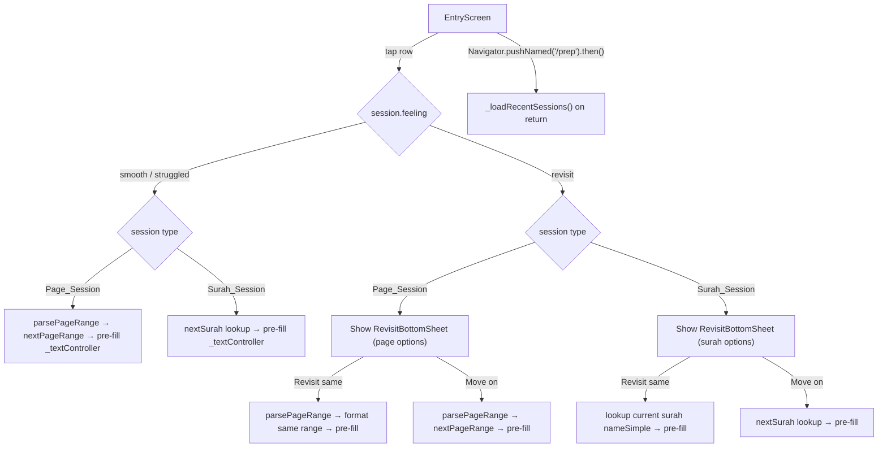

# Design Document: Session Quick Resume

## Overview

This feature makes recent session rows on the Entry Screen tappable, enabling users to quickly resume from where they left off. It extends the existing `recent-sessions-display` spec by:

1. **Model update** — `RecentSession` gains an optional `pages` (String?) and optional `surah` (int?) field, replacing the current required `pages` String. Exactly one must be present.
2. **Display logic** — Page sessions show the `pages` string; surah sessions look up `nameSimple` from the already-loaded `_surahs` list.
3. **Page utilities** — A new `lib/utils/page_utils.dart` provides `parsePageRange` (extracts start/end/span from a pages string) and `nextPageRange` (computes the next contiguous range).
4. **Next surah logic** — Simple N+1 with wrap from 114→1, looked up in `_surahs`.
5. **Tap handlers** — Non-revisit sessions pre-fill `_textController` with the next content. Revisit sessions show a bottom sheet with "revisit same" / "move on" options.
6. **Re-fetch on return** — The Entry Screen re-fetches recent sessions every time the user navigates back (using `Navigator.pushNamed` future resolution or route-aware callback).

## Architecture



Design decisions:

- **`pages` becomes optional** — The API returns either `pages` or `surah`, never both. Making both optional with a validation check in `fromJson` (at least one must be present) is the cleanest approach. This is a breaking change to the model but aligns with the actual API contract.
- **Pure utility functions for page parsing** — `parsePageRange` and `nextPageRange` are pure functions in `lib/utils/page_utils.dart`, making them trivially testable without widget infrastructure. They handle the "Pages 50–54" format from the API as well as raw "50-54" format.
- **Surah lookup via existing `_surahs` list** — No new API call needed. The `_surahs` list is already loaded at startup. We use `firstWhere` with an `orElse` fallback.
- **Bottom sheet as a standalone widget** — `RevisitBottomSheet` is a stateless widget in `lib/widgets/revisit_bottom_sheet.dart`. It receives the two option labels and returns the user's choice via `Navigator.pop`. This keeps the Entry Screen tap handler clean.
- **Re-fetch via `.then()` on `Navigator.pushNamed`** — When the user navigates to `/prep`, the returned `Future` resolves when they come back. At that point we call `_loadRecentSessions()` again. This is simpler than `RouteAware` and covers the main flow (feedback screen pops back to `/home`). We also re-fetch in `didChangeDependencies` by removing the `_didExtractArgs` guard on the fetch call — but the simpler `.then()` approach on the push is cleaner and more targeted.
- **`_recentRow` becomes an instance method** — Currently `_recentRow` is static. To attach an `onTap` callback that accesses instance state (`_textController`, `_surahs`), it needs to become an instance method or accept callbacks. We'll make it an instance method and wrap the row in an `InkWell` for tap feedback.

## Components and Interfaces

### RecentSession Model (Modified)

**File:** `lib/models/recent_session.dart`

```dart
class RecentSession {
  final String sessionId;
  final String? pages;    // was: required String pages
  final int? surah;       // NEW
  final String feeling;
  final DateTime createdAt;

  const RecentSession({
    required this.sessionId,
    this.pages,
    this.surah,
    required this.feeling,
    required this.createdAt,
  });

  factory RecentSession.fromJson(Map<String, dynamic> json) {
    // Validate at least one of pages/surah is present
    if (json['pages'] == null && json['surah'] == null) {
      throw FormatException('Either pages or surah must be present');
    }
    // ... parse fields
  }

  Map<String, dynamic> toJson() { ... }
}
```

Changes from current model:
- `pages` changes from `required String` to `String?`
- New `surah` field of type `int?`
- `fromJson` validates that at least one of `pages`/`surah` is present

### Page Utilities (New)

**File:** `lib/utils/page_utils.dart`

```dart
/// Parses a pages string into (start, end, span).
/// Accepts formats: "Pages 50–54", "Pages 50", "50-54", "50".
/// Returns null if the string cannot be parsed.
({int start, int end, int span})? parsePageRange(String pages);

/// Computes the next contiguous page range string.
/// Given start, end, span: returns "{end+1}-{end+span}" or "{end+1}" if span == 1.
String nextPageRange(int start, int end, int span);

/// Formats a parsed range back to a string: "{start}-{end}" or "{start}" if start == end.
String formatPageRange(int start, int end);
```

- `parsePageRange` uses a regex to strip the optional "Pages " prefix, then matches `(\d+)[\s]*[-–][\s]*(\d+)` for ranges or `(\d+)` for single pages.
- `nextPageRange` is pure arithmetic: `nextStart = end + 1`, `nextEnd = end + span`. If span is 1, returns just `"$nextStart"`.
- `formatPageRange` produces `"$start-$end"` or `"$start"` when start == end.

### Next Surah Logic

Inline in `_EntryScreenState`, not a separate utility (it depends on `_surahs`):

```dart
/// Returns the nameSimple of surah (id + 1), wrapping 114 → 1.
/// Returns null if the next surah can't be found in _surahs.
String? _nextSurahName(int currentSurahId) {
  final nextId = currentSurahId >= 114 ? 1 : currentSurahId + 1;
  final surah = _surahs?.firstWhere((s) => s.id == nextId, orElse: () => ???);
  // Use try/catch with firstWhere (no orElse) or use indexWhere
}
```

We'll use a helper that returns `null` on not-found:

```dart
String? _surahName(int id) {
  final idx = _surahs?.indexWhere((s) => s.id == id) ?? -1;
  return idx >= 0 ? _surahs![idx].nameSimple : null;
}

String? _nextSurahName(int currentId) {
  final nextId = currentId >= 114 ? 1 : currentId + 1;
  return _surahName(nextId);
}
```

### RevisitBottomSheet (New Widget)

**File:** `lib/widgets/revisit_bottom_sheet.dart`

```dart
class RevisitBottomSheet extends StatelessWidget {
  final String revisitLabel;  // e.g. "Revisit same pages" or "Revisit same surah"
  final String moveOnLabel;   // always "Move on"

  const RevisitBottomSheet({
    super.key,
    required this.revisitLabel,
    required this.moveOnLabel,
  });

  @override
  Widget build(BuildContext context) {
    // Returns 'revisit' or 'moveOn' via Navigator.pop
  }
}
```

Styled consistently with the app's design language:
- Background: `AppColors.surface`
- Rounded top corners (radius 16)
- Two option rows with `InkWell`, styled like the feedback screen options
- Drag handle at top
- Dismissible (swipe down or tap outside returns null)

### EntryScreen Tap Handler (Modified)

**File:** `lib/screens/entry_screen.dart`

New instance method:

```dart
Future<void> _onRecentSessionTap(RecentSession session) async {
  if (session.pages != null) {
    _handlePageSessionTap(session);
  } else if (session.surah != null) {
    _handleSurahSessionTap(session);
  }
}
```

For page sessions:
```dart
void _handlePageSessionTap(RecentSession session) async {
  final parsed = parsePageRange(session.pages!);
  if (parsed == null) return; // unparseable → no action

  if (session.feeling == 'revisit') {
    final choice = await showModalBottomSheet<String>(
      context: context,
      builder: (_) => RevisitBottomSheet(
        revisitLabel: 'Revisit same pages',
        moveOnLabel: 'Move on',
      ),
    );
    if (choice == 'revisit') {
      _textController.text = formatPageRange(parsed.start, parsed.end);
    } else if (choice == 'moveOn') {
      _textController.text = nextPageRange(parsed.start, parsed.end, parsed.span);
    }
    // null (dismissed) → no action
  } else {
    _textController.text = nextPageRange(parsed.start, parsed.end, parsed.span);
  }
}
```

For surah sessions:
```dart
void _handleSurahSessionTap(RecentSession session) async {
  if (session.feeling == 'revisit') {
    final currentName = _surahName(session.surah!);
    if (currentName == null) return; // can't find surah → no action
    final nextName = _nextSurahName(session.surah!);

    final choice = await showModalBottomSheet<String>(
      context: context,
      builder: (_) => RevisitBottomSheet(
        revisitLabel: 'Revisit same surah',
        moveOnLabel: 'Move on',
      ),
    );
    if (choice == 'revisit') {
      _textController.text = currentName;
    } else if (choice == 'moveOn' && nextName != null) {
      _textController.text = nextName;
    }
  } else {
    final nextName = _nextSurahName(session.surah!);
    if (nextName == null) return;
    _textController.text = nextName;
  }
}
```

### Re-fetch Mechanism

The current code calls `_loadRecentSessions()` once in `didChangeDependencies` guarded by `_didExtractArgs`. To re-fetch on navigation return:

```dart
// In _prepare(), change Navigator.pushNamed to await the result:
final result = await Navigator.pushNamed(context, '/prep', arguments: { ... });
// When user returns (via popUntil to '/home'), this future completes
if (mounted) {
  _loadRecentSessions();
}
```

This is the simplest approach. The `Navigator.pushNamed` future resolves when the route is popped. Since the feedback screen uses `Navigator.popUntil(context, ModalRoute.withName('/home'))`, the `/prep` route gets popped and the future resolves.

### Display Row Title Logic

The `_recentRow` method changes from static to instance, and the title computation becomes:

```dart
String _sessionTitle(RecentSession session) {
  if (session.pages != null) return session.pages!;
  if (session.surah != null) {
    return _surahName(session.surah!) ?? 'Surah ${session.surah}';
  }
  return 'Unknown session';
}
```

The row is wrapped in `InkWell` for tap feedback:

```dart
Widget _recentRow(RecentSession session) {
  return InkWell(
    onTap: () => _onRecentSessionTap(session),
    borderRadius: BorderRadius.circular(8),
    child: Padding(
      padding: const EdgeInsets.symmetric(vertical: 12),
      child: Row( /* title + date + revisit badge */ ),
    ),
  );
}
```

## Data Models

### RecentSession (Updated)

| Field | Type | Required | Description |
|---|---|---|---|
| `sessionId` | `String` | Yes | Unique session identifier |
| `pages` | `String?` | No* | Human-readable page range (e.g. "Pages 50–54") |
| `surah` | `int?` | No* | Surah ID (1–114) |
| `feeling` | `String` | Yes | One of `smooth`, `struggled`, `revisit` |
| `createdAt` | `DateTime` | Yes | ISO 8601 timestamp |

*At least one of `pages` or `surah` must be present.

### ParsedPageRange (Record)

```dart
({int start, int end, int span})
```

| Field | Type | Description |
|---|---|---|
| `start` | `int` | First page number |
| `end` | `int` | Last page number |
| `span` | `int` | Number of pages (end - start + 1) |

### RevisitBottomSheet Choice

The bottom sheet returns a `String?` via `Navigator.pop`:
- `'revisit'` — user chose to revisit same content
- `'moveOn'` — user chose to move on
- `null` — user dismissed without choosing


## Correctness Properties

*A property is a characteristic or behavior that should hold true across all valid executions of a system — essentially, a formal statement about what the system should do. Properties serve as the bridge between human-readable specifications and machine-verifiable correctness guarantees.*

### Property 1: RecentSession JSON round-trip

*For any* valid `RecentSession` instance (with either a non-null `pages` string or a non-null `surah` int, a feeling from `{smooth, struggled, revisit}`, and a valid DateTime), serializing via `toJson` and deserializing via `RecentSession.fromJson` should produce an equivalent object with identical field values.

**Validates: Requirements 1.3, 1.4**

### Property 2: Missing pages and surah throws FormatException

*For any* JSON map that contains a valid `sessionId`, `feeling`, and `createdAt` but has both `pages` and `surah` as null (or absent), calling `RecentSession.fromJson` should throw a `FormatException`.

**Validates: Requirements 1.5**

### Property 3: Page range parsing round-trip

*For any* pair of positive integers (start, end) where start <= end, formatting them as a page range string (either "Pages {start}–{end}" or "{start}-{end}") and then parsing with `parsePageRange` should return the same start and end values, with span equal to end - start + 1.

**Validates: Requirements 3.1, 3.2, 3.5**

### Property 4: Invalid pages strings return null

*For any* string that does not match a valid page range pattern (e.g. random alphabetic strings, empty strings, strings with multiple dashes), `parsePageRange` should return null.

**Validates: Requirements 3.4**

### Property 5: Next page range arithmetic

*For any* positive integers start, end, span where span = end - start + 1, calling `nextPageRange(start, end, span)` should produce a string that, when parsed, yields a start of `end + 1` and an end of `end + span`, with the same span as the original.

**Validates: Requirements 4.1**

### Property 6: Next surah wrapping

*For any* surah ID in the range 1–114, the next surah ID should equal `id + 1` when `id < 114`, and should equal `1` when `id == 114`. The result should always be in the range 1–114.

**Validates: Requirements 5.1, 5.2**

### Property 7: Session title computation

*For any* `RecentSession` and a surah list containing all 114 surahs, the computed session title should equal `session.pages` when pages is non-null, or the matching surah's `nameSimple` when surah is non-null and found in the list.

**Validates: Requirements 2.1, 2.2**

### Property 8: Non-revisit tap pre-fills next content

*For any* `RecentSession` with feeling `smooth` or `struggled`, and a complete surah list: if it's a page session with a parseable pages string, tapping should set the text controller to `nextPageRange` of the parsed range; if it's a surah session with a valid surah ID, tapping should set the text controller to the next surah's `nameSimple`.

**Validates: Requirements 6.1, 7.1**

### Property 9: Revisit choice pre-fills correct content

*For any* `RecentSession` with feeling `revisit`, a complete surah list, and a user choice of either `'revisit'` or `'moveOn'`: if the choice is `'revisit'`, the text controller should be set to the current content (same page range or same surah name); if the choice is `'moveOn'`, the text controller should be set to the next content (next page range or next surah name).

**Validates: Requirements 8.3, 8.4, 9.3, 9.4**

## Error Handling

| Scenario | Layer | Behavior |
|---|---|---|
| JSON has neither `pages` nor `surah` | `RecentSession.fromJson` | Throws `FormatException('Either pages or surah must be present')` |
| `pages` string is unparseable | `parsePageRange` | Returns `null` |
| Unparseable pages on tap (non-revisit) | `_handlePageSessionTap` | No action — text field unchanged |
| Unparseable pages on tap (revisit) | `_handlePageSessionTap` | No action — bottom sheet not shown |
| Surah ID not found in `_surahs` | `_surahName` | Returns `null` |
| Surah not found on tap (non-revisit) | `_handleSurahSessionTap` | No action — text field unchanged |
| Surah not found on tap (revisit) | `_handleSurahSessionTap` | No action — bottom sheet not shown |
| Surah not found for display title | `_sessionTitle` | Falls back to `"Surah {id}"` |
| Bottom sheet dismissed without choice | Tap handler | Text field unchanged (choice is `null`) |
| Re-fetch fails on navigation return | `_loadRecentSessions` | Sets `_recentError`, displays error message |
| `_surahs` not yet loaded when row tapped | Tap handler | `_surahName` returns `null`, no action taken |

## Testing Strategy

### Property-Based Tests

Use the `glados` package (already in dev_dependencies) for property tests. Each property test runs a minimum of 100 iterations with randomly generated inputs.

Each test must be tagged with a comment referencing the design property:

```dart
// Feature: session-quick-resume, Property 1: RecentSession JSON round-trip
```

| Property | Test Description | Generator Strategy |
|---|---|---|
| Property 1 | Generate random `RecentSession` instances (some with pages, some with surah). Serialize via `toJson`, deserialize via `fromJson`, assert all fields match. | Random non-empty strings for sessionId/pages, random ints 1–114 for surah, random choice from valid feelings, random DateTime values. Randomly choose pages-only or surah-only. |
| Property 2 | Generate random JSON maps with valid sessionId, feeling, createdAt but no pages and no surah. Assert `fromJson` throws `FormatException`. | Random valid strings for sessionId/feeling, random ISO 8601 dates for createdAt. |
| Property 3 | Generate random (start, end) pairs where 1 <= start <= end <= 604. Format as "Pages {start}–{end}" or "{start}-{end}" randomly. Parse with `parsePageRange`. Assert start, end, span match. | Random positive integer pairs with start <= end. |
| Property 4 | Generate random alphabetic strings, empty strings, and malformed patterns. Assert `parsePageRange` returns null. | Random strings that don't match page patterns. |
| Property 5 | Generate random (start, end) pairs. Compute span. Call `nextPageRange`. Parse the result. Assert the parsed start == end + 1 and parsed end == end + span. | Random positive integer pairs with start <= end. |
| Property 6 | Generate random surah IDs 1–114. Compute next surah. Assert next == id + 1 for id < 114, next == 1 for id == 114. Assert result is in 1–114. | Random integers 1–114. |
| Property 7 | Generate random sessions and a surah list. Compute title. Assert it matches pages or nameSimple as appropriate. | Random sessions with either pages or surah, random surah list. |
| Property 8 | Generate random non-revisit sessions with parseable pages or valid surah IDs. Simulate tap. Assert text controller value matches expected next content. | Random sessions with feeling in {smooth, struggled}, random page ranges or surah IDs. |
| Property 9 | Generate random revisit sessions. For each, simulate both 'revisit' and 'moveOn' choices. Assert text controller matches same or next content respectively. | Random revisit sessions, both page and surah types. |

### Unit Tests (Examples and Edge Cases)

- **Single page parsing**: `parsePageRange("Pages 50")` returns `(start: 50, end: 50, span: 1)` (edge case for Req 3.3)
- **Next range for single page**: `nextPageRange(50, 50, 1)` returns `"51"` (edge case for Req 4.3)
- **Next range example**: `nextPageRange(50, 54, 5)` returns `"55-59"` (example for Req 4.2)
- **Surah 114 wraps to 1**: `nextSurahId(114)` returns `1` (edge case for Req 5.2)
- **Fallback title for unknown surah**: Session with surah 999 and empty surah list produces title `"Surah 999"` (edge case for Req 2.3)
- **Unparseable pages — no action on tap**: Tapping a page session with pages `"invalid"` leaves text field unchanged (edge case for Req 6.3)
- **Unparseable pages — no bottom sheet**: Tapping a revisit page session with pages `"invalid"` does not show bottom sheet (edge case for Req 8.6)
- **Missing surah — no action on tap**: Tapping a surah session with ID not in list leaves text field unchanged (edge case for Req 7.3)
- **Missing surah — no bottom sheet**: Tapping a revisit surah session with ID not in list does not show bottom sheet (edge case for Req 9.6)
- **Bottom sheet dismissed**: Dismissing the bottom sheet (returning null) leaves text field unchanged (edge case for Req 8.5, 9.5)
- **Re-fetch on return**: After navigating to `/prep` and back, `fetchRecentSessions` is called again (example for Req 10.1)
- **Loading indicator during re-fetch**: While re-fetch is pending, a loading indicator is visible (example for Req 10.2)
- **Error on re-fetch failure**: When re-fetch throws, error message is displayed (example for Req 10.3)
- **Rows are tappable**: Each recent session row is wrapped in a tappable widget (example for Req 11.1)
- **Bottom sheet shows two page options**: For a revisit page session, bottom sheet shows "Revisit same pages" and "Move on" (example for Req 8.2)
- **Bottom sheet shows two surah options**: For a revisit surah session, bottom sheet shows "Revisit same surah" and "Move on" (example for Req 9.2)

### Test Configuration

- Property-based testing library: `glados` (already in dev_dependencies)
- Minimum iterations per property: 100
- Test runner: `flutter test`
- Each property test file tagged with feature and property reference
- Mock HTTP client used for service-level tests
- Each correctness property is implemented by a single property-based test
