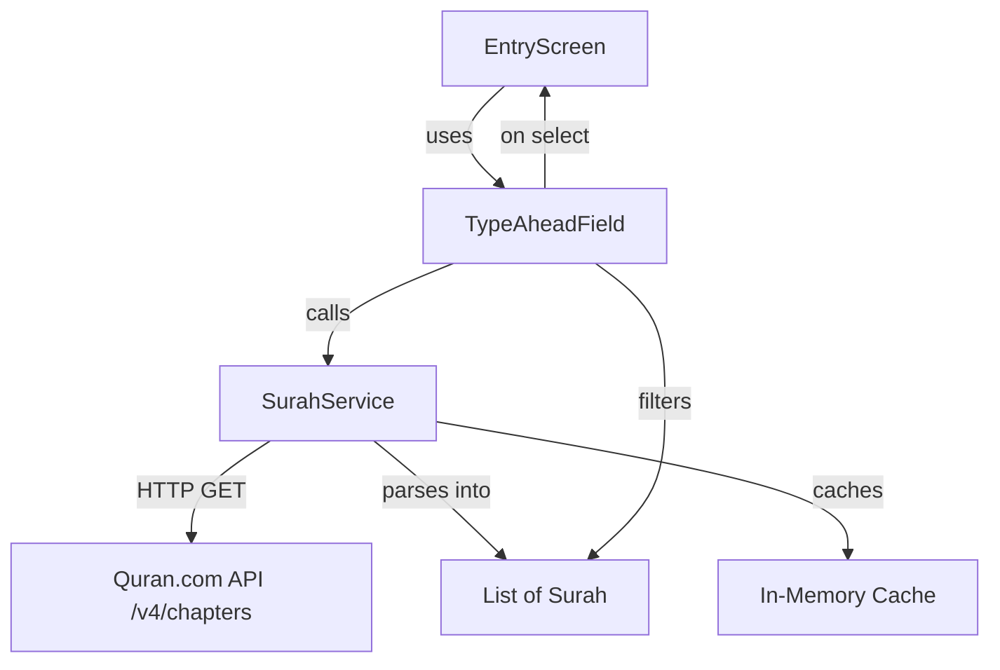

# Design Document: Surah Typeahead Search

## Overview

This feature replaces the plain `TextField` on the Entry Screen (`lib/screens/entry_screen.dart`) with a typeahead/autocomplete widget powered by surah data from the Quran.com public API. The implementation introduces three new components: a `Surah` data model, a `SurahService` for API fetching with in-memory caching, and a typeahead widget integration using the `flutter_typeahead` package. The existing visual style (fonts, colors, borders) is preserved.

## Architecture



The architecture follows a simple layered approach:

1. **Data Layer** — `Surah` model in `lib/models/surah.dart` handles JSON parsing.
2. **Service Layer** — `SurahService` in `lib/services/surah_service.dart` fetches from the API, parses the response, and caches the result in a private field.
3. **UI Layer** — `EntryScreen` becomes a `StatefulWidget`, creates a `SurahService` instance, calls it on `initState`, and wires the cached list into a `TypeAheadField` for filtering and selection.

Design decisions:
- **In-memory cache over persistence**: The surah list is small (114 items) and rarely changes. A simple nullable `List<Surah>?` field on `SurahService` is sufficient. No database or shared preferences needed.
- **Service as a plain Dart class**: No state management library (Provider, Riverpod) is introduced. The `EntryScreen` owns the service instance directly. This keeps the change minimal and avoids new architectural dependencies.
- **`flutter_typeahead` package**: Provides a well-maintained, drop-in `TypeAheadField` widget that handles debouncing, dropdown rendering, and keyboard interaction out of the box.
- **`http` package**: Lightweight HTTP client for the single GET request needed.

## Components and Interfaces

### Surah (Data Model)

**File:** `lib/models/surah.dart`

```dart
class Surah {
  final int id;
  final String nameSimple;
  final String nameArabic;
  final String translation;

  const Surah({
    required this.id,
    required this.nameSimple,
    required this.nameArabic,
    required this.translation,
  });

  factory Surah.fromJson(Map<String, dynamic> json);
}
```

- `fromJson` extracts `id`, `name_simple`, `name_arabic`, and `name_translation.name` from the API JSON.
- Throws `FormatException` with a descriptive message if any required field is missing or null.

### SurahService

**File:** `lib/services/surah_service.dart`

```dart
class SurahService {
  static const String _baseUrl = 'https://api.quran.com/api/v4/chapters';
  List<Surah>? _cachedSurahs;

  Future<List<Surah>> fetchSurahs();
}
```

- `fetchSurahs()` returns `_cachedSurahs` if non-null (cache hit). Otherwise performs HTTP GET, parses the `chapters` array, stores the result, and returns it.
- Throws `Exception` with status code on non-200 responses.
- Propagates network errors (e.g., `SocketException`) without catching them.
- Accepts an optional `http.Client` parameter for testability.

### EntryScreen (Modified)

**File:** `lib/screens/entry_screen.dart`

Changes:
- Convert from `StatelessWidget` to `StatefulWidget`.
- Add `SurahService` instance and `List<Surah>?` / error / loading state fields.
- Call `_surahService.fetchSurahs()` in `initState`.
- Replace `TextField` with `TypeAheadField<Surah>`:
  - `suggestionsCallback`: filters cached list by case-insensitive substring match on `nameSimple`. Returns empty list when input is empty.
  - `itemBuilder`: renders each suggestion showing `nameSimple` and `nameArabic`.
  - `onSelected`: sets the text controller value to the selected surah's `nameSimple`.
  - `emptyBuilder`: shows "No surahs found" text.
  - `loadingBuilder`: shows a `CircularProgressIndicator` while data is loading.
  - `errorBuilder`: shows inline error message when fetch failed.
- Styling matches existing `TextField` decoration (font size 15, `AppColors.textPrimary`, hint text, underline borders).

### Suggestion Filtering Logic

Filtering is a pure function that can be extracted for testability:

```dart
List<Surah> filterSurahs(List<Surah> surahs, String query) {
  if (query.isEmpty) return [];
  final lowerQuery = query.toLowerCase();
  return surahs
      .where((s) => s.nameSimple.toLowerCase().contains(lowerQuery))
      .toList();
}
```

## Data Models

### Surah

| Field         | Type     | JSON Source                    | Description                  |
|---------------|----------|--------------------------------|------------------------------|
| `id`          | `int`    | `json['id']`                   | Chapter number (1–114)       |
| `nameSimple`  | `String` | `json['name_simple']`          | English transliteration      |
| `nameArabic`  | `String` | `json['name_arabic']`          | Arabic name                  |
| `translation` | `String` | `json['name_translation']['name']` | English meaning          |

### API Response Shape (Quran.com /v4/chapters)

```json
{
  "chapters": [
    {
      "id": 1,
      "name_simple": "Al-Fatihah",
      "name_arabic": "الفاتحة",
      "name_translation": { "name": "The Opening" },
      ...
    }
  ]
}
```

Only the four fields above are extracted; all other fields in the response are ignored.


## Correctness Properties

*A property is a characteristic or behavior that should hold true across all valid executions of a system — essentially, a formal statement about what the system should do. Properties serve as the bridge between human-readable specifications and machine-verifiable correctness guarantees.*

### Property 1: Surah JSON parsing round trip

*For any* valid JSON map containing an integer `id`, string `name_simple`, string `name_arabic`, and a nested `name_translation` map with a string `name`, parsing via `Surah.fromJson` should produce a `Surah` whose `id`, `nameSimple`, `nameArabic`, and `translation` fields match the original JSON values exactly. Extending this to lists: for any list of such valid JSON maps wrapped in a `{"chapters": [...]}` response, `SurahService.fetchSurahs` should return a list of `Surah` instances of the same length where each element's fields match the corresponding JSON map.

**Validates: Requirements 1.2, 2.2**

### Property 2: Missing or null JSON fields produce descriptive errors

*For any* JSON map where at least one required field (`id`, `name_simple`, `name_arabic`, or `name_translation.name`) is either missing or null, calling `Surah.fromJson` should throw an error whose message identifies the missing or null field.

**Validates: Requirements 1.3**

### Property 3: Non-200 status codes produce exceptions with status code

*For any* HTTP status code that is not 200, when `SurahService.fetchSurahs` receives a response with that status code, it should throw an exception whose message contains the numeric status code.

**Validates: Requirements 2.3**

### Property 4: Filter correctness — case-insensitive substring match

*For any* list of `Surah` instances and any non-empty query string, `filterSurahs(surahs, query)` should return exactly those surahs whose `nameSimple` contains the query as a case-insensitive substring. Additionally, for any empty query string, `filterSurahs` should return an empty list regardless of the input surahs.

**Validates: Requirements 3.1, 3.2**

### Property 5: Selection populates text field with nameSimple

*For any* `Surah` instance, when the `onSelected` callback of the `TypeAheadField` is invoked with that surah, the text controller's value should equal the surah's `nameSimple`.

**Validates: Requirements 4.1**

## Error Handling

| Scenario | Layer | Behavior |
|---|---|---|
| JSON missing required field / null value | `Surah.fromJson` | Throws `FormatException` with message naming the missing field |
| HTTP non-200 response | `SurahService.fetchSurahs` | Throws `Exception('Failed to load surahs: status <code>')` |
| Network error (no connectivity, timeout) | `SurahService.fetchSurahs` | Propagates the underlying `SocketException` / `ClientException` unmodified |
| Service fetch failure | `EntryScreen` | Sets error state; displays inline error text below the typeahead field |
| No matching surahs for query | `TypeAheadField` | `emptyBuilder` renders "No surahs found" message |
| Data still loading when user types | `TypeAheadField` | `loadingBuilder` renders a `CircularProgressIndicator` |

Error messages are user-facing in the UI layer and developer-facing (with status codes / field names) in the service and model layers.

## Testing Strategy

### Property-Based Tests

Use the `dart_quickcheck` or `glados` package (Dart property-based testing library) for property tests. Each property test runs a minimum of 100 iterations with randomly generated inputs.

Each test must be tagged with a comment referencing the design property:

```dart
// Feature: surah-typeahead-search, Property 1: Surah JSON parsing round trip
```

| Property | Test Description | Generator Strategy |
|---|---|---|
| Property 1 | Generate random JSON maps with valid field types, parse via `fromJson`, assert field equality. For the list variant, generate random-length lists of valid JSON maps, mock HTTP 200 response, call `fetchSurahs`, assert list length and per-element field match. | Random int for `id`, random alphanumeric strings for name fields |
| Property 2 | Generate JSON maps then randomly remove or null-ify one or more required fields. Call `fromJson`, assert it throws and the error message contains the field name. | Start from valid JSON, apply random field removal/nullification |
| Property 3 | Generate random integers in 100–599 excluding 200. Mock HTTP response with that status code. Call `fetchSurahs`, assert exception message contains the code. | Random non-200 HTTP status codes |
| Property 4 | Generate random lists of `Surah` (random `nameSimple` strings) and random query strings. Call `filterSurahs`, assert every result contains the query (case-insensitive) and every non-result does not. Also test with empty query → empty result. | Random strings for names and queries |
| Property 5 | Generate random `Surah` instances. Simulate `onSelected` callback, assert text controller value equals `nameSimple`. | Random `Surah` instances |

### Unit Tests (Examples and Edge Cases)

Unit tests cover specific examples, integration points, and edge cases not fully addressed by property tests:

- **Surah.fromJson** with a real API response snippet (example for Req 1.1, 1.2)
- **SurahService** sends GET to correct URL (example for Req 2.1, using mock client)
- **SurahService** caches result — second call doesn't trigger HTTP (example for Req 2.5)
- **SurahService** propagates network errors (example for Req 2.4)
- **filterSurahs** with empty query returns empty list (edge case for Req 3.2)
- **TypeAheadField** shows "No surahs found" when filter returns empty (widget test for Req 3.3)
- **TypeAheadField** closes dropdown on selection (widget test for Req 4.2)
- **EntryScreen** shows error message when service fails (widget test for Req 6.1)
- **EntryScreen** shows loading indicator during fetch (widget test for Req 6.2)

### Test Configuration

- Property-based testing library: `glados` (Dart PBT library with shrinking support)
- Minimum iterations per property: 100
- Test runner: `flutter test`
- Each property test file tagged with feature and property reference
